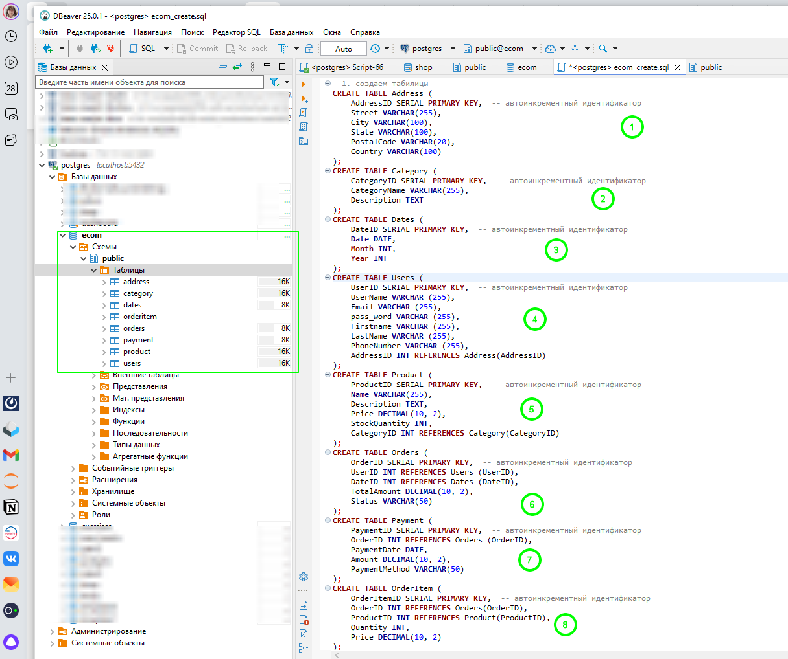
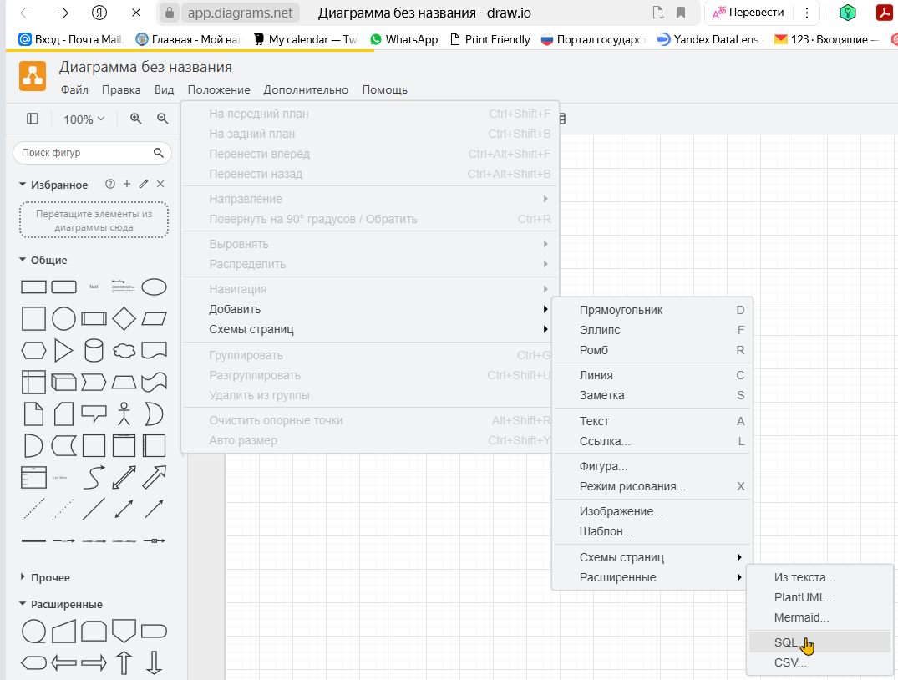
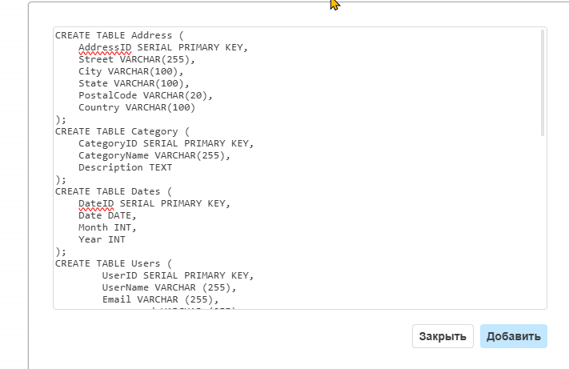
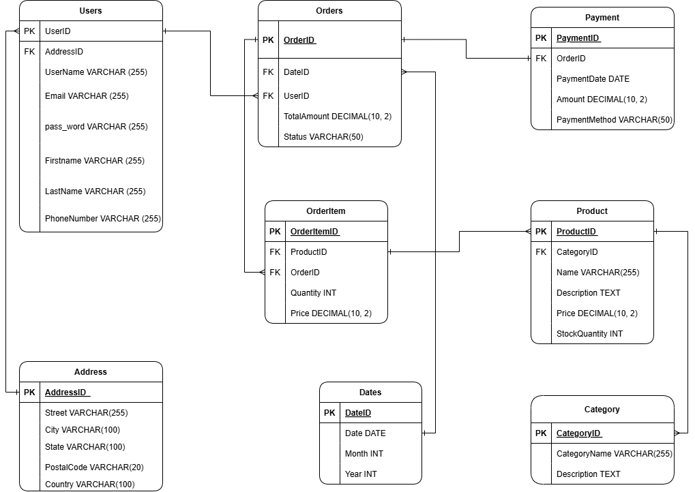
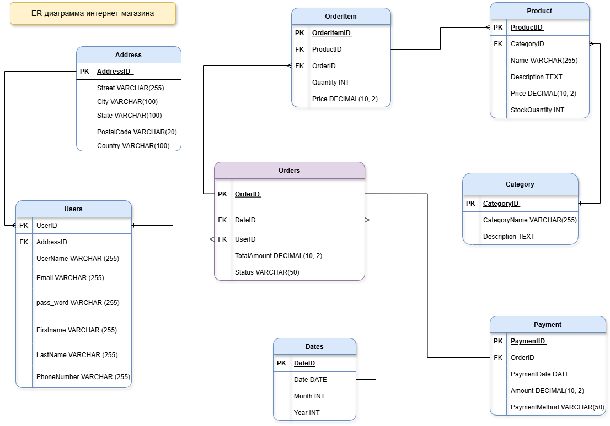

## 🦸 Моделирование данных 🦸
### 🖧 Упр.1 - ER-диаграмма для базы данных интернет-магазина, используя реляционную модель.

ER (диаграммы "сущность-связь")
https://app.diagrams.net/
Нарисовать по описанию

Ниже приведен текстовый пример ER-диаграммы, описывающий типичные сущности для интернет-магазина.
 
### Сущности и их атрибуты¶

#### Пользователь (User)
 - UserID (Primary Key)
 - UserName
 - Email
 - Password
 - FirstName
 - LastName
 - PhoneNumber
 - AddressID (Foreign Key)
 - Адрес (Address)
 - AddressID (Primary Key)
 - Street
 - City
 - State
 - PostalCode
 - Country

#### Товар (Product)
 - ProductID (Primary Key)
 - Name
 - Description
 - Price
 - StockQuantity
 - CategoryID (Foreign Key)
 - Категория (Category)
 - CategoryID (Primary Key)
 - CategoryName
 - Description

#### Заказ (Order)
 - OrderID (Primary Key)
 - UserID (Foreign Key)
 - OrderDate
 - TotalAmount
 - Status

#### Заказанный товар (OrderItem)
 - OrderItemID (Primary Key)
 - OrderID (Foreign Key)
 - ProductID (Foreign Key)
 - Quantity
 - Price

#### Оплата (Payment)
 - PaymentID (Primary Key)
 - OrderID (Foreign Key)
 - PaymentDate
 - Amount
 - PaymentMethod

#### Связи между сущностями
 -Пользователь (User) может иметь один или несколько Адресов (Address) (1:N).
 -Пользователь (User) может сделать один или несколько Заказов (Order) (1:N).
 -Заказ (Order) может содержать один или несколько Заказанных товаров (OrderItem) (1:N).
 -Товар (Product) может быть частью одного или нескольких Заказанных товаров (OrderItem) (1:N).
 -Товар (Product) принадлежит одной Категории (Category) (N:1).
 -Заказ (Order) может иметь одну Оплату (Payment) (1:1).

#### Текстовое представление ER-диаграммы

[User] --1:N--> [Order] --1:N--> [OrderItem] --N:1--> [Product] --N:1--> [Category] | | | | | | | | | | | | +--1:N--> [Address] +--1:1--> [Payment] | | +-------------+ | | [PaymentMethod]


#### Описание связи
 - User - Address: Один пользователь может иметь несколько адресов.
 - User - Order: Один пользователь может сделать несколько заказов.
 - Order - OrderItem: Один заказ может содержать несколько товаров.
 - OrderItem - Product: Каждый заказанный товар относится к одному продукту.
 - Product - Category: Каждый продукт принадлежит одной категории.
 - Order - Payment: Один заказ может иметь одну оплату.
 

## Решение

 скрипт создания таблиц [ecom_create.sql](../files/ecom_create.sql)
 
 
Заполним диаграмму на основе кода SQLю
 
 

draw.io. Позволяет автоматически создавать диаграммы из кода SQL. Код преобразуется в сущности, содержащие все определённые в нём атрибуты. Затем нужно перерасположить и соединить эти сущности.

В моем случае потребовалась корректировка, но основные данные были загружены. Отредактируем то что загрузилось, добавим связи.

 
 
### 🖧  Упражнение 2: Моделирование данных для Online-магазина

 - Определите факты и размерности для вашего интернет-магазина.
 - Создайте ER-диаграмму, используя выбранную вами схему (звезда, снежинка или Data Vault).
 - Опишите, как бы вы реализовали эту модель данных в реляционной базе данных.
 - Напишите SQL-запрос для получения общего объема продаж по месяцам, используя созданную вами схему.

## Решение

используем ER диаграмму из прошлого урока.

Доработали диаграмму, чтобы выделить таблицу фактов и таблицы размерностей - для этого было изменено месторасположения таблиц.Что улучшило читаемость и понимание.

Таблица фактов - orders

Таблицы размероностей - Address, Category,  Dates, Users, Product,  Payment, OrderItem

схема  снежинка

 
 
SQL запрос  для получения общего объема продаж по месяцам мог бы выглядеть так:

Если считать продажи по таблице Orders
```
SELECT d.month AS month_sales,
SUM(o.totalamount)  AS total_sales
FROM orders o 
LEFT JOIN dates AS d ON o.dateid=d.dateid
GROUP BY d.month
ORDER BY d.month;
```

Если считать продажи по таблице Payment
```
SELECT date_trunc('month', CAST(p.paymentdate AS DATE)) AS month,
SUM(p.amount)  AS total_sales
FROM payment AS p
GROUP BY month
ORDER BY month;
```