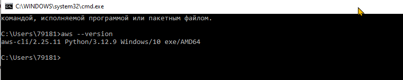
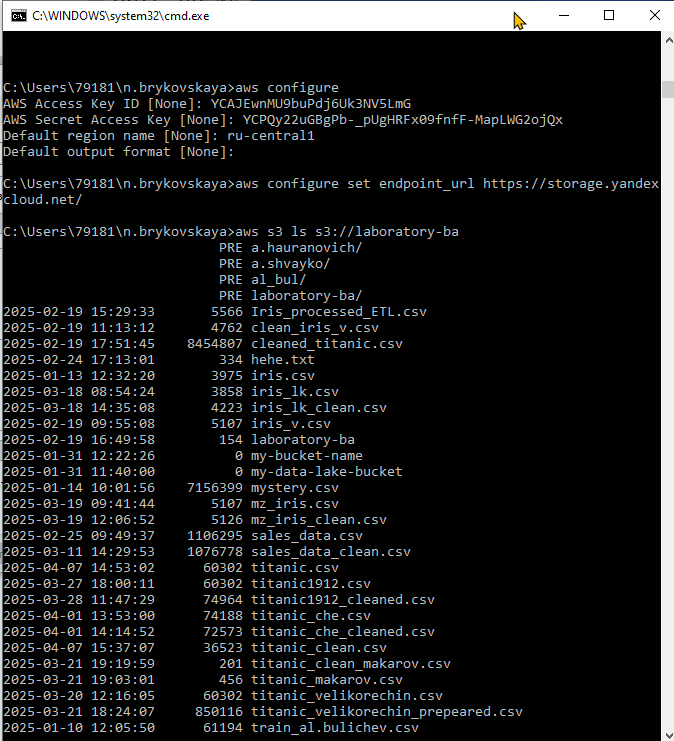
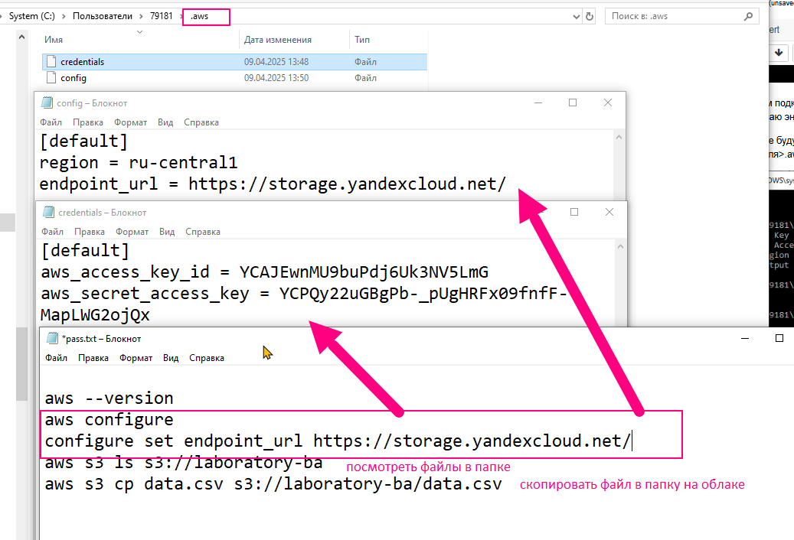
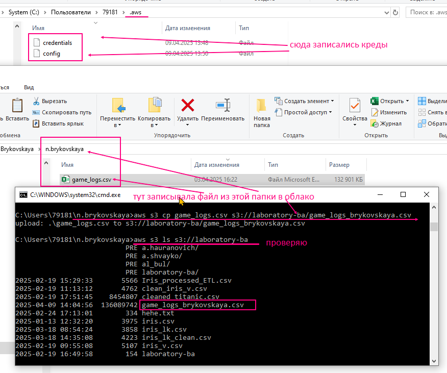
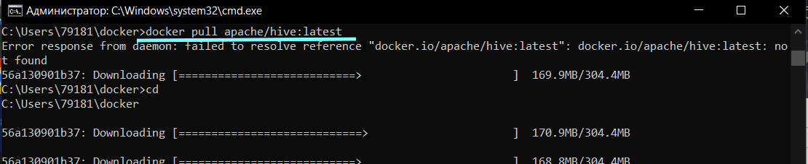
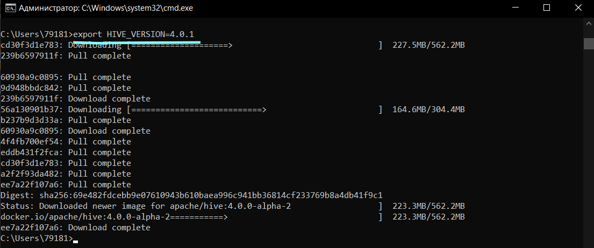
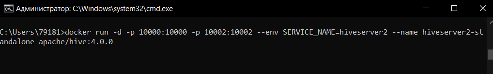
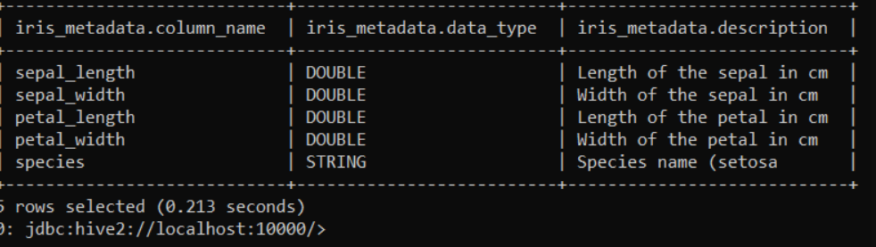
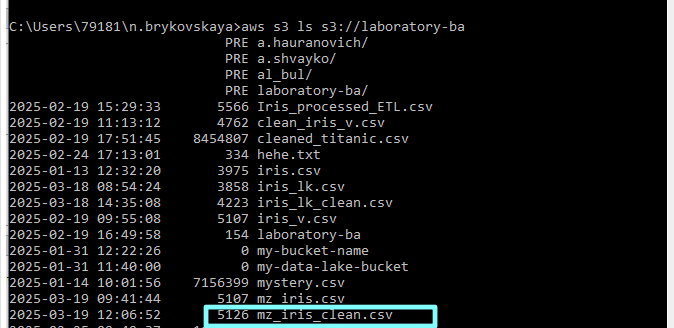
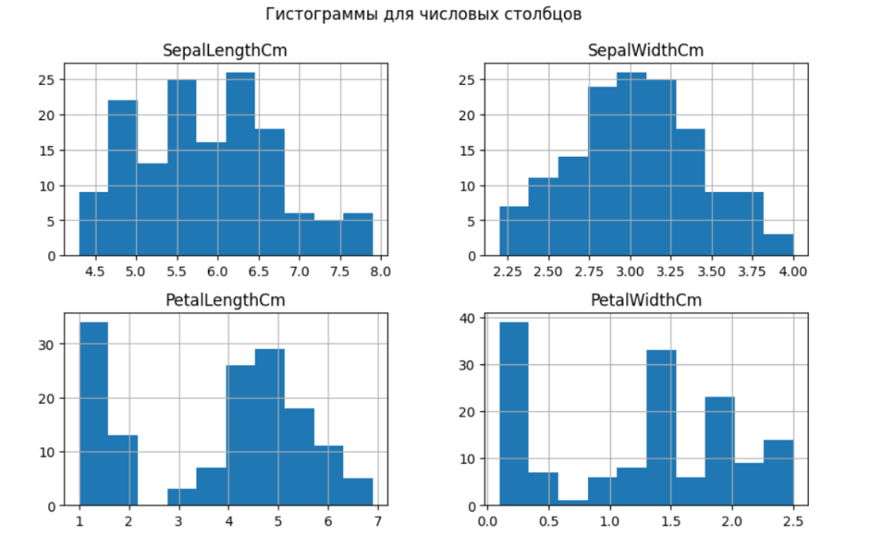

## 🔁 Упражнение 1: Загрузка данных в Data Lake🔁
#### Цель: Научиться загружать данные из различных источников в Data Lake.

Задание:

Выберите облачное хранилище, например, Amazon S3, Google Cloud Storage или Azure Blob Storage.<br>
у нас есть свое мини облако и "лужа" для курса <br>
Облако - AWS CLI в Yandex Object Storage (креды)

Создайте бакет (или контейнер) для хранения данных.<br>
Скачайте открытый набор данных (например, Titanic dataset или Iris dataset) в формате CSV или JSON.<br>
Загрузите этот файл в ваш бакет/контейнер.<br>
Проверьте, что файл успешно загружен, и запишите его путь.<br>

### ☑️ решение
код который сработал
```
aws --version
aws configure
configure set endpoint_url https://storage.yandexcloud.net/
aws s3 ls s3://laboratory-ba
aws s3 cp data.csv s3://laboratory-ba/data.csv
```
ранее был установлен aws 
теперь последовательно выполняю шаги - смотрю какая версия AWS установлена 
<br>
Настаиваем подключение к AWS CLI в Yandex Object S<br>
ввожу значения для параметров и Устанавливаю эндпоинт.

в результате будут записаны два файла в папку С:\Пользователи\<имя твоего пользователя>\.aws  . папка появляется автоматически. проверяем какие есть файлы.

<br>

<br>
Для упражнение принято решение использовать имеющийся бакет laboratory-ba т.к. доступа к его созданию нет.<br>
Загружаю набор данных `game_logs.csv` о логах игры за 130 лет и переименовываю его как `game_logs_brykovskaya.csv` и затем проверяем как файл был записан в облако
<br>

## 🔁 Упражнение 2: Создание каталога данных
### Цель: Научиться управлять метаданными в Data Lake.
Задание:<br>
Используйте инструмент управления метаданными, такой как Apache Hive или AWS Glue.
1. Создайте таблицу метаданных для вашего набора данных из упражнения 1.
1. Определите схему таблицы (например, имена столбцов, типы данных).
1. Укажите источник данных и описание.
1. Заполните таблицу метаданных данными о вашем наборе данных, включая информацию о том, откуда данные были получены, и их структуре.

### Решение

Поднимаю котнейнер с Hive.

Запустите Apache Hive внутри контейнера docker в псевдораспределенном режиме, чтобы обеспечить следующий быстрый запуск / отладку / Подготовить тестовую среду для Hive

#### STEP 1: Pull the image
Pull the image from DockerHub: https://hub.docker.com/r/apache/hive/tags. Here are the latest images:
4.0.0-beta-1  3.1.3

`docker pull apache/hive:4.0.0-alpha-2`

<br>
#### STEP 2: Export the Hive version
`export HIVE_VERSION=4.0.0-alpha-2`

<br>

<br>

Usage
```
HiveServer2 web
Accessed on browser at http://localhost:10002/
```
Beeline:
```
  docker exec -it hiveserver2 beeline -u 'jdbc:hive2://hiveserver2:10000/'
  # If beeline is installed on host machine, HiveServer2 can be simply reached via:
  beeline -u 'jdbc:hive2://localhost:10000/'
```
some queries:
   - show tables;
   - create table hive_example(a string, b int) partitioned by(c int);
   - alter table hive_example add partition(c=1);
   - insert into hive_example partition(c=1) values('a', 1), ('a', 2),('b',3);
   - select count(distinct a) from hive_example;
   - select sum(b) from hive_example;

Запуск Apache Hive в контейнере:
```
cmd
    C:\Users\79181>docker run -d -p 10000:10000 -p 10002:10002 -e SERVICE_NAME=hiveserver2 --name hive4 apache/hive:4.0.1
```

Далее в другом окне cmd:
    
```
cmd
C:\Users\79181>docker exec -it hive4 beeline -u 'jdbc:hive2://localhost:10000/'
```

- Создайте таблицу метаданных для вашего набора данных из упражнения 1. Для удобства создам для уже находящегося набора данных iris

```
cmd
0: jdbc:hive2://localhost:10000/> CREATE TABLE IF NOT EXISTS iris_metadata
(column_name STRING, data_type STRING, description STRING)
ROW FORMAT DELIMITED FIELDS TERMINATED BY ',' STORED AS TEXTFILE;
```

Определите схему таблицы (например, имена столбцов, типы данных).

Укажите источник данных и описание.

Заполните таблицу метаданных данными о вашем наборе данных, включая информацию о том, откуда данные были получены, и их структуре.

```
0: jdbc:hive2://localhost:10000/> INSERT INTO iris_metadata VALUES
('sepal_length', 'DOUBLE', 'Length of the sepal in cm'),
('sepal_width', 'DOUBLE', 'Width of the sepal in cm'),
('petal_length', 'DOUBLE', 'Length of the petal in cm'),
('petal_width', 'DOUBLE', 'Width of the petal in cm'),
('species', 'STRING', 'Species name (setosa, versicolor, virginica)');
```

Проверяем таблицу:

```
0: jdbc:hive2://localhost:10000/> SELECT * FROM iris_metadata;
```
Результат:


## 🔁 Упражнение 3: Очистка и подготовка данных
#### Цель: Научиться очищать и подготавливать данные для анализа.
Задание:

- Загрузите данные из вашего Data Lake (например, используя Apache Spark или Pandas в Python).
    ```python
    import pandas as pd 
    import boto3
    from io import StringIO
    import numpy as np

    session =boto3.session.Session()
    s3 = session.client(
        service_name ='s3',
        endpoint_url ='https://storage.yandexcloud.net/',
        aws_access_key_id ='YCAJEwnMU9buPdj6Uk3NV5LmG',
        aws_secret_access_key ='YCPQy22uGBgPb-_pUgHRFx09fnfF-MapLWG2ojQx')

    bucket = 'laboratory-ba'
    file_name='mz_iris.csv'

    response =s3.get_object(Bucket=bucket,Key=file_name)
    data =response['Body'].read().decode('utf-8')
    df =pd.read_csv(StringIO(data),index_col=0)
    ```

- Проверьте данные на наличие пропущенных значений и выбросов.
- Выполните следующие операции очистки данных:
    - Заполните пропущенные значения (например, медианой или средним значением).

    - Удалите или исправьте выбросы.

    - Преобразуйте категориальные переменные в числовые форматы (например, используя one-hot encoding).

    ```python
    numeric_cols = df.select_dtypes(include=['float64', 'int64']).columns.tolist()
    for column in df.columns:
        if df[column].dtype == 'float64' or df[column].dtype == 'int64':
            df[column] = df[column].fillna(df[column].median())
    print(df.dtypes)
    for col in numeric_cols:
        Q1 = df[col].quantile(0.25)
        Q3 = df[col].quantile(0.75)
        IQR = Q3 - Q1
        df = df[(df[col] >= (Q1 - 1.5 * IQR)) & (df[col] <= (Q3 + 1.5 * IQR))]
    ```

- Сохраните очищенные данные обратно в Data Lake.

    ```python
    csv_buffer =StringIO()
    df.to_csv(csv_buffer, index =False)
    s3.put_object(Bucket=bucket,Key ='mz_iris_clean.csv', Body = csv_buffer.getvalue())
    ```

Проверяем результат в Data Lake:

<br>

## 🔁 Упражнение 4: Разработка ETL-процесса
#### Цель: Научиться создавать ETL-процесс для загрузки и обработки данных. Задание:
Напишите скрипт на Python или используйте Apache NiFi для создания ETL-процесса.
-E (Extract): Извлеките данные из вашего источника данных (например, CSV или базу данных).

-T (Transform): Примените очистку и преобразование данных, которые вы выполнили в предыдущем упражнении.

-L (Load): Загрузите преобразованные данные обратно в Data Lake.

Запустите ETL-процесс и убедитесь, что данные загружаются правильно.

[iris_etl.ipynb](../files/iris_etl.ipynb)
Упражнение дублирует предыдущее (см. предыдущее упражнение)

## 🔁 Упражнение 5: Анализ данных в Data Lake

#### Цель: Научиться анализировать данные, хранящиеся в Data Lake. Задание:
Используйте Apache Spark или SQL-запросы (например, через AWS Athena) для анализа вашего очищенного набора данных.

Выполните следующие запросы:
 - Подсчитайте общее количество записей.
 - Найдите среднее значение для числовых столбцов (например, возраст, цена).
 - Подсчитайте количество уникальных значений для категориальных столбцов (например, пол, класс).
 - Сохраните результаты анализа в отчете или визуализации.

#### РЕШЕНИЕ

[pyspark_analyze.ipynb](../files/pyspark_analyze.ipynb)
```python
from pyspark.sql import SparkSession
from pyspark.sql.functions import col, avg, countDistinct

# Создаем сессию Spark
spark = SparkSession.builder.appName("IrisAnalysis").getOrCreate()

# Загрузим данные из CSV файла
df = spark.read.csv("mz_iris_clean.csv", header=True, inferSchema=True)
df = df.drop("Id")
# Покажем первые несколько строк данных для проверки
df.show(5)

total_records = df.count()
print(f"Общее количество записей: {total_records}")

# Список числовых столбцов
numerical_columns = [col for col, dtype in df.dtypes if dtype in ('int', 'double')]

# Среднее значение для числовых столбцов
average_values = df.select([avg(col).alias(col) for col in numerical_columns]).show()

# Список категориальных столбцов
categorical_columns = [col for col, dtype in df.dtypes if dtype == 'string']

# Подсчет уникальных значений для категориальных столбцов
for column in categorical_columns:
    distinct_count = df.select(column).distinct().count()
    print(f"Количество уникальных значений в столбце {column}: {distinct_count}")

import matplotlib.pyplot as plt
import pandas as pd

# Переводим данные Spark DataFrame в Pandas для удобства работы с визуализацией
df_pandas = df.toPandas()

# Строим гистограмму для каждого числового столбца
numerical_columns = [col for col, dtype in df.dtypes if dtype in ('int', 'double')]
df_pandas[numerical_columns].hist(bins=10, figsize=(10, 6))
plt.suptitle("Гистограммы для числовых столбцов")
plt.show()
```

Результат:

<br>


## 🔁 Упражнение 6: Управление безопасностью данных
#### Цель: Научиться управлять безопасностью данных в Data Lake.
Задание:

- Определите, какие данные в вашем Data Lake являются конфиденциальными или чувствительными.

#### РЕШЕНИЕ
В условиях лаборатории используются только открытые датасеты, которые не содержат чувствительных и конфиденциальных данных. В реальных же проектах это могли быть персональные данные клиентов, медицинская информация, финансовые данные и т. д. 

С датасетом iris.csvпердставим, что данные в колонке species будут "чувствительными". а именно вид растения (species) является конфиденциальной информацией, которую нужно защитить.

Для этого 
1. Настроим контроль доступа к данным:
Создадим группы пользователей с различными уровнями доступа (например, администраторы, аналитики, операторы).
 - Администраторы: Доступ ко всем данным.
 - Аналитики: Доступ только к числовым данным (например, sepal_length, sepal_width, petal_length, petal_width).
 - Операторы: Доступ к базовым статистическим данным или результатам агрегации.

В реальных условиях это обычно делается с использованием инструментов безопасности в Data Lake (например, с AWS Lake Formation, Apache Ranger или Azure Synapse).

2. Настроим политики доступа, чтобы ограничить доступ к конфиденциальным данным только для определенных пользователей или групп.
 - Администратор имеет доступ ко всем данным.
 - Аналитик может видеть только числовые данные и не имеет доступа к чувствительным данным (например, колонка species).
 - Оператор может получить только сводные статистики.

3. Протестируем настройки безопасности, чтобы убедиться, что только авторизованные пользователи могут получать доступ к чувствительным данным.

Для проверки безопасности, можно проверить, что:
 - Аналитик не видит чувствительные данные, например, колонку species.
 - Оператор видит только статистику, а не исходные данные.