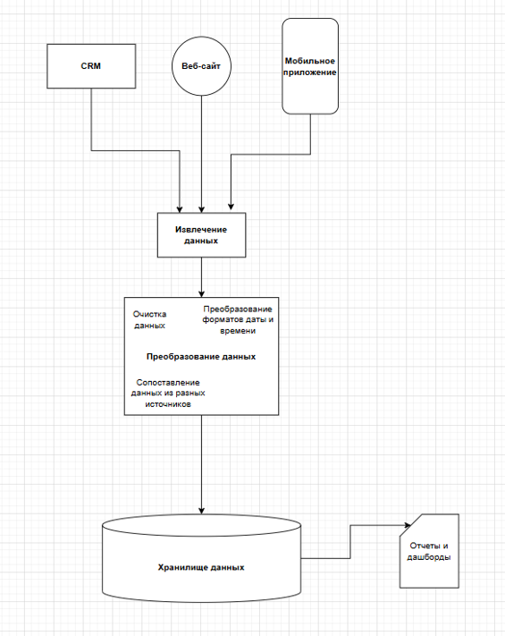
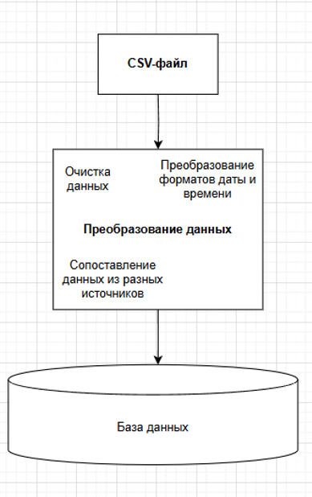

## 📋 УПРАЖНЕНИЕ 1 – ПРИМЕР КАРТИРОВАНИЯ ДАННЫХ В DRAW.IO 📋
Пример: Вот пример простого картирования данных, которое можно создать в draw.io, демонстрирующий, как данные о клиентах перемещаются из разных источников в хранилище данных для аналитики:

1. Источники данных:
CRM-система: (изобразите как прямоугольник с названием) Хранит основную информацию о клиентах - Имя, Фамилия, Email, Телефон.
Веб-сайт: (изобразите как иконку глобуса) Сбор данных о поведении пользователей на сайте - Просмотренные страницы, Товары в корзине, Заказы.
Мобильное приложение: (изобразите как иконку смартфона) Отслеживание действий пользователей в приложении - Регистрации, Покупки, Оценки.

2. Процессы обработки:
Извлечение данных (Extract): Используйте стрелки от каждого источника данных к блоку "Извлечение данных".
Преобразование данных (Transform): Создайте блок с названием "Преобразование данных". Стрелки от блока "Извлечение данных" должны вести к нему. Внутри блока "Преобразование данных" можно добавить текстовые блоки, описывающие преобразования:
Очистка данных (удаление дубликатов, обработка пропущенных значений)
Преобразование форматов даты и времени
Сопоставление данных из разных источников
Загрузка данных (Load): Создайте блок с названием "Хранилище данных" (Data Warehouse) и направьте к нему стрелку от блока "Преобразование данных".

3. Хранилище данных:
Хранилище данных: Изобразите как большую базу данных (например, цилиндр). Здесь хранятся все данные о клиентах в структурированном виде.

4. Аналитика:
Отчеты и Dashboards: (изобразите как графики и диаграммы) Стрелки от "Хранилище данных" ведут к блокам "Отчеты" и "Dashboards", показывая, что данные используются для аналитики.
Дополнительные элементы:

Используйте разные цвета стрелок, чтобы различать типы данных (например, синий для информации о клиентах, зеленый для данных о заказах).

Добавьте текстовые поля с подписями к каждому элементу карты данных для пояснения.
Результат: У вас получится наглядная карта данных, демонстрирующая путь, который проходят данные о клиентах от источников до хранилища и как они используются для аналитики.
Важно: Это простой пример, и ваши карты данных могут быть гораздо более сложными в зависимости от ваших потребностей. Главное - соблюдать принцип наглядности и информативности.

Решение:

## 📋 УПРАЖНЕНИЕ 2 – КАРТИРОВАНИЕ ДАННЫХ
Пример: Компания создает карту данных, чтобы отследить, как данные о клиентах перемещаются между CRM-системой, хранилищем данных и маркетинговой платформой.

#### Упражнение: Создайте карту данных для простого процесса обработки данных
например, загрузка данных из CSV-файла, очистка и загрузка в базу данных.

Решение:
