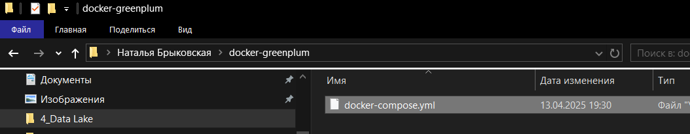
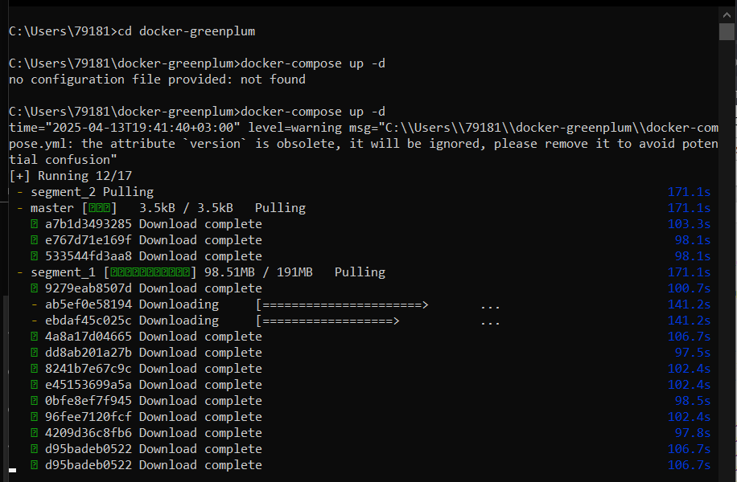
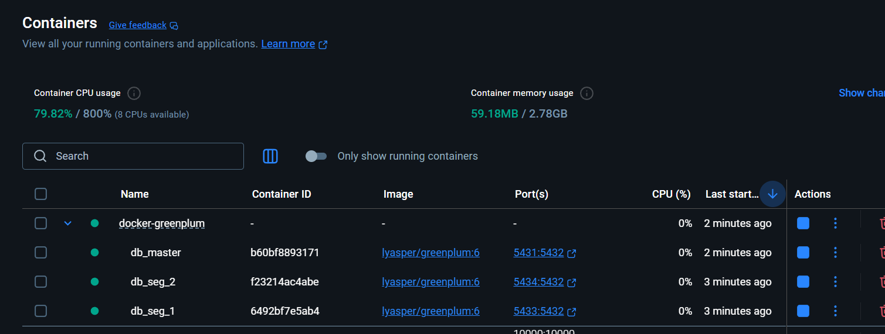
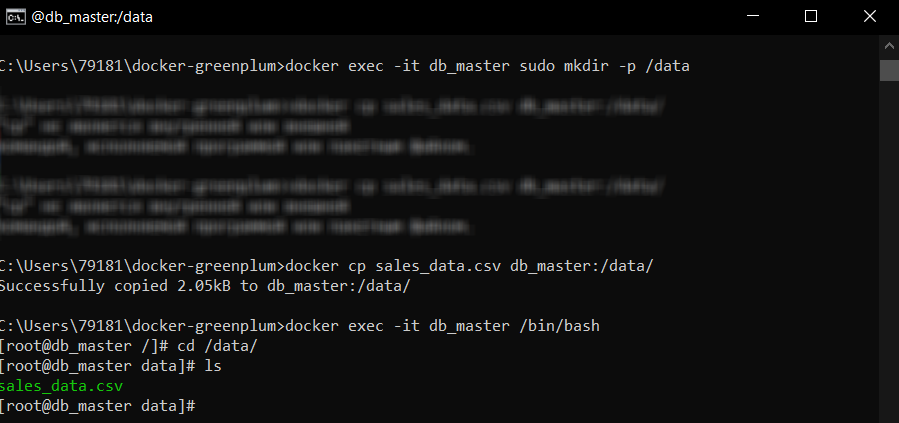
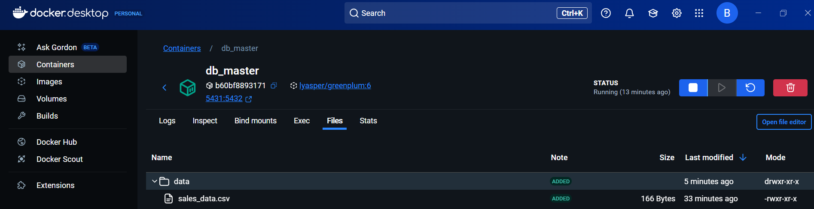
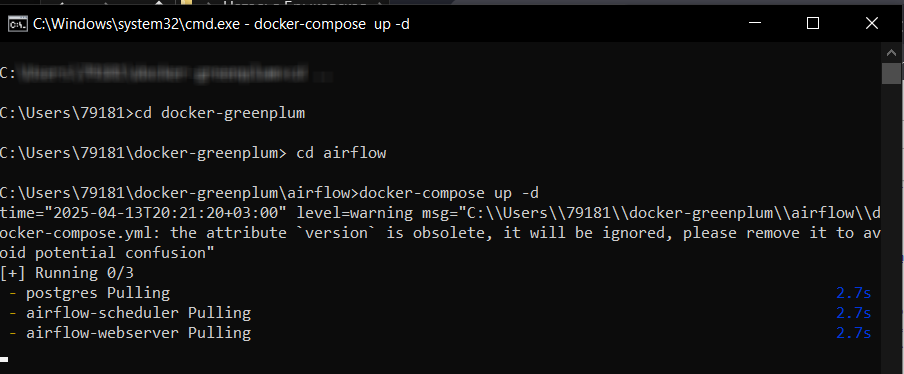

# 🍈 GreenPlum
---
## 🍈 Установка GreenPlum

Запускаем docker-compose file:
<br>
<br>
```
C:\Users\79181>mkdir docker-greenplum
C:\Users\79181>cd docker-greenplum
C:\Users\79181\docker-greenplum>docker-compose up -d
```
Созданные контейнеры:<br>
<br>


---

## 🍈 Упр. GreenPlum - данные о продажах из CSV-файла
Скопируем файл [sales_data.csv](./files/sales_data.csv):
```
C:\Users\79181\docker-greenplum>docker exec -it db_master sudo mkdir -p /data
C:\Users\79181\docker-greenplum>docker cp sales_data.csv db_master:/data/

Теперь зайдем db_master и посмортим что скопировалось в /data/

C:\Users\79181\docker-greenplum>docker exec -it db_master /bin/bash
[root@db_master /]# cd /data/
[root@db_master data]# ls
sales_data.csv
```
<br>
<br>
Пробросим порт, чтобы работать через gpfdist на 2 терминале:

```
C:\Users\79181\docker-greenplum>docker exec -it db_master /bin/bash
[root@db_master /]# su - gpadmin
[gpadmin@db_master ~]$ gpfdist -d /data -p 5435 &
[1] 1208
[gpadmin@db_master ~]$ 2025-04-13 17:05:54 1208 INFO Before opening listening sockets - following listening sockets are available:
2025-04-13 17:05:55 523 INFO IPV6 socket: [::]:5435
2025-04-13 17:05:55 523 INFO IPV4 socket: 0.0.0.0:5435
2025-04-13 17:05:55 523 INFO Trying to open listening socket:
2025-04-13 17:05:55 523 IPV6 socket: [::]:5435
2025-04-13 17:05:55 523  INFO Opening listening socket succeeded
2025-04-13 17:05:55 523  INFO Trying to open listening socket:
2025-04-13 17:05:55 523 INFO IPV4 socket: 0.0.0.0:5435
Serving HTTP on port 5435, directory /data
```

Во 2 терминале зайдем в psql:

```
C:\Users\79181>cd docker-greenplum

C:\Users\79181\docker-greenplum>docker exec -it db_master /bin/bash
[root@db_master /]# psql -U gpadmin -d postgres
bash: psql: command not found
[root@db_master /]# /opt/greenplum/bin/psql -U gpadmin -d postgres
psql (9.4.24)
Type "help" for help.

postgres=#
```

Создадим внешнюю таблицу, загрузим в нее данные из csv-file, после чего вставим их уже в постоянную таблицу:

```
postgres=# CREATE EXTERNAL TABLE sales_external (
postgres(#   product_id INT,
postgres(#   sales_date DATE,
postgres(#   quantity INT
postgres(# )
postgres-# LOCATION ('gpfdist://172.24.0.5:5435/sales_data.csv')
postgres-# FORMAT 'CSV' (HEADER);
NOTICE:  HEADER means that each one of the data files has a header row
CREATE EXTERNAL TABLE
postgres=# CREATE TABLE sales (LIKE sales_external) DISTRIBUTED BY (product_id);
CREATE TABLE
postgres=# INSERT INTO sales SELECT * FROM sales_external;
NOTICE:  HEADER means that each one of the data files has a header row
INSERT 0 8
```

Выполним запрос: 

```
postgres=# SELECT product_id, SUM(quantity) AS total_sales
postgres-# FROM sales
postgres-# GROUP BY product_id
postgres-# ORDER BY total_sales DESC
postgres-# LIMIT 10;
 product_id | total_sales
------------+-------------
        101 |          13
        103 |           9
        102 |           7
        104 |           1
(4 rows)
```
---
## 🍈 Упр. - Сегментация пользователей интернет-магазина и персонализация рекомендаций
### Контекст:
#### Интернет-магазин собирает данные о пользователях, включая:
 * Данные из Data Lake (Amazon S3): События на сайте (просмотры товаров, добавления в корзину, покупки) - хранятся в файлах JSON.
 * Данные в Greenplum:
Информация о пользователях (ID, email, дата регистрации, город).
Каталог товаров (ID, название, категория, цена)
#### Цель:
Сегментировать пользователей на основе их покупательского поведения.
Персонализировать рекомендации товаров для каждого сегмента.
### 🍈Решение:
1. Создание внешней таблицы для данных о событиях:
```
sql
CREATE EXTERNAL TABLE user_events (
    event_time TIMESTAMP,
    user_id INT,
    event_type TEXT,
    product_id INT
)
LOCATION ('s3://my-data-lake/events/')
FORMAT 'JSON'
```
2. Расчёт метрик поведения пользователей (RFM-анализ):
```
sql
CREATE TABLE user_rfm AS
SELECT 
    u.user_id,
    MAX(e.event_time) AS last_purchase_date,
    COUNT(DISTINCT CASE WHEN e.event_type = 'purchase' THEN e.event_time END) AS purchase_frequency,
    SUM(CASE WHEN e.event_type = 'purchase' THEN 1 ELSE 0 END) AS total_purchases
FROM users u
LEFT JOIN user_events e ON u.user_id = e.user_id
GROUP BY u.user_id;
```
3. Сегментация пользователей с помощью алгоритма K-Means (MADlib):
```
sql
-- Обучение модели K-Means
SELECT madlib.kmeans_train(
    'user_rfm',                -- Таблица с данными
    'user_rfm_clusters',        -- Выходная таблица с кластерами
    'ARRAY[last_purchase_date, purchase_frequency, total_purchases]', -- Столбцы для кластеризации
    3                         -- Количество кластеров
);
-- Присоединение информации о кластерах к таблице user_rfm
ALTER TABLE user_rfm ADD COLUMN cluster_id INT;

UPDATE user_rfm
SET cluster_id = c.cluster_id
FROM user_rfm_clusters c
WHERE user_rfm.user_id = c.user_id;
```
4. Анализ предпочтений по категориям товаров для каждого кластера:
```
sql
SELECT 
    c.cluster_id,
    p.category,
    COUNT(*) AS total_purchases
FROM user_rfm c
JOIN user_events e ON c.user_id = e.user_id
JOIN products p ON e.product_id = p.product_id
WHERE e.event_type = 'purchase'
GROUP BY c.cluster_id, p.category
ORDER BY c.cluster_id, total_purchases DESC
```
5. Персонализация рекомендаций:

На основе анализа предпочтений по категориям для каждого кластера, интернет-магазин может показывать пользователям релевантные товары на сайте, отправлять персонализированные email-рассылки и настраивать таргетированную рекламу.

---
## 🍈 Упражнение Greenplum: Анализ заказов клиентов
#### Шаг 1: Создание таблицы customers
```
postgres=# CREATE TABLE customers (
postgres(#     customer_id INT PRIMARY KEY,
postgres(#     name TEXT,
postgres(#     city TEXT
postgres(# )
postgres-# DISTRIBUTED BY (customer_id);
CREATE TABLE
```
Этот запрос создаст таблицу customers с полями customer_id, name и city, используя customer_id как ключ распределения.

#### Шаг 2: Загрузка данных о клиентах из CSV-файла [customers.csv](./dataset/customers.csv) (создадим внешнюю таблицу и через нее загрузим данные в основную):
```
postgres=# CREATE EXTERNAL TABLE ext_customers (
postgres(#     customer_id INT,
postgres(#     name TEXT,
postgres(#     city TEXT
postgres(# )
postgres-# LOCATION ('gpfdist://172.24.0.5:5435/customers.csv')
postgres-# FORMAT 'CSV' (HEADER);
NOTICE:  HEADER means that each one of the data files has a header row
CREATE EXTERNAL TABLE
postgres=# INSERT INTO customers SELECT * FROM ext_customers;
NOTICE:  HEADER means that each one of the data files has a header row
INSERT 0 20
```
#### Шаг 3: Создание внешней таблицы для данных о заказах (hadoop и hive пока не прошли поэто используем тоже что и в прошлом задании):
```
sql
postgres=# CREATE EXTERNAL TABLE orders (
postgres(#     order_id INT,
postgres(#     customer_id INT,
postgres(#     order_date DATE,
postgres(#     total_amount DECIMAL
postgres(# )
postgres-# LOCATION ('gpfdist://172.24.0.5:5435/orders.csv')
postgres-# FORMAT 'CSV' (HEADER);
NOTICE:  HEADER means that each one of the data files has a header row
CREATE EXTERNAL TABLE
```
#### Шаг 4: Основной запрос - топ 10 клиентов по количеству заказов
```
sql
postgres=# SELECT
postgres-#     c.customer_id,
postgres-#     c.name,
postgres-#     COUNT(o.order_id) AS total_orders
postgres-# FROM customers c
postgres-# JOIN orders o ON c.customer_id = o.customer_id
postgres-# GROUP BY c.customer_id, c.name
postgres-# ORDER BY total_orders DESC
postgres-# LIMIT 10;
NOTICE:  HEADER means that each one of the data files has a header row
 customer_id |               name                | total_orders
-------------+-----------------------------------+--------------
           1 | Иван Петров             |            5
           3 | Елена Иванова         |            4
           5 | Ольга Васильева     |            3
           2 | Алексей Смирнов     |            3
           6 | Сергей Михайлов     |            2
           7 | Анна Федорова         |            2
           9 | Наталья Алексеева |            2
           8 | Михаил Яковлев       |            2
           4 | Дмитрий Кузнецов   |            2
          14 | Артем Павлов           |            1
(10 rows)
```

## 🍈 Дополнительные задания

1. Общая сумма заказов для каждого клиента
   
```
sql
postgres=# SELECT
postgres-#     c.customer_id,
postgres-#     c.name,
postgres-#     COUNT(o.order_id) AS total_orders,
postgres-#     SUM(o.total_amount) AS total_spent
postgres-# FROM customers c
postgres-# JOIN orders o ON c.customer_id = o.customer_id
postgres-# GROUP BY c.customer_id, c.name
postgres-# ORDER BY total_spent DESC
postgres-# LIMIT 10;
NOTICE:  HEADER means that each one of the data files has a header row
 customer_id |               name                | total_orders | total_spent
-------------+-----------------------------------+--------------+-------------
           1 | Иван Петров                       |            5 |    67002.00
           3 | Елена Иванова     		 |            4 |    46600.00
           5 | Ольга Васильева  		 |            3 |    37720.75
           2 | Алексей Смирнов 			 |            3 |    33200.75
           9 | Наталья Алексеева	         |            2 |    22301.00
           8 | Михаил Яковлев                    |            2 |    21700.50
           6 | Сергей Михайлов                   |            2 |    20350.75
           4 | Дмитрий Кузнецов                  |            2 |    18850.50
           7 | Анна Федорова                     |            2 |    16600.50
          13 | Мария Козлова                     |            1 |    12700.25
(10 rows)
```
2. Топ клиентов за определенный период
```
sql 
postgres=# SELECT
postgres-#     c.customer_id,
postgres-#     c.name,
postgres-#     COUNT(o.order_id) AS total_orders,
postgres-#     SUM(o.total_amount) AS total_spent
postgres-# FROM customers c
postgres-# JOIN orders o ON c.customer_id = o.customer_id
postgres-# WHERE o.order_date BETWEEN '2023-01-01' AND '2023-12-31'
postgres-# GROUP BY c.customer_id, c.name
postgres-# ORDER BY total_spent DESC
postgres-# LIMIT 10;
NOTICE:  HEADER means that each one of the data files has a header row
 customer_id |               name                | total_orders | total_spent
-------------+-----------------------------------+--------------+-------------
           1 | Иван Петров             |            5 |    67002.00
           3 | Елена Иванова         |            4 |    46600.00
           5 | Ольга Васильева     |            3 |    37720.75
           2 | Алексей Смирнов     |            3 |    33200.75
           9 | Наталья Алексеева |            2 |    22301.00
           8 | Михаил Яковлев       |            2 |    21700.50
           6 | Сергей Михайлов     |            2 |    20350.75
           4 | Дмитрий Кузнецов   |            2 |    18850.50
           7 | Анна Федорова         |            2 |    16600.50
          13 | Мария Козлова         |            1 |    12700.25
(10 rows)
```
3. Ранжирование клиентов с использованием оконных функций
```
sql
postgres=# SELECT
postgres-#     customer_id,
postgres-#     name,
postgres-#     total_orders,
postgres-#     total_spent,
postgres-#     RANK() OVER (ORDER BY total_orders DESC) AS orders_rank,
postgres-#     RANK() OVER (ORDER BY total_spent DESC) AS spending_rank
postgres-# FROM (
postgres(#     SELECT
postgres(#         c.customer_id,
postgres(#         c.name,
postgres(#         COUNT(o.order_id) AS total_orders,
postgres(#         SUM(o.total_amount) AS total_spent
postgres(#     FROM customers c
postgres(#     JOIN orders o ON c.customer_id = o.customer_id
postgres(#     GROUP BY c.customer_id, c.name
postgres(# ) AS customer_stats
postgres-# ORDER BY total_orders DESC
postgres-# LIMIT 20;
NOTICE:  HEADER means that each one of the data files has a header row
 customer_id |               name                | total_orders | total_spent | orders_rank | spending_rank
-------------+-----------------------------------+--------------+-------------+-------------+---------------
           1 | Иван Петров             |            5 |    67002.00 |           1 |             1
           3 | Елена Иванова         |            4 |    46600.00 |           2 |             2
           5 | Ольга Васильева     |            3 |    37720.75 |           3 |             3
           2 | Алексей Смирнов     |            3 |    33200.75 |           3 |             4
           7 | Анна Федорова         |            2 |    16600.50 |           5 |             9
           4 | Дмитрий Кузнецов   |            2 |    18850.50 |           5 |             8
           6 | Сергей Михайлов     |            2 |    20350.75 |           5 |             7
           8 | Михаил Яковлев       |            2 |    21700.50 |           5 |             6
           9 | Наталья Алексеева |            2 |    22301.00 |           5 |             5
          13 | Мария Козлова         |            1 |    12700.25 |          10 |            10
          14 | Артем Павлов           |            1 |    11200.75 |          10 |            11
          11 | Татьяна Николаева |            1 |     9400.25 |          10 |            12
          10 | Андрей Григорьев   |            1 |     9200.25 |          10 |            13
          12 | Павел Семенов         |            1 |     7600.00 |          10 |            14
(14 rows)
```
## 🍈 Установка Apache Airflow

Создадим папку airflow, и загрузим туда [docker-compose.yml](dataset/Airflow_docker/docker-compose.yml)  после чего запустим `docker-compose`

```
C:\Users\79181\docker-greenplum> cd airflow
C:\Users\79181\docker-greenplum\airflow>docker-compose up -d
```
<br>

---

## 🍈. - Пример создания DAG в Airflow

Создайте файл my_greenplum_dag.py в директории dags, например, /path/to/airflow/dags/my_greenplum_dag.py:

```py
from airflow import DAG
from airflow.operators.postgres_operator import PostgresOperator
from airflow.utils.dates import days_ago
# Определение аргументов по умолчанию
default_args = {
    'owner': 'airflow',
    'depends_on_past': False,
    'start_date': days_ago(1),
    'retries': 1,
}
# Создание DAG
dag = DAG('greenplum_data_pipeline', default_args=default_args, schedule_interval='@daily')
# Задача для создания таблицы в Greenplum
create_table = PostgresOperator(
    task_id='create_table',
    postgres_conn_id='greenplum_conn',  # ID соединения для Greenplum, его нужно настроить
    sql="""
    CREATE TABLE IF NOT EXISTS analytics_data (
        id SERIAL PRIMARY KEY,
        category VARCHAR(50),
        value FLOAT
    );
    """,
    dag=dag,
)
# Задача для вставки данных в таблицу
insert_data = PostgresOperator(
    task_id='insert_data',
    postgres_conn_id='greenplum_conn',
    sql="""
    INSERT INTO analytics_data (category, value) VALUES
    ('category1', 100),
    ('category2', 200),
    ('category3', 300);
    """,
    dag=dag,
)
# Определение порядка выполнения задач
create_table >> insert_data
```
---
## 🍈 Упр. - Airflow и Greenplum

Создадим пользователя:

```
C:\Users\admin\docker-greenplum\airflow>docker exec -it airflow-airflow-webserver-1 airflow users create --username nata --password nata --firstname natalia --lastname brykovskaya --role Admin --email br.nat.vas@gmail.com
[2025-04-13T20:21:20+03:00] {cli_action_loggers.py:105} WARNING - Failed to log action with (psycopg2.errors.UndefinedTable) relation "log" does not exist
LINE 1: INSERT INTO log (dttm, dag_id, task_id, event, execution_dat...
                    ^

[SQL: INSERT INTO log (dttm, dag_id, task_id, event, execution_date, owner, extra) VALUES (%(dttm)s, %(dag_id)s, %(task_id)s, %(event)s, %(execution_date)s, %(owner)s, %(extra)s) RETURNING log.id]
[parameters: {'dttm': datetime.datetime(2025, 4, 13, 20, 54, 5, 146386, tzinfo=Timezone('UTC')), 'dag_id': None, 'task_id': None, 'event': 'cli_users_create', 'execution_date': None, 'owner': 'airflow', 'extra': '{"host_name": "5556baddb669", "full_command": "[\'/home/airflow/.local/bin/airflow\', \'users\', \'create\', \'--username\', \'nata\', \'--password\', \'********\', \'--firstname\', \'natalia\', \'--lastname\', \'brykovskaya\', \'--role\', \'Admin\', \'--email\', \'br.nat.vas@gmail.com\']"}'}]
(Background on this error at: http://sqlalche.me/e/13/f405)
[2025-04-13T20:21:22+03:00] {manager.py:763} WARNING - No user yet created, use flask fab command to do it.
[2025-04-13T20:21:22+03:00] {manager.py:512} WARNING - Refused to delete permission view, assoc with role exists DAG Runs.can_create User
[2025-04-13T20:21:22+03:00] {manager.py:214} INFO - Added user nata
User "nata" created with role "Admin"
```
Настроим соединение между AirFlow и GreenPLum (Зайдем по адресу http://localhost:8081/, под новым пользователем, далее зайдем Admin - connections)


Проверим подключение через командную строку из контейнера:
```
bash
airflow@1ba487c959c6:/opt/airflow$ airflow connections get greenplum_conn
+----+------------+-------------+-----------+-----------+-----------+---------+----------+------+-----------+--------------+----------+--------------------------------+
| id |  conn_id   |  conn_type  | descript  |   host    |  schema   |  login  | password | port | is_encr   | is_extra_enc | extra_de |             get_uri            |
|    |            |             |   ion     |           |           |         |          |      | ypted     |    rypted    |   json   |                                |
+----+------------+-------------+-----------+-----------+-----------+---------+----------+------+-----------+--------------+----------+--------------------------------+
| 3  |greenplum_co|   postgres  |   None    | db_master | postgres  | gpadmin |   None   | 5432 |   False   |    False     |    {}    | postgres://gpadmin@db_master:54|
|    |     nn     |             |           |           |           |         |          |      |           |              |          | 32/postgres                    |
+----+------------+-------------+-----------+-----------+-----------+---------+----------+------+-----------+--------------+----------+--------------------------------+
```

Поместим наш [DAG-file](./dataset/greenplum_etl.py) в папку airflow/dags и проверим загрузку:

```
bash
airflow@1ba487c959c6:/opt/airflow$ airflow dags list
dag_id         | filepath         | owner   | paused
===============+==================+=========+=======
greenplum_etl  | greenplum_etl.py | airflow | None
test_greenplum | test_dag.py      | airflow | None
```
---
## 🍈  Упражнение: Создание DAG с несколькими зависимостями

Создадим [DAG](./dataset/DAG/DAG1.py):

```
py
from airflow import DAG
from airflow.operators.bash import BashOperator
from airflow.utils.dates import days_ago
default_args = {
    'owner': 'airflow',
    'start_date': days_ago(1),
    'retries': 1,
}
dag = DAG('complex_dag', default_args=default_args, schedule_interval='@daily')
# Загрузка данных
download_data = BashOperator(
    task_id='download_data',
    bash_command='hdfs dfs -get hdfs://namenode:9000/path/to/input.csv /path/to/local/input.csv',
    dag=dag,
)
# Обработка данных
process_data = BashOperator(
    task_id='process_data',
    bash_command='python /path/to/your_script.py',
    dag=dag,
)
# Сохранение данных
save_data = BashOperator(
    task_id='save_data',
    bash_command='hdfs dfs -put /path/to/local/output.csv hdfs://namenode:9000/path/to/output.csv',
    dag=dag,
)
download_data >> process_data >> save_data
```
---
## 🍈 Упражнение: Использование PythonOperator для выполнения функции Python

Создадим [DAG](./dataset/DAG/DAG2.py):

```
py
from airflow import DAG
from airflow.operators.python import PythonOperator
from airflow.utils.dates import days_ago
def calculate_and_write():
    a = 10
    b = 5
    sum_result = a + b
    diff_result = a - b
    
    with open('/path/to/results.txt', 'w') as f:
        f.write(f'Sum: {sum_result}\n')
        f.write(f'Difference: {diff_result}\n')
default_args = {
    'owner': 'airflow',
    'start_date': days_ago(1),
}
dag = DAG('python_operator_dag', default_args=default_args, schedule_interval='@daily')
calculate_task = PythonOperator(
    task_id='calculate_and_write',
    python_callable=calculate_and_write,
    dag=dag,
)
```
---
## 🍈 Упражнение: Использование XCom для передачи данных между задачами

Созадим [DAG-file](./dataset/DAG/DAG3.py):

```
py
import random
from airflow import DAG
from airflow.operators.python import PythonOperator
from airflow.utils.dates import days_ago
def generate_random_number(**kwargs):
    random_number = random.randint(1, 100)
    kwargs['ti'].xcom_push(key='random_number', value=random_number)
def multiply_random_number(**kwargs):
    ti = kwargs['ti']
    random_number = ti.xcom_pull(key='random_number', task_ids='generate_random_number')
    result = random_number * 2
    print(f'Multiplied value: {result}')
default_args = {
    'owner': 'airflow',
    'start_date': days_ago(1),
}
dag = DAG('xcom_dag', default_args=default_args, schedule_interval='@daily')
generate_task = PythonOperator(
    task_id='generate_random_number',
    python_callable=generate_random_number,
    provide_context=True,
    dag=dag,
)
multiply_task = PythonOperator(
    task_id='multiply_random_number',
    python_callable=multiply_random_number,provide_context=True,
    dag=dag,
)
generate_task >> multiply_task
```
---

## 🍈 Упражнение: Создание DAG с использованием различных операторов

Создадим [DAG-file](./dataset/DAG/DAG4.py)):

```
py
from airflow import DAG
from airflow.operators.bash import BashOperator
from airflow.operators.python import PythonOperator
from airflow.providers.postgres.operators.postgres import PostgresOperator
from airflow.utils.dates import days_ago
def process_data():
    # Ваша логика обработки данных
    pass
default_args = {
    'owner': 'airflow',
    'start_date': days_ago(1),
}
dag = DAG('mixed_operators_dag', default_args=default_args, schedule_interval='@daily')
download_data = BashOperator(
    task_id='download_data',
    bash_command='hdfs dfs -get hdfs://namenode:9000/path/to/input.csv /path/to/local/input.csv',
    dag=dag,
)
process_data_task = PythonOperator(
    task_id='process_data',
    python_callable=process_data,
    dag=dag,
)
save_to_postgres = PostgresOperator(
    task_id='save_to_postgres',
    postgres_conn_id='postgres_default',  # Убедитесь, что соединение настроено
    sql='INSERT INTO your_table (col1, col2) VALUES (value1, value2);',
    dag=dag,
)
download_data >> process_data_task >> save_to_postgres
```
---
## 🍈  Упражнение: Мониторинг и уведомления

Создадим[DAG-file](./dataset/DAG/DAG5.py):

```
py
from airflow import DAG
from airflow.operators.dummy import DummyOperator
from airflow.operators.email import EmailOperator
from airflow.operators.python import PythonOperator
from airflow.utils.dates import days_ago
def failing_task():
    raise Exception("This task is intended to fail.")
default_args = {
    'owner': 'airflow',
    'start_date': days_ago(1),
    'email_on_failure': True,
    'email': ['your_email@example.com'],  # Укажите свой адрес электронной почты
}
dag = DAG('notification_dag', default_args=default_args, schedule_interval='@daily')
start = DummyOperator(task_id='start', dag=dag)
failing_task = PythonOperator(
    task_id='failing_task',
    python_callable=failing_task,
    dag=dag,
)
send_email = EmailOperator(
    task_id='send_email',
    to='your_email@example.com',
    subject='Airflow Task Failed',
    html_content='The task has failed!',
    dag=dag,
)
start >> failing_task >> send_email
```