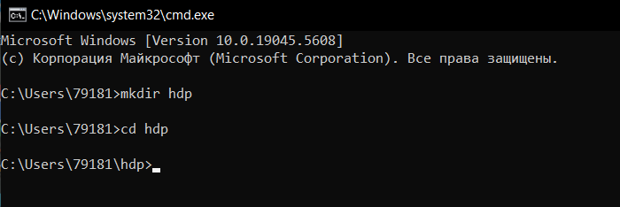
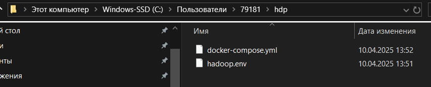
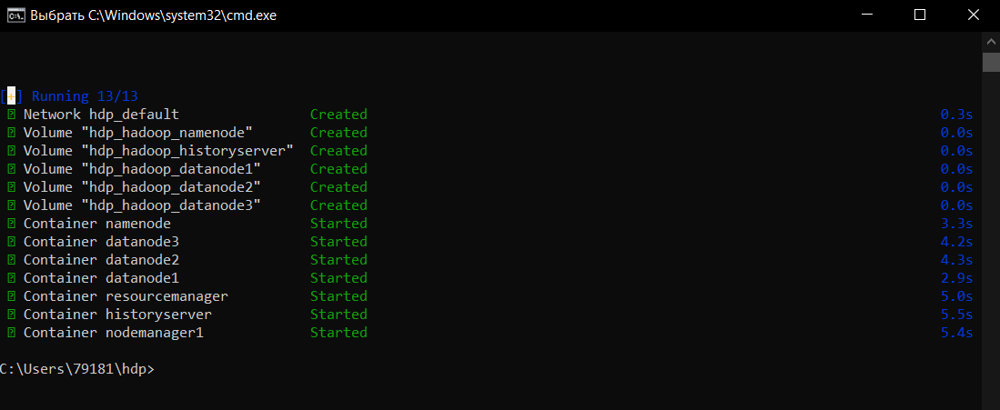
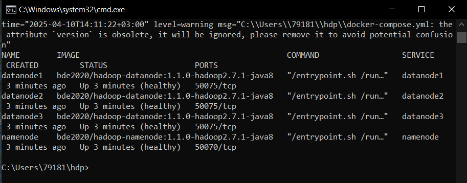
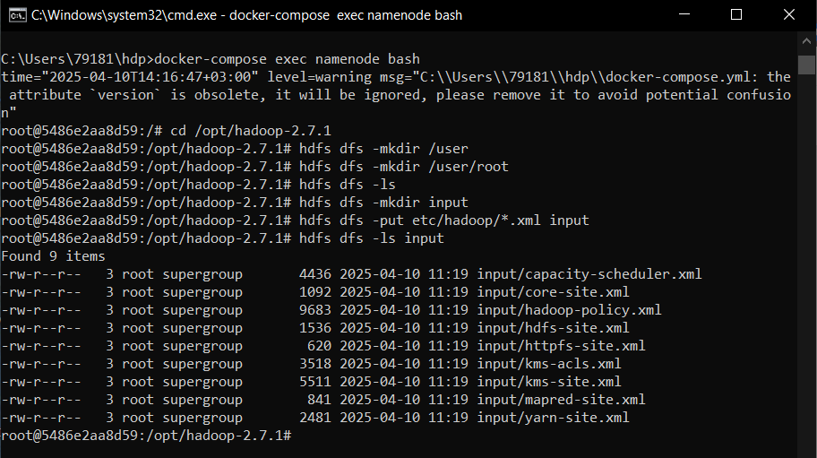
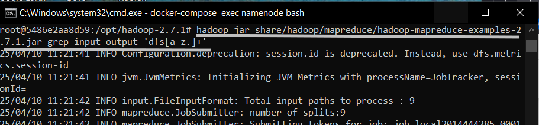
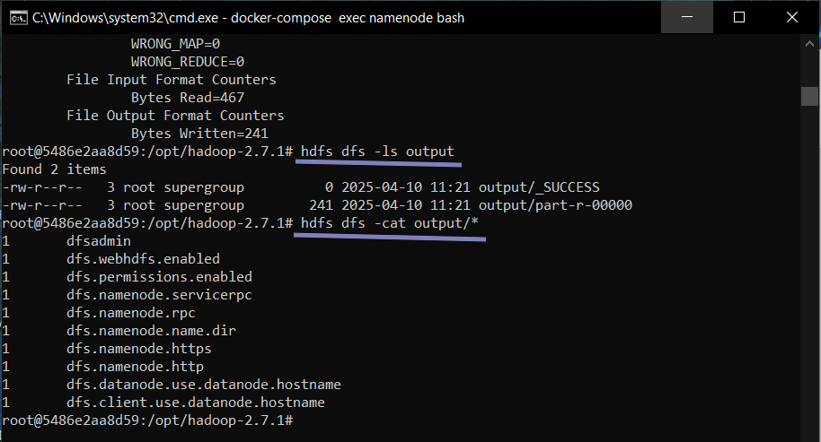
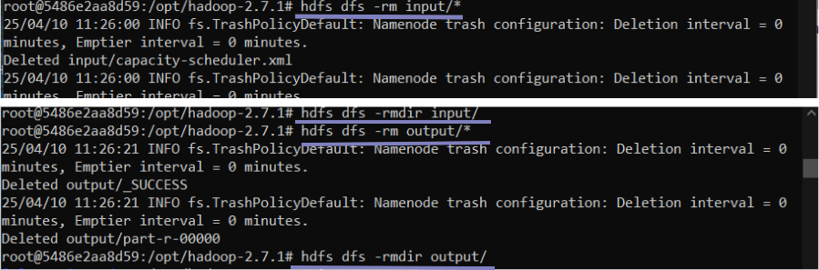
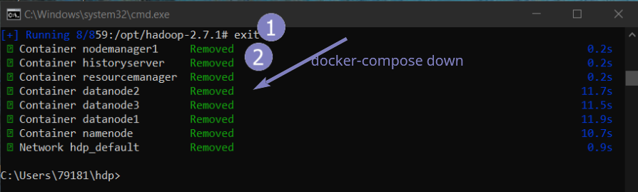

# Компоненты и архитектурные особенности кластера Hadoop

Hadoop лучше всего подходит:

Для хранения и обработки неструктурированных данных объемом от одного терабайта — такие массивы сложно и дорого хранить в локальном хранилище.
Для компонуемых вычислений — когда нужно собрать множество схожих разрозненных данных в одно целое. Также подходит для выделения полезной информации из массива лишней.
Для пакетной обработки, обогащения данных и ETL — извлечения информации из внешних источников, ее переработки и очистки под потребности компании, последующей загрузки в базу данных.
## Упражнение - Введение в Hadoop (локально на вашем ПК)

1. Установите Hadoop через Docker Compose.
2. Ознакомьтесь с компонентами Hadoop, запустив примеры задач MapReduce.

Это упражнение поможет вам настроить кластер Hadoop с помощью Docker Compose и запустить примеры задач MapReduce.

### Решение

1. Папка для примера и переменные окружения: 
Создайте папку hdp и перейдите в нее (cmd)

 - `mkdir hdp`
 - `cd hdp`

 
Создайте файл переменного окружения [hadoop.env](./files/hadoop.env)  
2. Создайте файл [docker-compose.yml](./files/docker-compose.yml ) 
 
Запускаю Docker desktop 

3. Запуск кластера Hadoop:
в директории с файлом docker-compose.yml и выполните команду:

`docker-compose up -d` 
Эта команда запустит кластер Hadoop в фоновом режиме.
 
4. Проверка работоспособности:
Проверьте, что все контейнеры запущены и работают:

`docker-compose ps` 
Вы должны увидеть запущенныe контейнера.
 
5. Запуск примера задачи MapReduce: 
5.1. Подключитесь к контейнеру namenode: 
`docker-compose exec namenode bash` 
`cd /opt/hadoop-2.7.1` 
`hdfs dfs -mkdir /user` 
`hdfs dfs -mkdir /user/root` 
`hdfs dfs -ls /` 
5.2. Создайте директории в HDFS: 
`hdfs dfs -mkdir input` 
5.3. Скопируйте пример данных в HDFS: 
`hdfs dfs -put etc/hadoop/*.xml input` 
`hdfs dfs -ls input` 
 
5.4. Запустите пример задачи: 
`hadoop jar share/hadoop/mapreduce/hadoop-mapreduce-examples-2.7.1.jar grep input output 'dfs[a-z.]+'` 
 
5.5. Просмотрите результаты: 
`hdfs dfs -ls output` 
`hdfs dfs -cat output/*` 
 

(можно также удалить файлы и папки)
`hdfs dfs -rm input/* ` 
`hdfs dfs -rmdir input/` 
`hdfs dfs -rm output/*` 
`hdfs dfs -rmdir output/` 
 
6. Остановка кластера Hadoop: 
`exit` 
`docker-compose down` 
 
данные останутся в volumes (Docker) и будут видны при создании нового кластера