## HDFS
### Упражнение - HDFS (Hadoop Distributed File System)

### РЕШЕНИЕ 
#### ШАГ 0
```
Клонируем каталог из репозитория гит
git clone https://github.com/big-data-europe/docker-hadoop.git
Запускаем контейнеры
cd docker-hadoop
docker-compose up -d
docker-compose ps
```
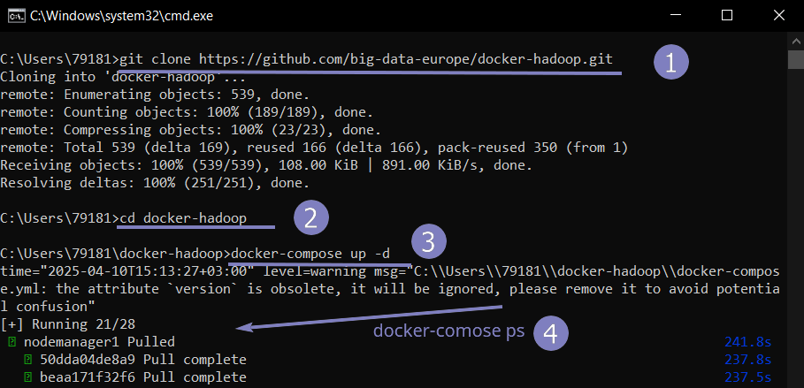<br>

http://localhost:9870/dfshealth.html
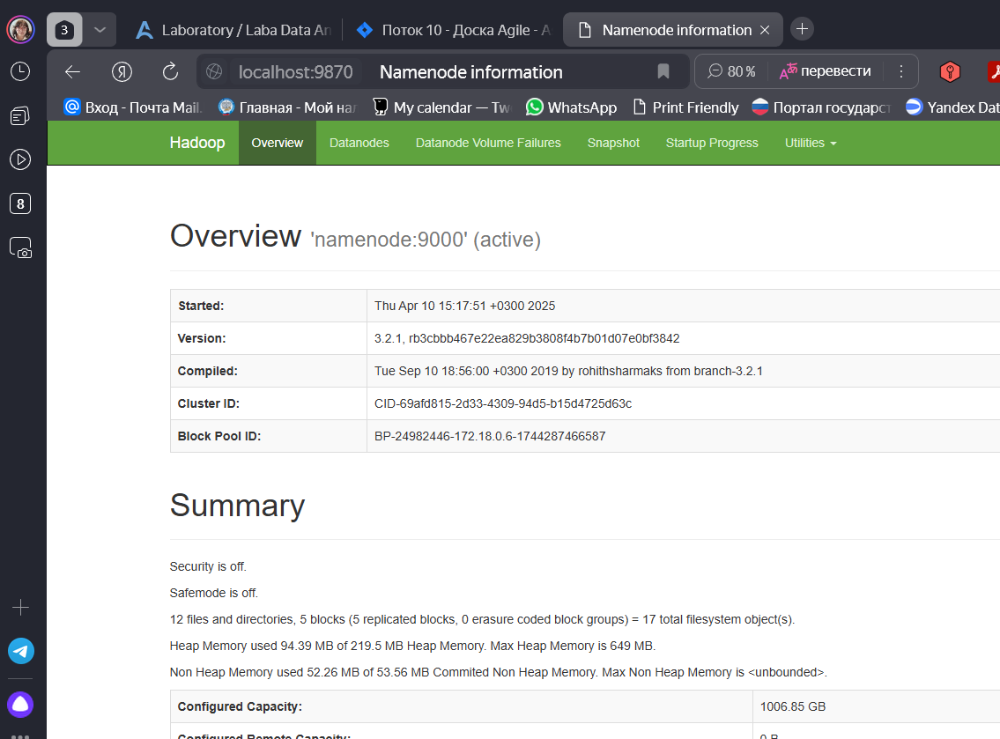<br>
`docker exec -it namenode bash`

Проверим, работает ли UI. Переходим по UI - http://localhost:9870/ 

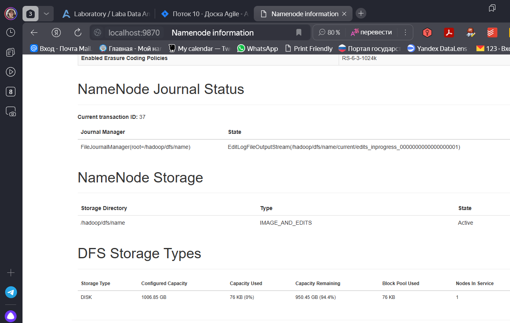<br>
#### ШАГ 1 Создание директории в HDFS<br>
В терминале выполним команду для создания директории: 
```
hdfs dfs -mkdir /user/your_username/my_directory
root@fd357c833a94:/# hdfs dfs -mkdir /user
root@fd357c833a94:/# hdfs dfs -mkdir /user/brykovskaya
root@fd357c833a94:/# hdfs dfs -mkdir /user/brykovskaya/my_directory

brykovskaya - имя пользователя в Hadoop.
```
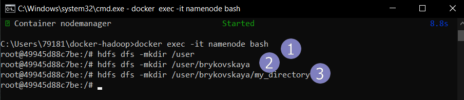<br>

#### ШАГ 2: Создание файла в HDFS
Создадим локальный файл test_file.txt

`echo "This is a test file.Brykovskaya" > test_file.txt`

посмотрим на файл

`cat test_file.txt`

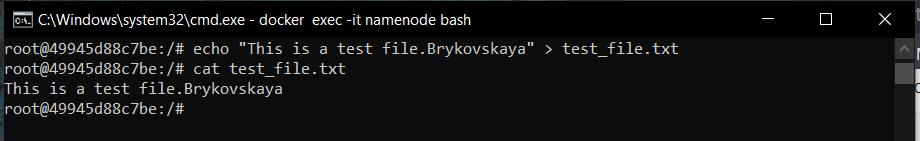<br>

Загрузим этот файл в HDFS: 

`hdfs dfs -put test_file.txt /user/brykovskaya/my_directory/`

просмотр содержимого файла в HDFS

`hdfs dfs -text /user/brykovskaya/my_directory/test_file.txt`

`hdfs dfs -cat /user/brykovskaya/my_directory/test_file.txt`

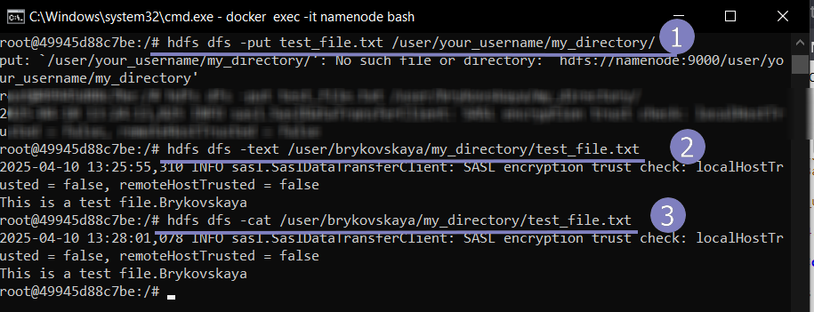<br>

#### ШАГ 3  Просмотр информации о блоках файла и их расположении
Теперь мы можем просмотреть информацию о блоках файла и их расположении с помощью команды fsck: 

`hdfs fsck /user/brykovskaya/my_directory/test_file.txt -files -blocks -locations`

Эта команда:<br>
 - `fsck`: Проверяет целостность файловой системы HDFS.<br>
 - `-files`: Показывает информацию о файлах.<br>
 - `-blocks`: Показывает информацию о блоках.<br>
 - `-locations`: Показывает расположение блоков на узлах.<br>

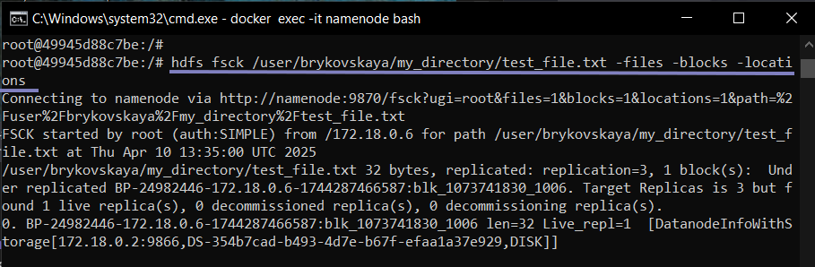<br>
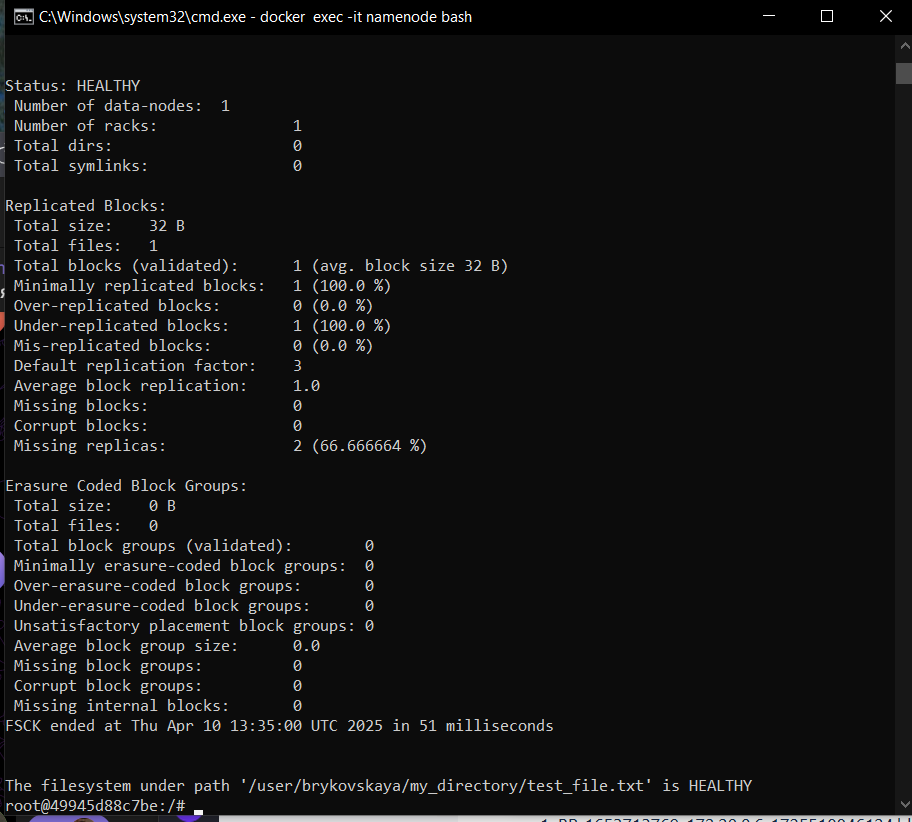<br>

#### ШАГ 4 : Изменение фактора репликации для файла
Для изменения фактора репликации используем следующую команду: 

`hdfs dfs -setrep -w 1 /user/brykovskaya/my_directory/test_file.txt`

Здесь:
 - `-setrep`: Команда для изменения фактора репликации.<br>
 - `-w`: Ожидание завершения операции.<br>
 - `1`: Указывает новый фактор репликации (в данном случае 1 копии файла).<br>

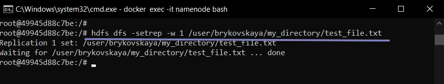<br>
#### ШАГ 5 : Проверка изменения фактора репликации
После изменения фактора репликации снова просмотрим информацию о блоках файла:
` hdfs fsck /user/brykovskaya/my_directory/test_file.txt -files -blocks -locations`
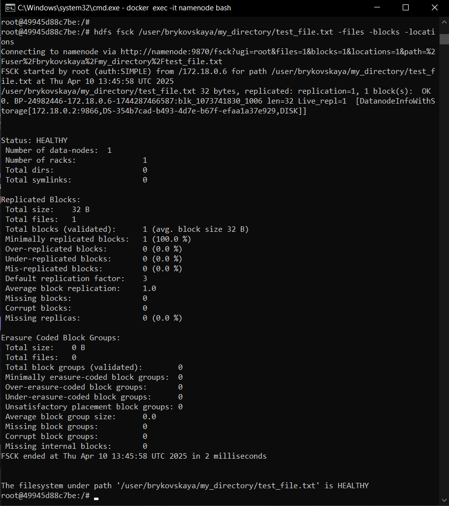<br>

## Упражнение: Настройка политик хранения в HDFS
Это упражнение поможет вам научиться создавать, просматривать и применять политики хранения данных в HDFS.

Предпосылки:

Рабочий кластер Hadoop (Упражнение - HDFS (Hadoop Distributed File System)):
-У вас должен быть доступ к кластеру Hadoop, либо локально установленному, либо в облаке.

Права администратора: Для выполнения некоторых команд могут потребоваться права администратора HDFS.

## РЕШЕНИЕ 
**Шаги:**

**Просмотр доступных политик хранения:**

Подключимся к узлу NameNode ранее созданного (в прошлом упр) кластера Hadoop. 

**Выполним следующую команду:**

`hdfs storagepolicies -listPolicies`

По умолчанию мы должны увидеть следующие политики:
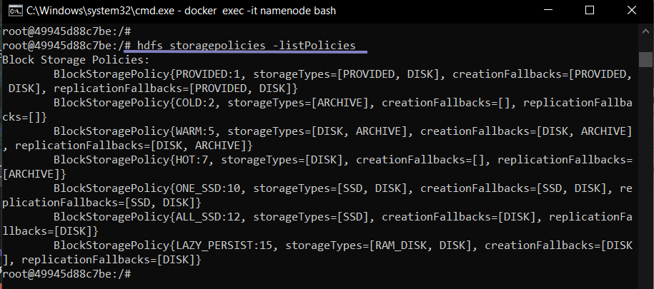<br>

**Создание политики хранения:**
```
hdfs dfs -mkdir /storage/
hdfs dfs -mkdir /storage/Hot
hdfs dfs -mkdir /storage/Cold
hdfs dfs -mkdir /storage/Warm
посмотрим на созданнные папки
hdfs dfs -ls /storage
```
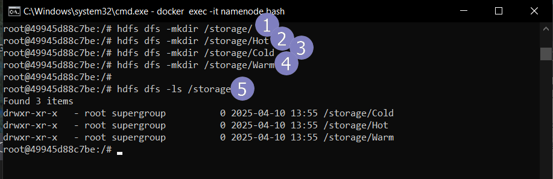<br>

**установим политику хранения для директорий** 
```
hdfs storagepolicies -setStoragePolicy -path /storage/Hot -policy Hot
hdfs storagepolicies -setStoragePolicy -path /storage/Warm -policy Warm
hdfs storagepolicies -setStoragePolicy -path /storage/Cold -policy Cold
```

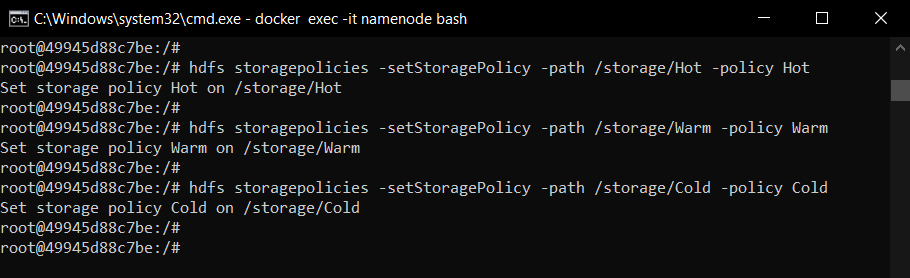<br>
**Посмотрим политик хранения:**
```
hdfs storagepolicies -getStoragePolicy -path /storage/Hot
hdfs storagepolicies -getStoragePolicy -path /storage/Cold
hdfs storagepolicies -getStoragePolicy -path /storage/Warm
```
**Теперь мы должны увидеть:**<br>
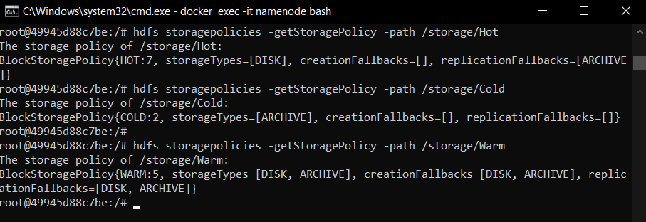<br>

**Просмотр политики хранения по умолчанию:**<br>

`hdfs dfs -mkdir /deafult`

поместим ранее созданный файл в папку deafult

`hdfs dfs -put test_file.txt /deafult/`

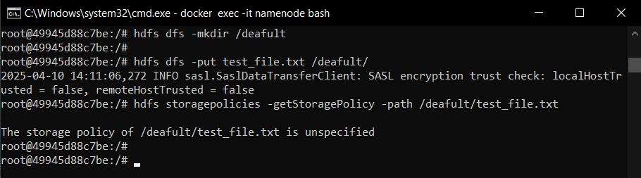<br>

### Дополнительные задания:

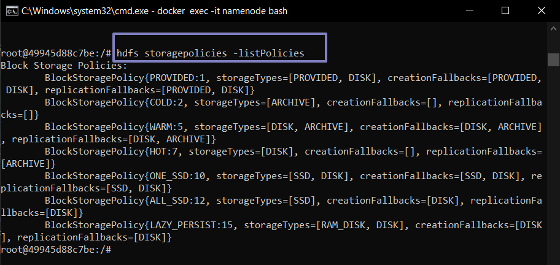<br>

**Создание новой директории и назначение политики**
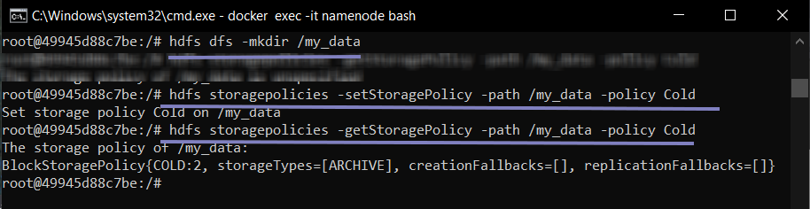<br>

**Изучите команду hdfs dfsadmin -report для просмотра информации о хранилищах HDFS.**

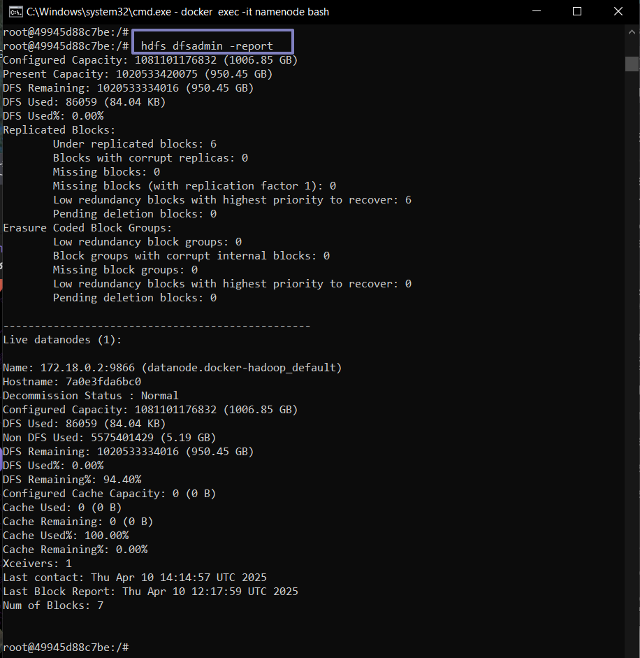<br>

**Узнайте, как настроить автоматическое перемещение данных между уровнями хранения (tiering) в HDFS.**

Чтобы данные автоматически перемещались в соответствии с их давностью (например, старые файлы переходят на HDD), нужно настроить датчики (schedulers) в hdfs-site.xml.
```
<property>
<name>dfs.mover.enabled</name>  <!--Включает автоматическое перемещение -->
<value>true</value>
</property>

<property>
<name>dfs.mover.interval</name>
<value>600</value>  <!-- Перемещение каждые 10 минут (600 сек) -->
</property>    
```