## 🙃 Apache Hive
### Упражнение - Apache Hive 
Задача: Создайте таблицу для хранения информации о студентах, загрузите данные, а затем выполните несколько запросов для анализа.

На этом этапе установим `bigdata миникластер`
•	Первые три команды загружают в выбранную директорию три Git-репозитория с файлами docker-compose.yml. Каждый репозиторий - это будущий Docker-образ Big Data-решения от Apache, который развернём.<br>
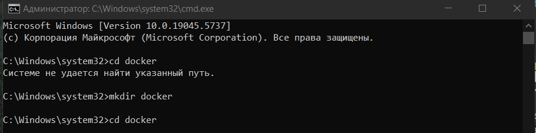<br>
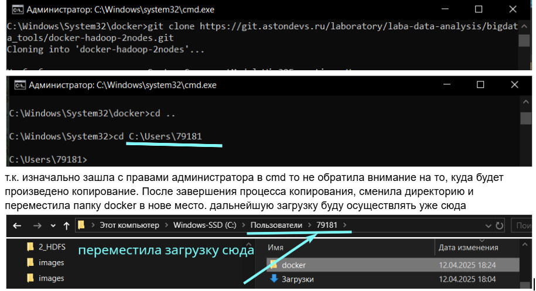<br>
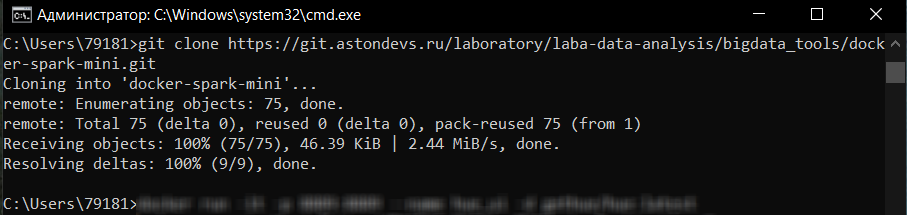<br>
Запускаю Docker Desktop
и после `docker run -it -p 8889:8889 --name hue_ui -d gethue/hue:latest`
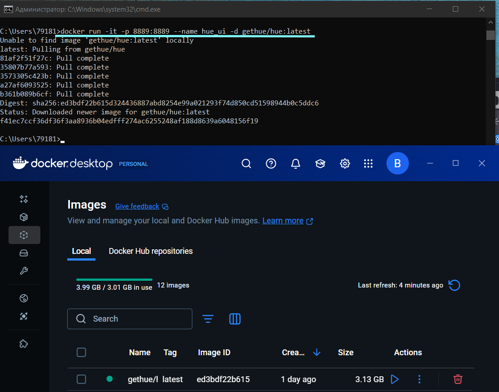<br>

Используем команду `docker-compose up -d` для развёртывания приложений на сервере. Команда Docker Compose позволяет запускать все сервисы в фоновом режиме.  При использовании этой опции команда завершится сразу после запуска контейнеров, и они будут работать в фоновом режиме.  
Сперва перейду в папку docker-hadoop-2nodes 
 - cd docker-hadoop-2nodes
 - docker-compose up -d<br>

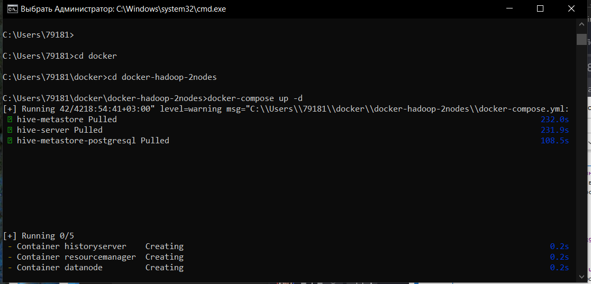<br>
затем в папку docker-spark-mini
 - cd ..
 - cd docker-spark-mini
 - docker-compose up -d<br>
 
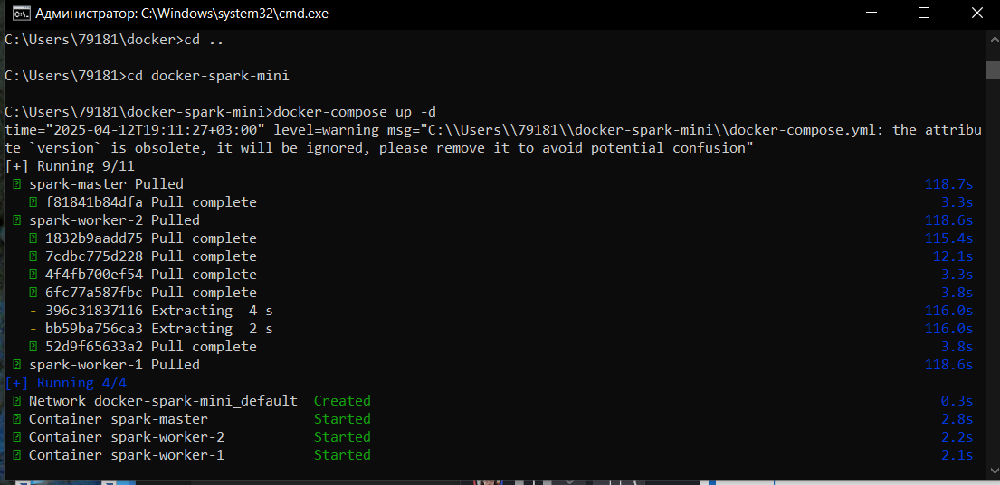<br>

чтобы проверить работоспособность сердца BigData-семейства Hadoop, введите в браузере адрес http://localhost:9870/ и перед вами откроется главная страница сервера Apache Hadoop:
И если у вас запущен Spark с Hive, это говорит о том, что необходимые нам инструменты успешно установлены и запущены.

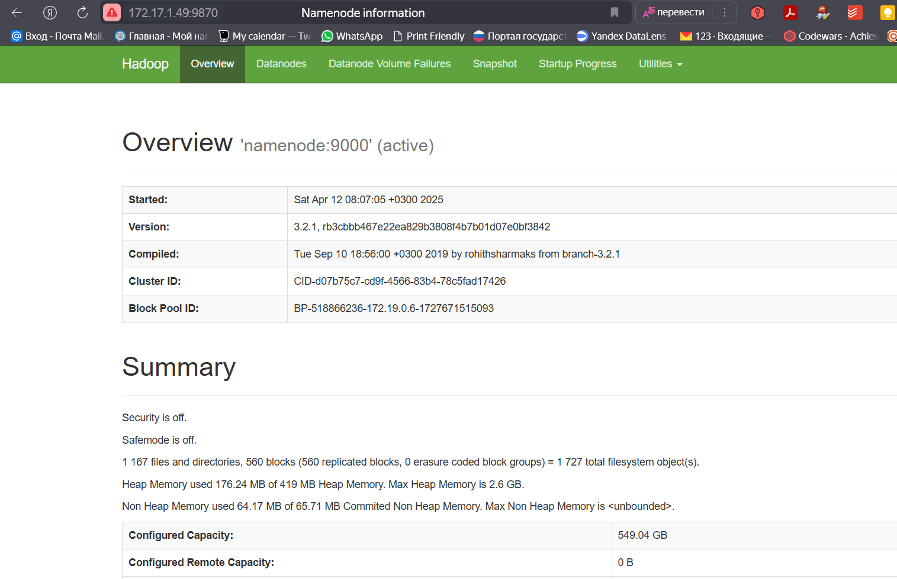<br>

http://172.17.1.49:10002/

http://172.17.1.49:8088/cluster


http://localhost:8889/hue/editor?type=hive

<br>
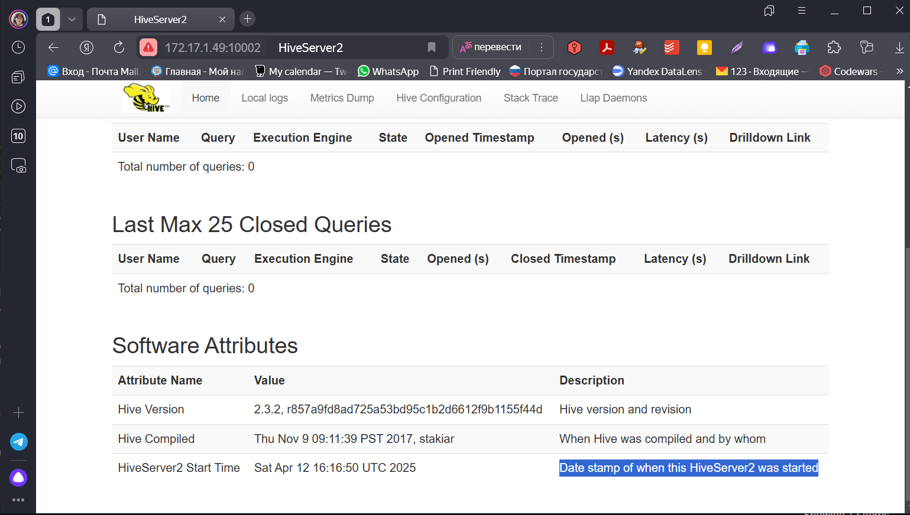<br>

http://localhost:8089/cluster

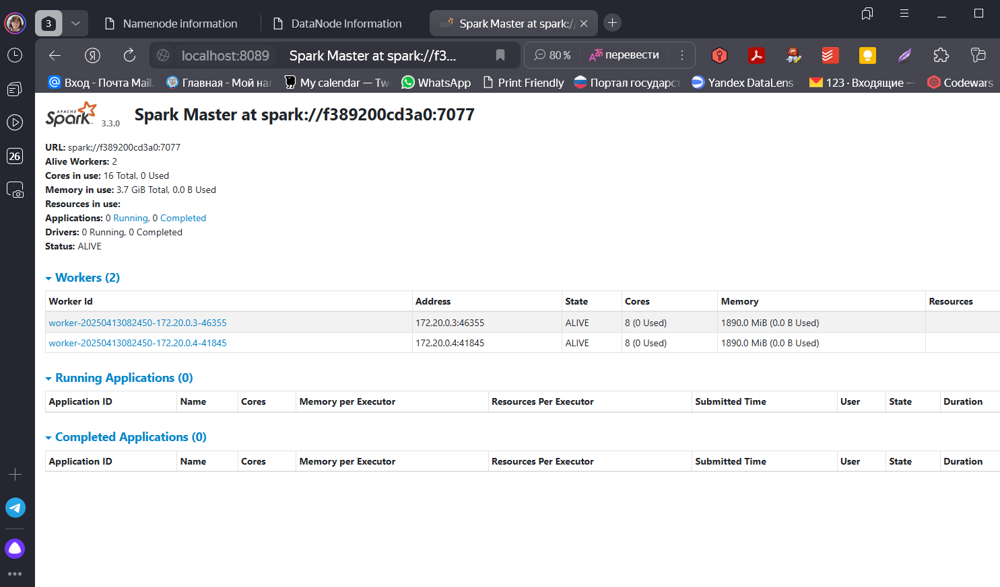<br>

### Упражнение - Apache Hive 
Задача: Создайте таблицу для хранения информации о студентах, загрузите данные, а затем выполните несколько запросов для анализа.

Файл должен быть загружен в HDFS, не лежать локально.
Пример загрузки: hdfs dfs -put ~/students_data.csv /user/hive/warehouse/

Выгружаю в hive данные из другой командной строки:
```
C:\Users\79181\docker\bigdata>docker cp students_data.csv hive-server:/tmp/students.csv
C:\Users\79181\docker\bigdata>docker exec -it hive-server /bin/bash
```
Запуск hive, создание таблицы
```
beeline -u jdbc:hive2://localhost:10000
CREATE TABLE students (

student_id INT,
name STRING,
age INT,
major STRING,
enrollment_date DATE)
ROW FORMAT DELIMITED
FIELDS TERMINATED BY ','
STORED AS TEXTFILE;
```
Загрузка данных, запросы.
```
LOAD DATA INPATH '/user/hive/warehouse/students.csv' INTO TABLE students;
SELECT * FROM students LIMIT 10;
```
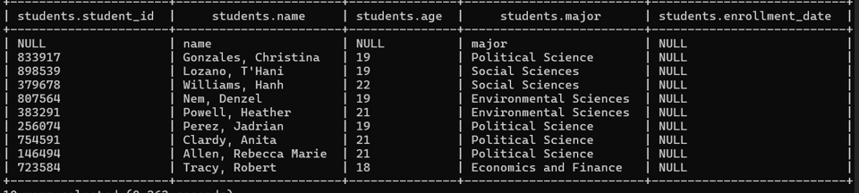<br>

```
Найдите количество студентов по специальностям.
SELECT major, COUNT(*) as total_students
FROM students
GROUP BY major;
```

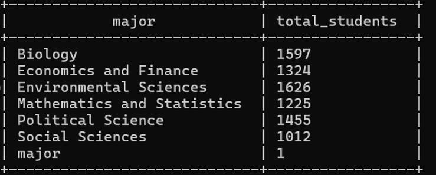<br>

```
Найдите средний возраст студентов.
SELECT AVG(age) as average_age
FROM students;
```

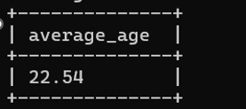<br>