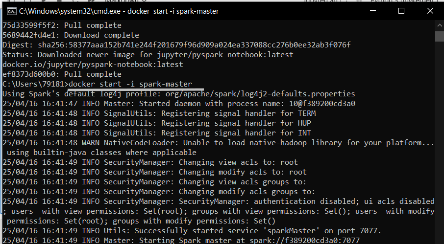
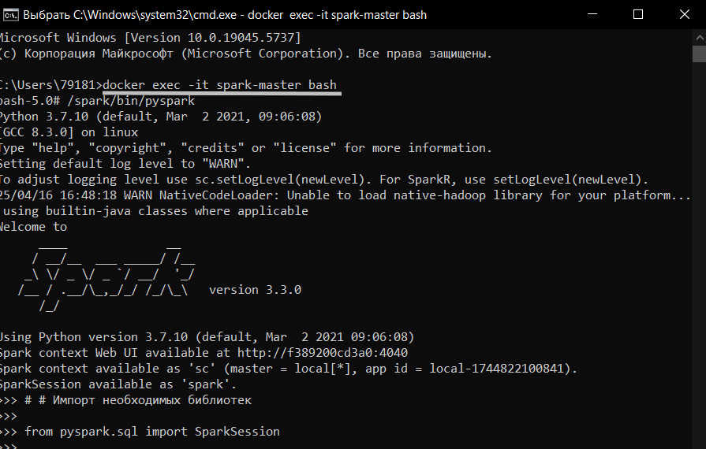
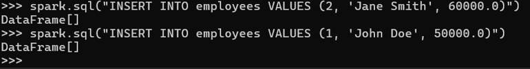
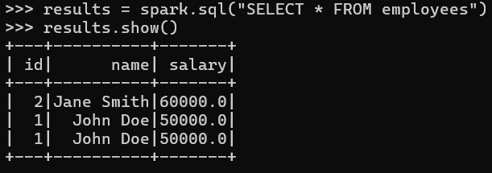

## Spark с Hadoop и работа с большими данными
### Упр. -  Полный пример в Jupyter Notebook
Вот полный пример кода, который можно использовать в Jupyter Notebook:
```
# Импорт необходимых библиотек
from pyspark.sql import SparkSession
# Создание SparkSession
spark = SparkSession.builder \
    .appName("Spark SQL with Hive") \
    .config("spark.sql.warehouse.dir", "/user/hive/warehouse") \
    .enableHiveSupport() \
    .getOrCreate()
# Создание таблицы
spark.sql("""
CREATE TABLE IF NOT EXISTS employees (
    id INT,
    name STRING,
    salary FLOAT
) USING hive
""")

# Вставка данных
spark.sql("INSERT INTO employees VALUES (1, 'John Doe', 50000.0)")
spark.sql("INSERT INTO employees VALUES (2, 'Jane Smith', 60000.0)")

# Запрос данных
results = spark.sql("SELECT * FROM employees")

# Вывод результатов
results.show()

# Завершение работы

spark.stop()
```

с этим кодом из примера возникли проблемы.

```
Сначала установим Spark контейнер.
В консоли необходимо запустить последовательно:
docker pull jupyter/pyspark-notebook
docker start -i spark-master
И откроется сессия Spark.
```

<br>

В другом окне консоли 
docker exec -it spark-master bash
/spark/bin/pyspark

<br>
```
# # Импорт необходимых библиотек

from pyspark.sql import SparkSession

# Создание SparkSession

spark = SparkSession.builder \
    .appName("Spark SQL with Hive") \
    .config("spark.sql.warehouse.dir", "/docker/hive/warehouse") \
    .enableHiveSupport() \
    .getOrCreate()

# Создание таблицы

spark.sql("""
CREATE TABLE IF NOT EXISTS employees (
    id INT,
    name STRING,
    salary FLOAT
) USING hive
""")
# Вставка данных
spark.sql("INSERT INTO employees VALUES (1, 'John Doe', 50000.0)")
spark.sql("INSERT INTO employees VALUES (2, 'Jane Smith', 60000.0)")
```
<br>

```
# Запрос данных
results = spark.sql("SELECT * FROM employees")

# Вывод результатов
results.show()
```
<br>

# Вставка данных
spark.sql("INSERT INTO employees VALUES (1, 'John Doe', 50000.0)")
spark.sql("INSERT INTO employees VALUES (2, 'Jane Smith', 60000.0)")

<br>
```
# Завершение работы
spark.stop()
```

<br>

Примечания:

Hive и Spark должны быть настроены: Убедитесь, что Hive и Spark правильно настроены и могут взаимодействовать друг с другом. Вам также может понадобиться настроить переменные окружения, такие как HADOOP_HOME и SPARK_HOME.

Проверьте доступ к Hive: Убедитесь, что ваш Spark имеет доступ к метаданным Hive. Это может потребовать настройки hive-site.xml внутри вашего Spark проекта.

Интеграция с Jupyter: Для работы с Jupyter Notebook убедитесь, что у вас установлен Jupyter и он правильно настроен для работы с Python.
Запуск Jupyter Notebook: Для запуска Jupyter Notebook используйте команду:

      jupyter notebook