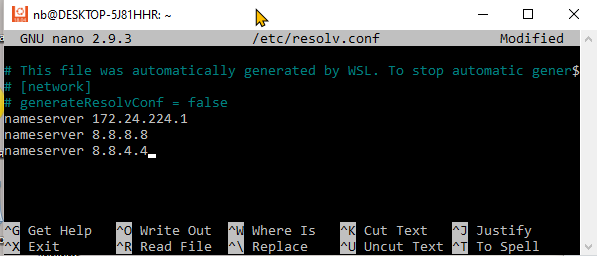
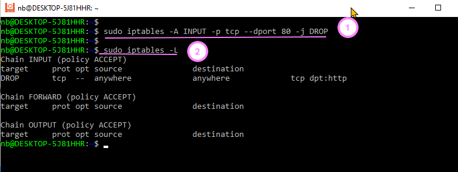
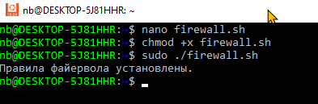
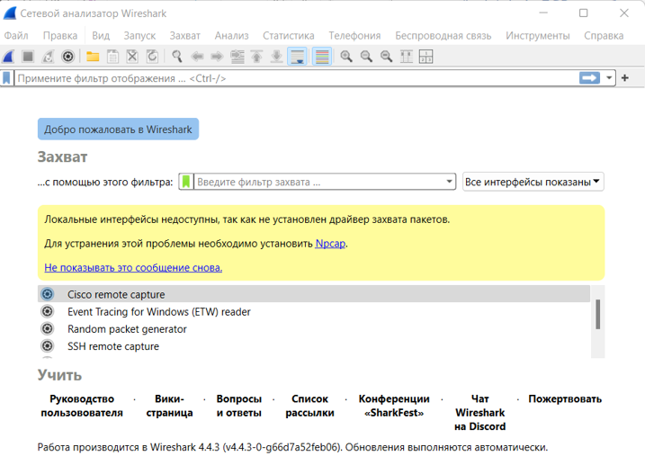

# Сетевые основы в Linux
## Практика - Понимание IP-адресов и портов

#### Найдите свой IP-адрес в локальной сети.
 

#### Определите, какие порты использует ваш браузер при просмотре веб-страниц.
 
#### Преобразуйте доменное имя сайта vk.com в IP-адрес.
 

#### Используя команду nc, отправьте сообщение на определенный порт -
 

## Практика - Основные сетевые утилиты

#### Проверьте доступность своего домашнего роутера.
адрес роутера может быть 192.168.0.1 или 192.168.1.1.   
 

 
#### Используйте traceroute, чтобы увидеть маршрут до сервера в другой стране.
 
#### С помощью nslookup найдите IP-адрес почтового сервера mail.ru.
 
#### Используйте tcpdump для захвата и анализа DNS-трафика (требует root-прав!).
 
 

#### Напишите скрипт, который будет проверять доступность определенного сайта каждые 5 минут.
 
 

## Практика - Имя хоста и DNS

#### Узнайте имя хоста своего компьютера.
 
#### Измените имя хоста на временное (без перезагрузки).
 
#### Узнайте, какие DNS-серверы использует ваша система.
 

 
#### Настройте использование публичного DNS-сервера (например, Google Public DNS).

Для контейнера с ubuntu, изменить файл resolv.conf в нано, добавив туда адреса гугловских DNS.

Google Public DNS — публичные DNS-серверы Google:  
8.8.8.8  
8.8.4.4  

 
 

# Основы работы с Firewall
Firewall (межсетевой экран): Система, контролирующая входящий и исходящий сетевой трафик.

iptables/nftables: Утилиты для управления правилами файервола в Linux.

Цепочки: Наборы правил, применяемые к трафику.
Правила: Инструкции, определяющие, что делать с трафиком (разрешить, отклонить, изменить).
## Практика - Основы работы с Firewall 
(выполнять на своем хосте а не в контейнере)

Установка WSL2 в Windows 10 (lumpics.ru)

Примеры:
-Просмотр текущих правил iptables: iptables -L

-Блокировка входящего трафика на порт 80: iptables -A INPUT -p tcp --dport 80 -j DROP (требует root-прав!)

-Разрешение исходящего трафика на порт 443: iptables -A OUTPUT -p tcp --dport 443 -j ACCEPT (требует root-прав!)

### Упражнения:
#### Изучите основные команды iptables или nftables.
`iptables и nftables` — это утилиты для настройки и управления сетевыми фильтрами на Linux, обеспечивающие фильтрацию пакетов и управление доступом в сети. 

Они позволяют создавать правила для блокировки, перенаправления, модификации трафика и т. д. 

Разница между ними заключается в том, что `nftables` — это более современная система, которая была введена в ядре Linux 3.13 в 2014 году и является заменой `iptables`.
 

#### Заблокируйте доступ к определенному порту на своем компьютере.
 

#### Разрешите доступ к определенному порту только с определенного IP-адреса.
 
#### Создайте простой скрипт для настройки базовых правил файервола.
набираю скрипт 
 
Вставляю его при помощи nano firewall.sh
 
и даю права командой chmod +x firewall.sh.  
Запускаю скрипт:sudo ./firewall.sh 
 
 
все входящие соединения по умолчанию блокируются, за исключением SSH, HTTP и HTTPS, все исходящие соединения разрешены.

## Практика - Дополнительные возможности
Примеры:
-Создание SSH-туннеля: ssh -L 8080:localhost:80 user@remote-host

-Загрузка файла через прокси-сервер: curl -x http://proxy-server:port http://example.com/file.txt

### Упражнения:
#### Изучите основные принципы работы VPN и SSH-туннелей.
#### VPN (Virtual Private Network)
**VPN** — это технология, которая создает зашифрованное соединение (туннель) между вашим устройством и удаленным сервером через интернет. Это позволяет безопасно передавать данные, скрывая их от третьих сторон.

**Основные типы VPN:**
 - PPTP (Point-to-Point Tunneling Protocol) — устаревший и менее безопасный.
 - L2TP (Layer 2 Tunneling Protocol) — более безопасен, но в связке с IPsec.
 - OpenVPN — более современный и широко используемый протокол с хорошей безопасностью.
 - WireGuard — новый и эффективный протокол для VPN-соединений.

VPN позволяет:

 - Скрывать ваш реальный IP-адрес.
 - Шифровать интернет-трафик, предотвращая его перехват.
 - Обходить блокировки контента.

**SSH-туннель**
SSH-туннель позволяет создать защищенный канал между вашим устройством и удаленным сервером для безопасной передачи данных через небезопасные сети. Он использует SSH-протокол (Secure Shell), который обеспечивает безопасность за счет шифрования.

Пример SSH-туннеля:

ssh -L 8080:localhost:80 user@remote-host

Эта команда создает туннель, который перенаправляет локальный порт 8080 на порт 80 удаленного хоста через защищенное SSH-соединение.
#### Настройте прокси-сервер на своем компьютере.
 
#### Попробуйте использовать сетевой анализатор (Wireshark) для изучения трафика.
 
 
 
#### Напишите скрипт, 
который будет выполнять ping до определенного сервера и отправлять уведомление при недоступности.
 
