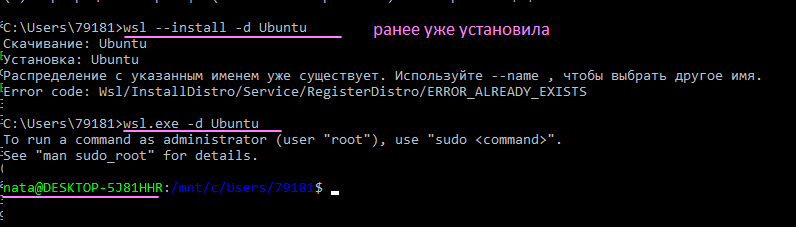
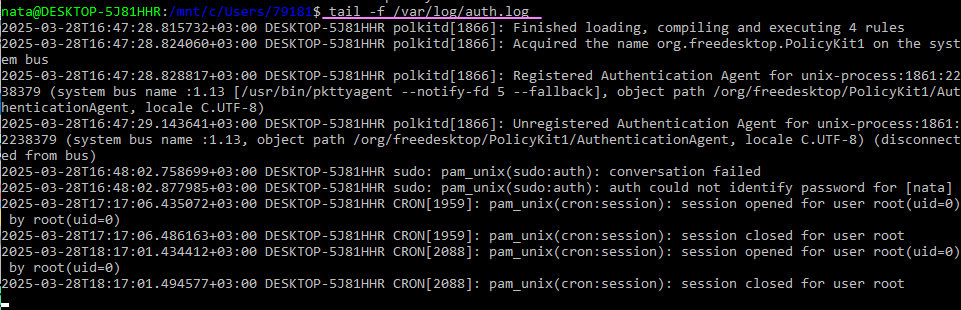
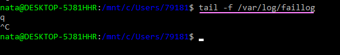
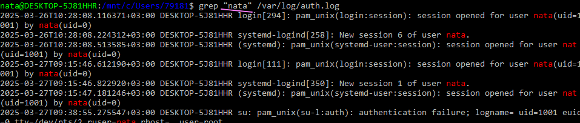
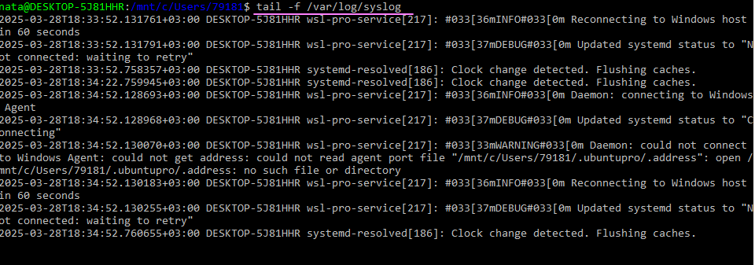
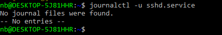
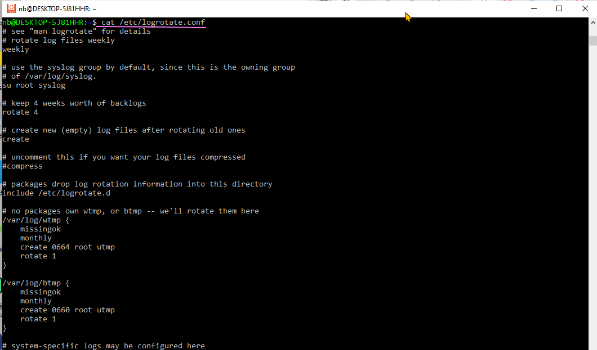
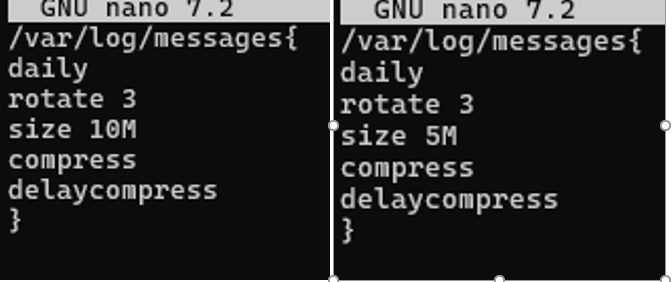
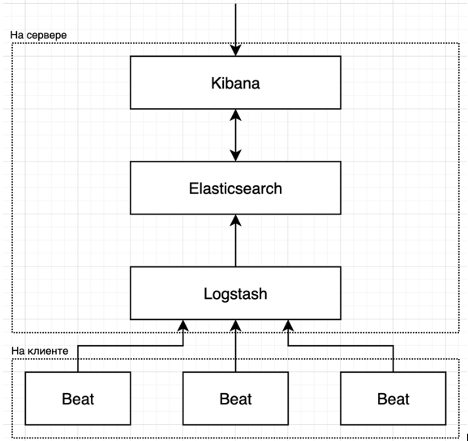

# Логирование и мониторинг в Linux
Установка WSL
 

## Практика - Что такое логи и зачем они нужны?
### Упражнения:
####  Найдите и откройте файл логов вашего контейнера Linux, содержащий сообщения об успешных входах в систему.
 
####  Найдите и откройте файл логов, содержащий информацию об ошибках загрузки системы.
 

## Практика - Стандартные расположения логов
####  Найдите и просмотрите файлы логов для сервисов SSH и PostgreSQL на вашем хосте.
Для поиска и просмотра файлов логов сервисов SSH и PostgreSQL на хосте можно использовать разные методы в зависимости от операционной системы и способа установки сервисов. 

Логи SSH на сервере с CentOS находятся в файле /var/log/secure. Чтобы открыть этот файл, нужно выполнить команду: `sudo nano /var/log/secure`. Затем можно использовать следующие команды для просмотра логов:

 - Чтобы получить из файла только неудачные попытки подключений по SSH, нужно ввести: grep -a "Failed password" /var/log/secure.  
 - Чтобы вывести логи только SSH-подключений, нужно ввести: grep -a “sshd” /var/log/secure.   
 - Чтобы посмотреть логи подключений конкретного пользователя, нужно ввести: grep -a “username” /var/log/secure, где вместо username нужно указать имя пользователя.   
 
Для поиска логов PostgreSQL можно использовать следующие методы:  

 - Найти расположение логов в файле конфигурации PostgreSQL (postgresql.conf). По умолчанию логи хранятся в подкаталоге pg_log каталога данных.    
 - Посмотреть логи напрямую в каталоге pg_log. Обычно файлы логов имеют название postgresql-<дата>.log, где <дата> — дата создания лога.   
 - Использовать графический инструмент pgAdmin. Нужно открыть pgAdmin, выбрать сервер в браузере объектов, нажать на него правой кнопкой мыши и выбрать «Свойства». В окне свойств будет вкладка «Log» с указанием местоположения лог-файла и возможностями его просмотра и загрузки.   
 - Использовать инструмент командной строки psql. Для доступа к логам нужно использовать каталог pg_log. 
 
Важно учитывать, что для доступа к лог-файлам могут потребоваться достаточные разрешения, особенно при работе с ними через командную строку или другие инструменты.   
## Практика - Просмотр логов с помощью консольных утилит 
#### Используйте grep, чтобы найти все вхождения вашего имени пользователя в файле /var/log/auth.log.
 
#### Используйте tail -f /var/log/messages, чтобы следить за системными логами в реальном времени.
Messages в ubutu нет, есть только syslog:  
 

#### Используйте journalctl, чтобы найти сообщения о последнем запуске сервиса network manager.

 

## Практика - Ротация логов

### Упражнения:
#### Изучите конфигурационный файл logrotate для сервиса SSH.
 
#### Измените конфигурацию logrotate, чтобы хранить логи дольше или короче.
 
#### Создайте свою собственную конфигурацию logrotate для определенного файла лога.
Чтобы создать собственную конфигурацию logrotate для определённого файла лога, нужно использовать директивы, которые определяют, что и когда нужно делать. Некоторые из них:

 - rotate. Указывает, сколько старых логов нужно хранить. 
 - create. Указывает, что необходимо создать пустой лог-файл после перемещения старого. 
 - dateext. Добавляет дату ротации перед заголовком старого лога. 
 - compress. Указывает, что лог необходимо сжимать. 
 - delaycompress. Не сжимает последний и предпоследний журнал. 

Пример конфигурации: 

`/var/log/messages { daily rotate 3 size 10M compress delaycompress } `

Эти настройки означают, что ротация журналов будет выполняться ежедневно, будут храниться три последних журнала, более старые копии будут автоматически удаляться. Минимальный размер для ротации — 10 мегабайт, ротация не будет выполнена, если лог не занимает более 10 мегабайт. Будет использоваться сжатие для всех журналов, кроме последнего и предпоследнего. 

Для настройки можно использовать отдельные файлы, расположенные по пути /etc/logrotate.d/ (во FreeBSD — /usr/local/etc/logrotate.d/). 

Чтобы конфигурационные файлы из этой папки загружались программой, необходимо добавить в основной конфигурационный файл строчку: vi /etc/logrotate.conf include /etc/logrotate.d.

## Практика - Централизованное логирование

### Упражнения:
#### Исследуйте возможности rsyslog для централизованного логирования.
Rsyslog позволяет настроить отправку логов для определенного приложения на централизованный сервер. Это может значительно упростить процесс контроля за событиями на компьютерах в сети. Его настройка на различных системах на базе Linux, практически, не отличается.
#### Попробуйте настроить тестовую среду на предоставленных контейнерах с использованием ELK (Elasticsearch, Logstash, Kibana) для централизованного логирования.
 