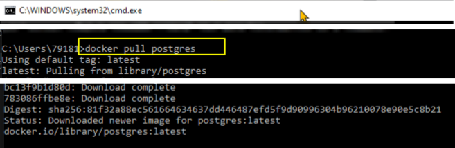
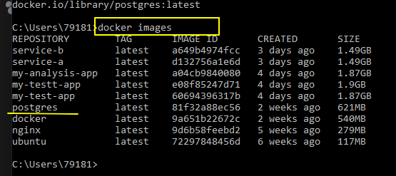
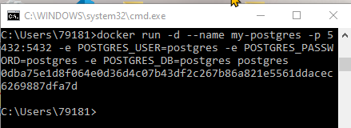
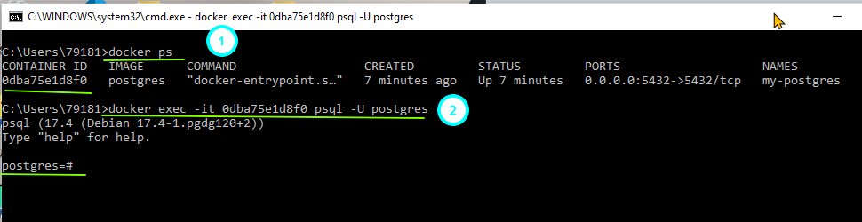
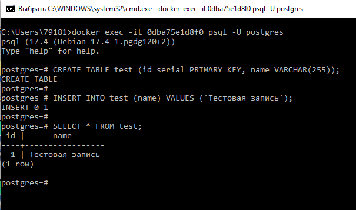
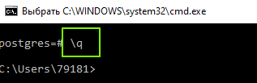
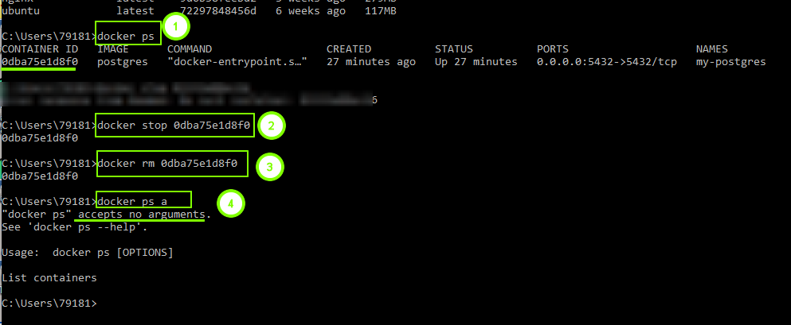
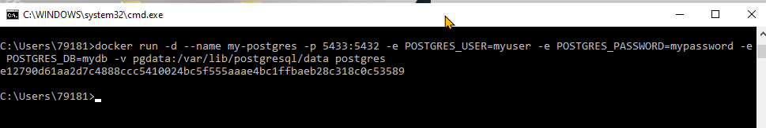
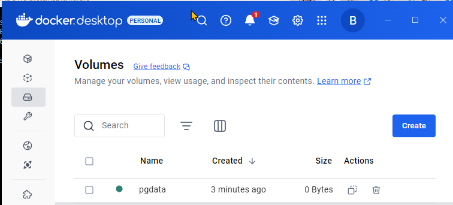

# PostgreSQL в контейнере

## Упр - Скачать образ PostgreSQL

- Чтобы скачать образ PostgreSQL для Docker, выполните следующую команду в вашем терминале:  
  `docker pull postgres`  
Это скачает последний образ PostgreSQL с тегом latest.

<br>
- После завершения загрузки вы можете проверить наличие образа локально `docker images`

<br>

---
## Упр. - БД и docker run

Запущен контейнер на основе установленного образа
<br>
```
docker run -d \ 
--name my-postgres \   
-p 5432:5432 \   
-e POSTGRES_USER=postgres \   
-e POSTGRES_PASSWORD=postgres \   
-e POSTGRES_DB=postgres \   
postgres  
```

`docker run -d --name my-postgres \` docker run: Команда запуска контейнера. -d: Запускает контейнер в фоновом режиме (detached mode). --name my-postgres: Дает контейнеру имя "my-postgres".
`-p 5432:5432 \` Пробрасывает порт 5432 хоста на порт 5432 контейнера. Это позволит вам подключиться к базе данных PostgreSQL внутри контейнера через порт 5432 на вашем компьютере.
`-e POSTGRES_USER=postgres \` Устанавливает переменную окружения POSTGRES_USER в postgres.
`-e POSTGRES_PASSWORD=postgres \` Устанавливает переменную окружения POSTGRES_PASSWORD в postgres.
`-e POSTGRES_DB=postgres \` Устанавливает переменную окружения POSTGRES_DB в postgres.
`postgres` Имя образа, который будет использоваться для запуска контейнера (в данном случае, образ postgres, который вы скачали ранее).

Заменим на свои собственные значения и выполним команду. Убедимся, что порт 5432 свободен на вашем компьютере.
 `netstat -pnltu | grep -i "5432"`
Если порт занят, используйте другой свободный порт на хосте.
### Подключение к PostgreSQL в контейнере с помощью psql
1. Найдите ID контейнера:
`docker ps`  
В выводе найдите ID или имя (NAMES) вашего контейнера PostgreSQL.
2. Подключитесь к контейнеру:  
`docker exec -it <CONTAINER_ID_OR_NAME> psql -U postgres`  
Замените <CONTAINER_ID_OR_NAME> на ID или имя вашего контейнера.
--U postgres указывает, что вы подключаетесь как пользователь postgres (имя пользователя, которое вы указали при запуске контейнера).

Вам могут предложить ввести пароль. Используйте пароль, который вы указали для POSTGRES_PASSWORD.
<br>

### Выполнение SQL-запросов в psql
Теперь вы подключены к PostgreSQL. Вы можете выполнять SQL-запросы, например:
```
CREATE TABLE test (id serial PRIMARY KEY, name VARCHAR(255));
INSERT INTO test (name) VALUES ('Тестовая запись');
SELECT * FROM test;
```
<br>
### Выход из psql
Чтобы выйти из psql, введите:
`\q`

<br>

### Дополнительные опции exec
Для подключения к конкретной базе данных используйте флаг -d:  
`docker exec -it <CONTAINER_ID_OR_NAME> psql -U postgres -d mydb`

Для указания хоста и порта используйте флаги -h и -p соответственно (хотя в большинстве случаев подключение по имени контейнера работает автоматически).
Вы можете использовать любой PostgreSQL-клиент для подключения к вашему контейнеру, указав правильный хост, порт, имя пользователя, пароль и имя базы данных.


## Упр. - Запуск контейнера PostgreSQL с named volume
Удалите все предыдущие контейнеры с БД 
1. Проверим все запущенные контейнеры
2. Остановим их
3. удалим
4. проверим что запущенных контейнеров нет
<br>

Шаблон команды  

```
docker run -d \
  --name my-postgres \
  -p 5433:5432 \
  -e POSTGRES_USER=myuser \
  -e POSTGRES_PASSWORD=mypassword \
  -e POSTGRES_DB=mydb \
  -v pgdata:/var/lib/postgresql/data \
  postgres
```
<br>
<br>