## ⚡ DDL (Data Definition Language)
 - CREATE: создание таблиц, баз данных, представлений и т.д.
 - ALTER: изменение существующих объектов базы данных.
 - DROP: удаление объектов базы данных.
 - TRUNCATE: очистка таблиц от данных.
### 🦉 01_Практика - DDL
 - Создайте таблицу "Сотрудники" с полями: id (serial, PRIMARY KEY), имя (VARCHAR), зарплата (DECIMAL).  
 - Упражнение: Создайте таблицу "Отделы" с полями: id (serial, PRIMARY KEY), название (VARCHAR), расположение (VARCHAR).

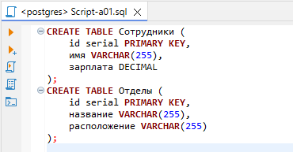<br>

💾 [скрипт: Script-a01.sql](./exercises/Script-a01.sql)

### 🦉02_Упражнения - ALTER
 - Создайте таблицу "students" с полями: id (SERIAL PRIMARY KEY), name (VARCHAR(255)), age (INTEGER).
 - Добавьте в таблицу "students" столбец "email" типа VARCHAR(255) и сделайте его уникальным.
 - Измените тип данных столбца "age" на SMALLINT.
 - Переименуйте столбец "name" в "full_name".
 - Добавьте ограничение NOT NULL для столбца "full_name".

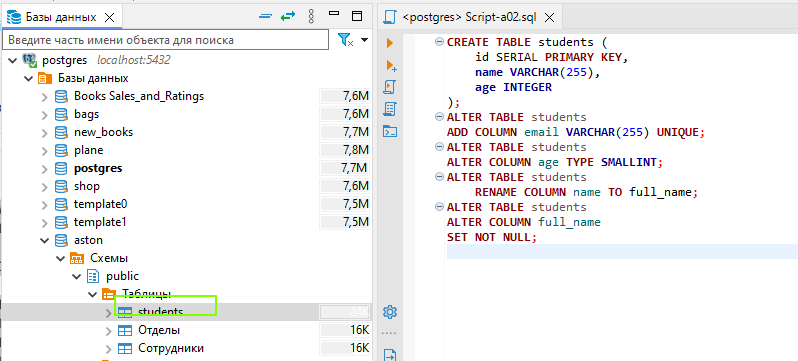<br>

💾 [скрипт: Script-a02.sql](./exercises/Script-a02.sql)

### 🦉03_Упражнения - DROP
 - Удалите таблицу "students", созданную в предыдущем упражнении.
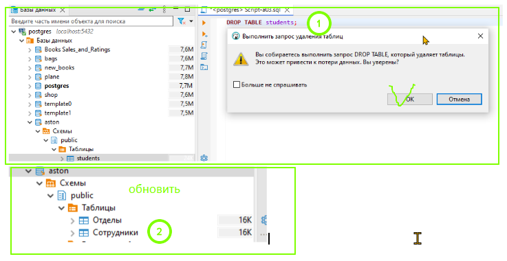<br>

 - Попробуйте удалить несуществующую таблицу. Что происходит?
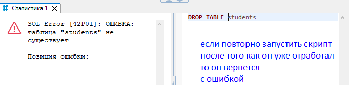<br>
 - Создайте две таблицы: "authors" (id, name) и "books" (id, title, author_id). Добавьте внешний ключ в таблицу "books", ссылаясь на "authors".
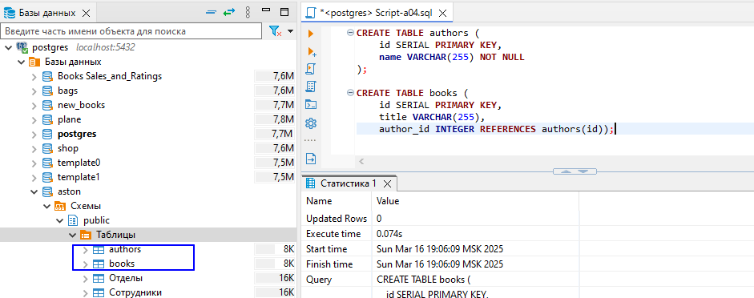<br>
 - Попробуйте удалить таблицу "authors". Что происходит?
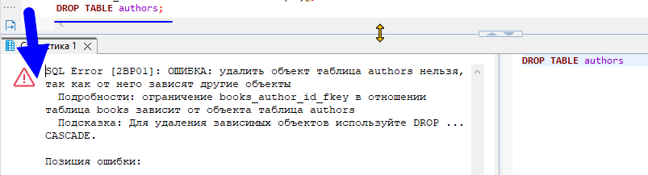<br>
 - Удалите таблицу "authors" с каскадным удалением.
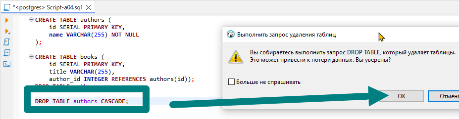<br>
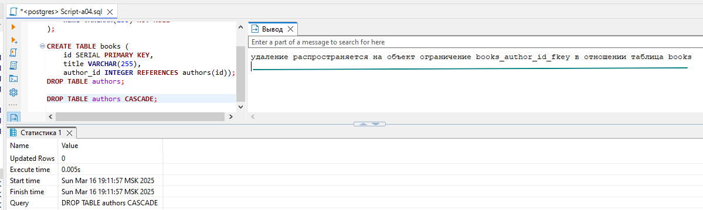<br>
💾 [скрипт: Script-a03.sql](./exercises/Script-a03.sql)
### 🦉04_Упражнения - TRUNCATE
Создайте таблицу "items" с полями: id (SERIAL PRIMARY KEY), name (VARCHAR(255)). Добавьте несколько записей.
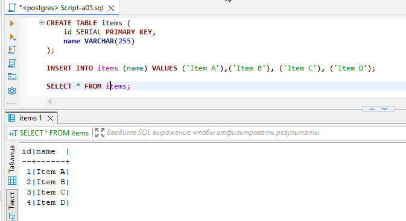<br>
Очистите таблицу "items" с помощью команды TRUNCATE.   
Добавьте новые записи в таблицу "items". Что происходит с идентификаторами записей? - Идентификаторы записей не сброшены - нумерация продолжается.
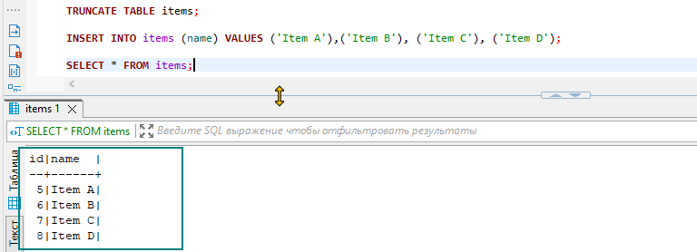<br>
Очистите таблицу "items" с помощью команды TRUNCATE и сбросьте идентификаторы последовательностей. Добавьте новые записи. Что происходит с идентификаторами записей? - Идентификаторы записей  сброшены - нумерация начата с начала.
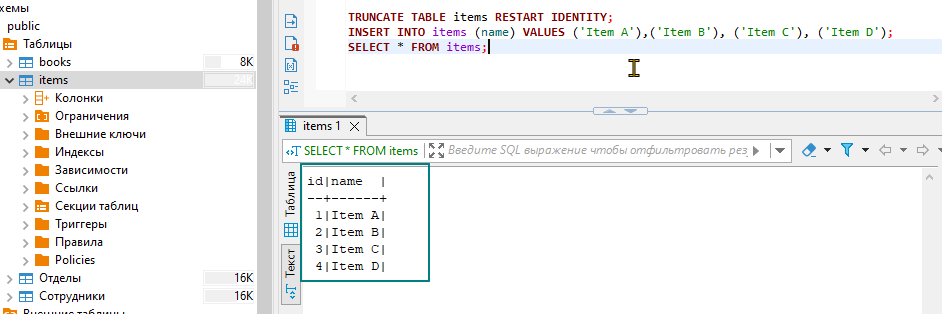<br>
💾 [скрипт: Script-a04.sql](./exercises/Script-a04.sql)

## ⚡ DML (Data Manipulation Language)
 - SELECT:  извлечение данных из таблиц.
 - INSERT:  добавление новых данных в таблицы.
 - UPDATE:  обновление существующих данных.
 - DELETE:  удаление данных из таблиц.
### 🦉 05_Упр. - Предпосылки
Создать таблицу ("employees") со следующими столбцами:
 - lid (SERIAL PRIMARY KEY)
 - lfirst_name (VARCHAR(50))
 - llast_name (VARCHAR(50))
 - ldepartment (VARCHAR(50))
 - lsalary (NUMERIC(8,2))
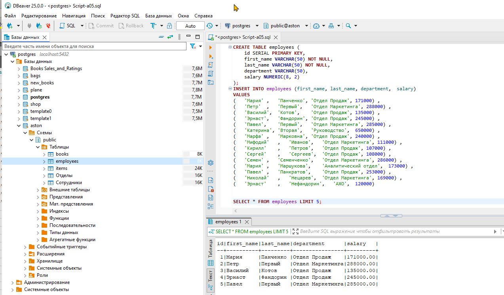<br>
💾 [скрипт: Script-a05.sql](./exercises/Script-a05.sql)
### 🦉 06_Упражнения - SELECT

Выбрать всех сотрудников с зарплатой больше 250000--.
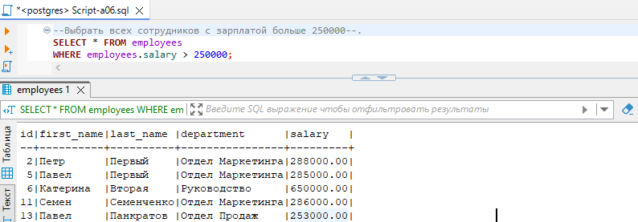<br>
Выбрать имя и фамилию сотрудников, чья фамилия начинается на "С".
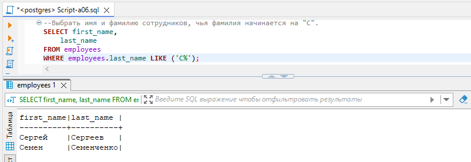<br>
Выбрать количество сотрудников в каждом отделе.
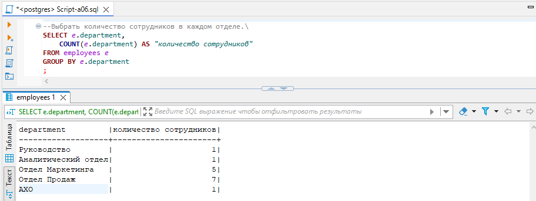<br>
💾 [скрипт: Script-a06.sql](./exercises/Script-a06.sql)
### 🦉07_Упражнения - INSERT
Вставить нового сотрудника в отдел "HR" с зарплатой 40000.
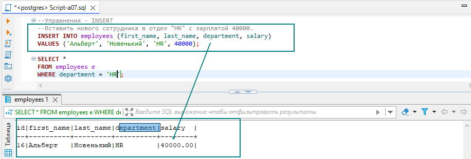<br>
Вставить двух новых сотрудников в отдел "Finance".
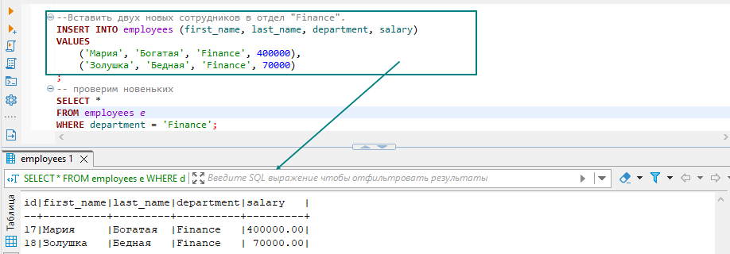<br>
💾 [скрипт: Script-a07.sql](./exercises/Script-a07.sql)
### 🦉08_Упражнения - UPDATE
Уменьшить зарплату всем сотрудникам отдела "Sales" на 5%. (Отдела Продаж)
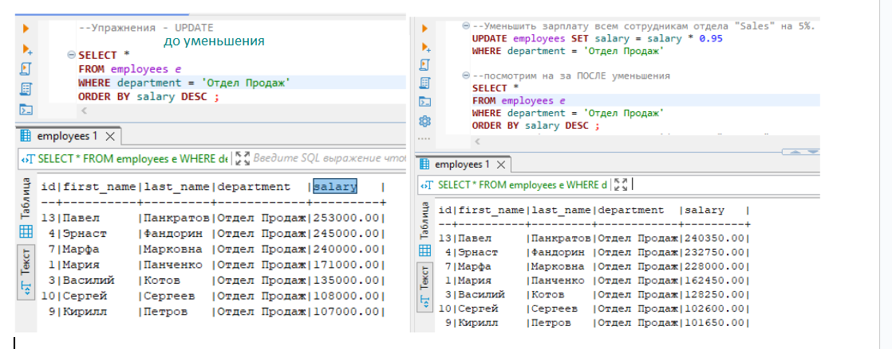<br>
Изменить фамилию сотрудника с id = 1 на "Смирнов".
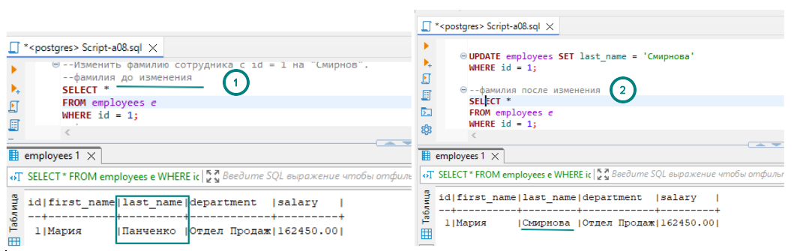<br>
💾 [скрипт: Script-a08.sql](./exercises/Script-a08.sql)
### 🦉09_Упражнения - DELETE
Удалить всех сотрудников с зарплатой меньше 40000. (Меньше 100000 в моем запросе)
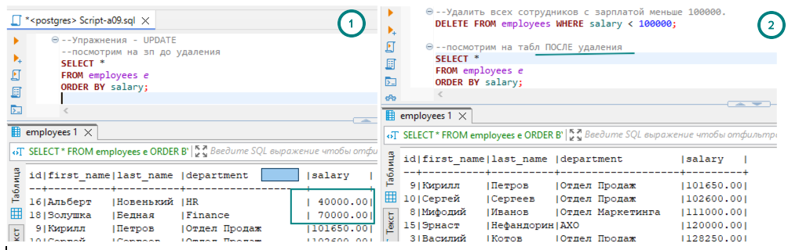<br>
Удалить все записи из таблицы employees. (Внимание! Будьте осторожны с этим запросом.)
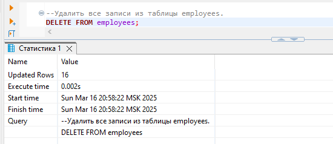<br>
💾 [скрипт: Script-a09.sql](./exercises/Script-a09.sql)

## ⚡ DCL (Data Control Language)
 - GRANT:  предоставление прав доступа к объектам базы данных.
 - REVOKE: отмена прав доступа.
### 🦉 10_Упражнения — DCL (psql)
1. Создайте пользователя `editor` и дайте ему права на чтение и запись данных в таблицу `posts`.
1. Создайте роль `admin` и дайте ей все права на базу данных.
1. У пользователя `editor` отнимите право на удаление данных из таблицы `posts`.
1. У пользователя `admin` отнимите право на передачу другим пользователям права на изменение данных в таблице `users`.
1. Удалите пользователя `editor` вместе со всеми его привилегиями.
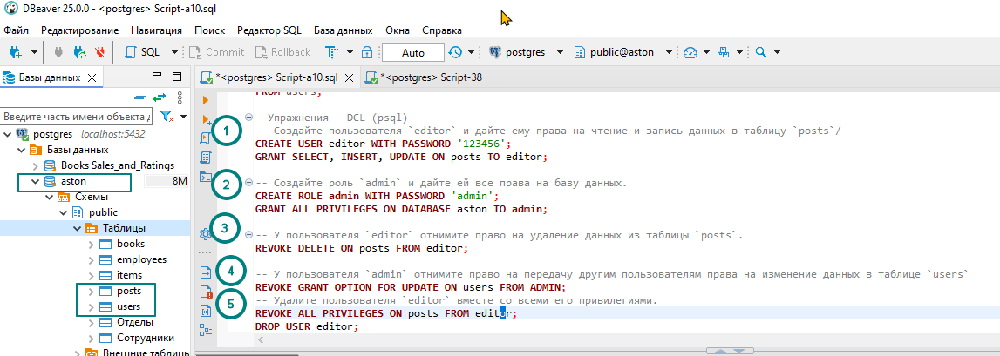<br>
💾 [скрипт: Script-a10.sql](./exercises/Script-a10.sql)

## ⚡TCL (Transaction Control Language)
язык управления транзакциями в PostgreSQL. Он позволяет контролировать и управлять изменениями в базе данных.

 - COMMIT: Подтверждает транзакцию, делая все изменения постоянными в базе данных.
 - ROLLBACK: Откатывает транзакцию, отменяя все изменения, внесенные с момента начала транзакции или до последней точки сохранения (SAVEPOINT).
 - SAVEPOINT: Создает точку сохранения внутри транзакции, к которой можно откатиться, не отменяя всю транзакцию.
### 🦉11_Упражнения - TCL 
 - Создайте таблицу "products" с полями id (serial primary key), name (varchar(50)), price (numeric).
 - Добавьте 3 продукта в таблицу.
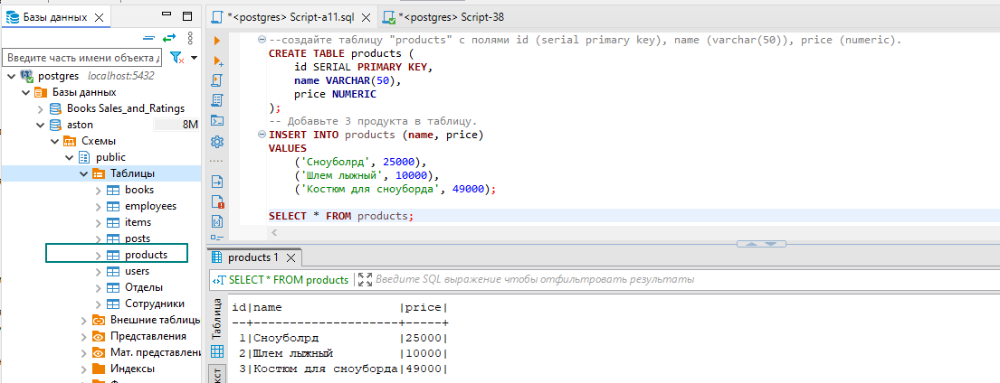<br>
 - В рамках одной транзакции: Увеличьте цену первого продукта на 10%. Создайте точку сохранения "price_update". Удалите второй продукт. Откатитесь к точке сохранения "price_update". Подтвердите транзакцию.
 - Проверьте содержимое таблицы "products".
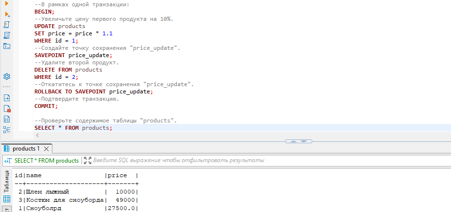<br>
💾 [скрипт: Script-a11.sql](./exercises/Script-a11.sql)
### 🦉12_Упр. - Таблицы для примеров
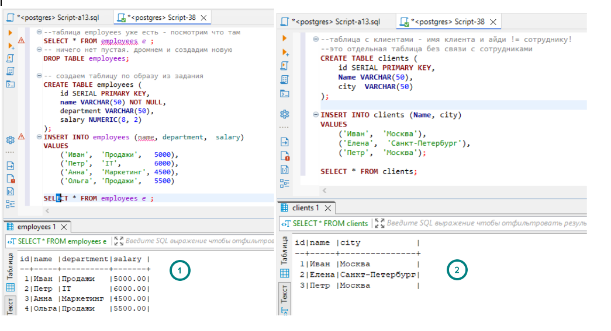<br>
💾 [скрипт: Script-a12.sql](./exercises/Script-a12.sql)
### 🦉13_Упражнение - UNION и UNION ALL
Вывести отделы, в которых работают сотрудники, и города, в которых живут клиенты, исключая дубликаты.
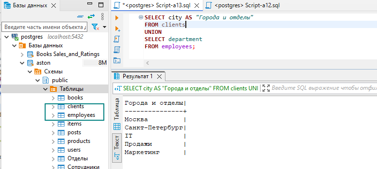<br>
💾 [скрипт: Script-a13.sql](./exercises/Script-a13.sql)

### 🦉14_Упражнение - INTERSECT
Вывести города, в которых живут клиенты, и где зарплата сотрудников выше 5000.
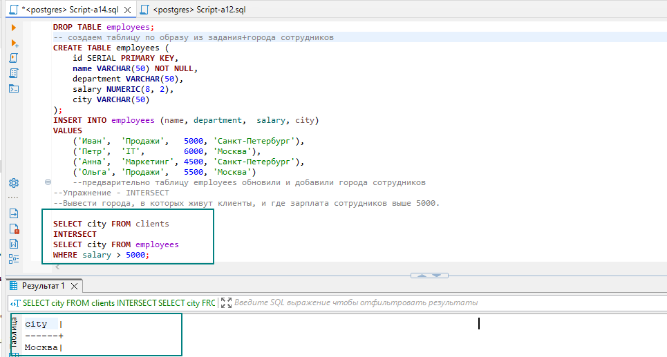<br>
💾 [скрипт: Script-a14.sql](./exercises/Script-a14.sql)

### 🦉15_Упражнение - EXCEPT
Вывести отделы, в которых нет сотрудников с именем "Иван".
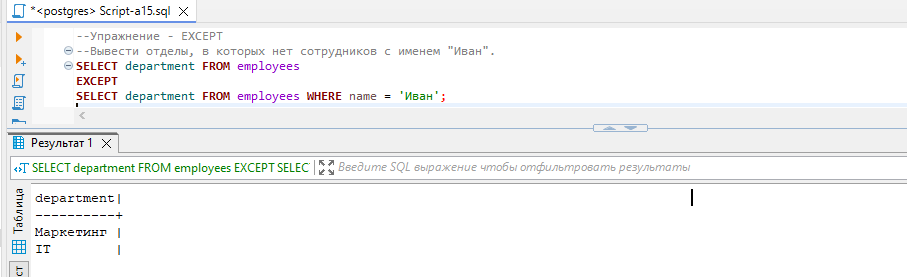<br>
💾 [скрипт: Script-a15.sql](./exercises/Script-a15.sql)
### 🦉16_Упражнение - IN и NOT IN
Вывести клиентов, которые не являются сотрудниками.
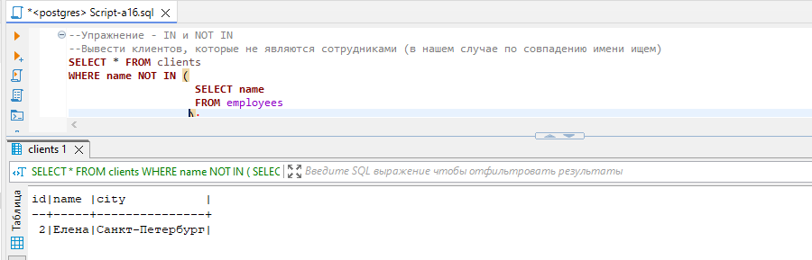<br>
💾 [скрипт: Script-a16.sql](./exercises/Script-a16.sql)
### 🦉17_Упражнение - WHERE
Упражнение 1: Выбрать все продукты из таблицы products с ценой между 10 и 50.
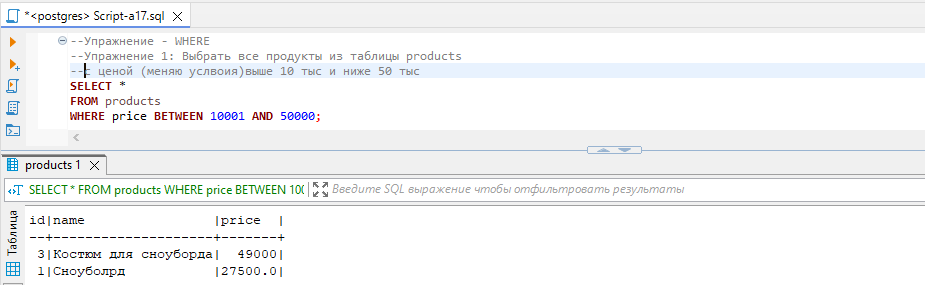<br>
Упражнение 2: Выбрать всех сотрудников из таблицы employees с должностью 'Manager' и зарплатой выше 50000.
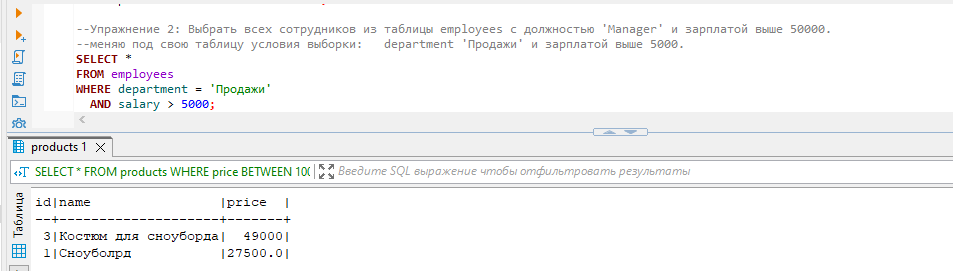<br>
💾 [скрипт: Script-a17.sql](./exercises/Script-a17.sql)
### 🦉18_Упражнение - HAVING
таблица orders
<br>
Упражнение 3: Выбрать клиентов из таблицы orders с общей суммой заказов более 1000.
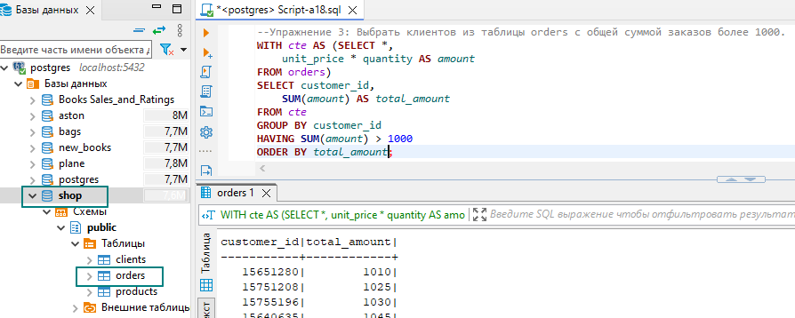<br>
Упражнение 4: Выбрать категории продуктов из таблицы products со средней ценой более 50.
меняю условие под таблицу:
выбрать customer_id со средним количеством quantity в заказе выше 10
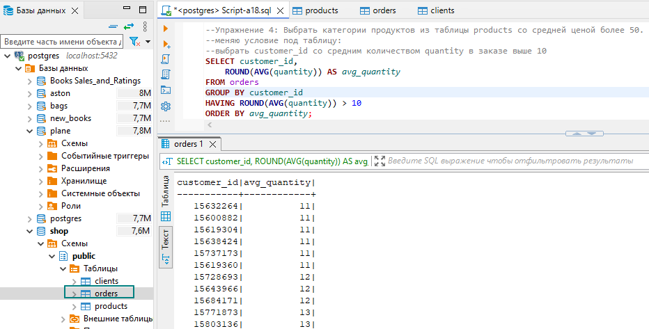<br>
💾 [скрипт: Script-a18.sql](./exercises/Script-a18.sql)
### 🦉19_Упражнение - CASE
Упражнение 5: Добавить колонку shipping_cost к таблице orders с бесплатной доставкой для заказов от 50.
меняю под свои условия: Добавить колонку shipping_cost к таблице orders если в заказе от 14 quantity для остальных доставка 200
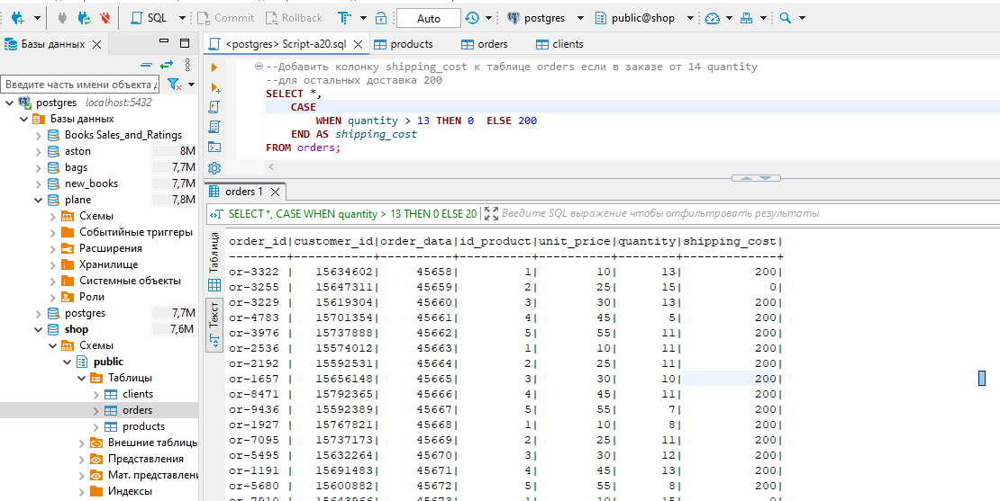<br>
Упражнение 6: Классифицировать клиентов в таблице orders по количеству заказов: "New", "Regular" и "VIP".
если заказов менее 4 это New
если заказов  4 это Regular
если заказов более 4 это VIP
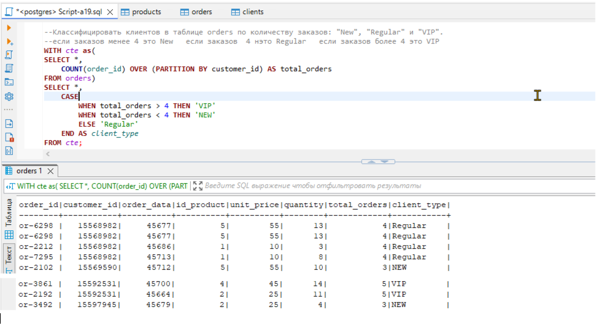<br>
💾 [скрипт: Script-a19.sql](./exercises/Script-a19.sql)
### 🦉20_Упражнение - Операторы сравнения
Упражнение 7: Написать запросы с использованием разных операторов сравнения для таблиц из предыдущих упражнений.
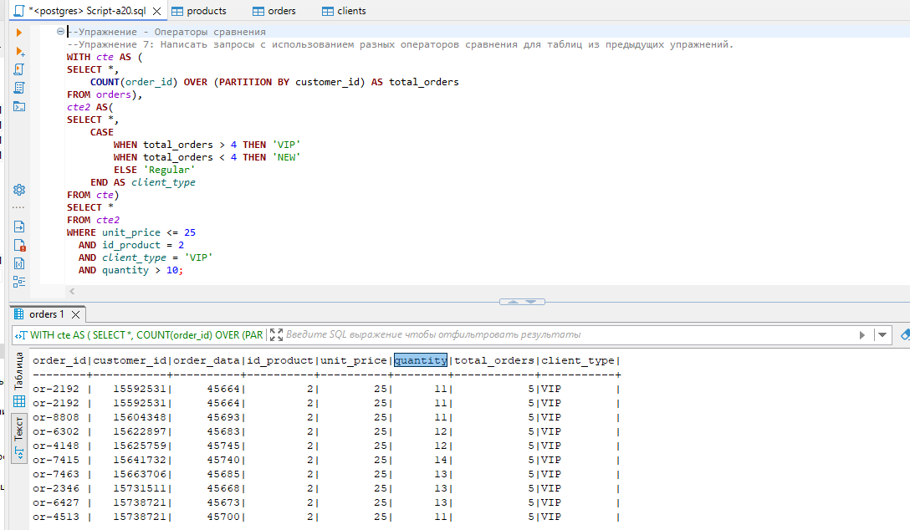<br>
💾 [скрипт: Script-a20.sql](./exercises/Script-a20.sql)
### 🦉21_Упражнение - EXISTS
Проверьте, есть ли товары в категории "Электроника", цена которых выше 1000.
меняю условие запроса под свою таблицу  на : проверьте есть ли customer_id купившие товар id_product в количестве более 12 штук в одном заказе
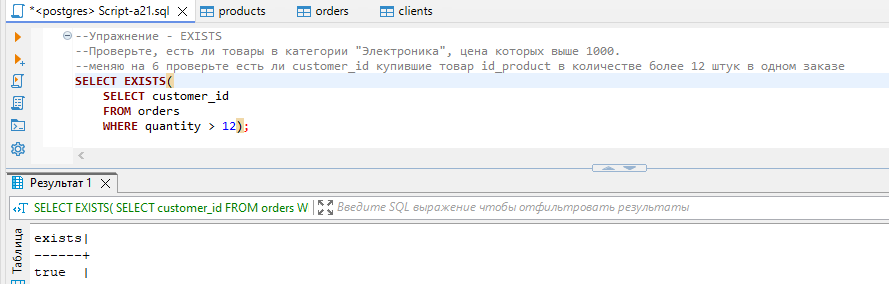<br>
проверьте есть ли customer_id купившие товар id_product в количестве более 20 штук в одном заказе
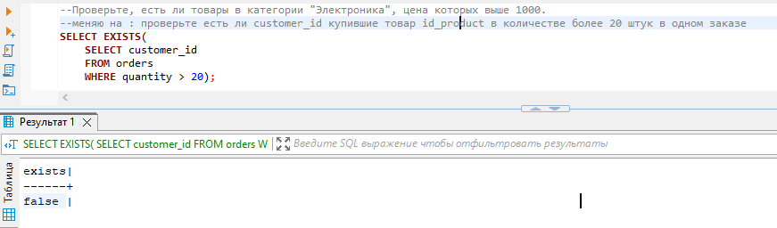<br>
💾 [скрипт: Script-a21.sql](./exercises/Script-a21.sql)
### 🦉22_Упражнение - ANY, ALL
💾 [для таблицы orders](../files/orders_new.csv)
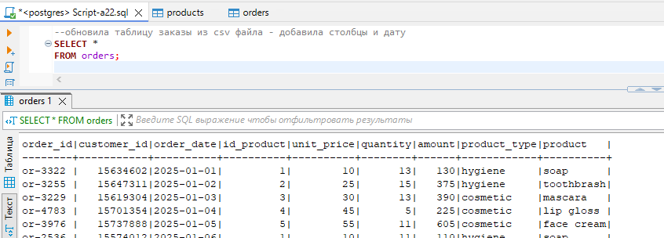<br>
Найдите все заказы, дата которых совпадает с датой любого заказа клиента с ID 5.
меняю на свои условия --Найдите все заказы, дата которых совпадает с датой любого заказа клиента с customer_id 15634602.
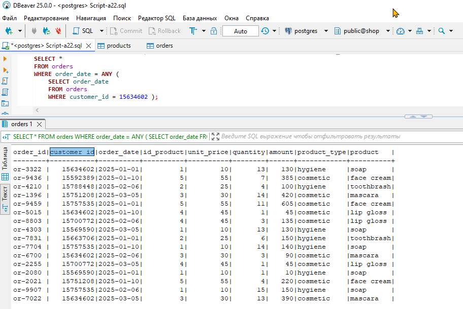<br>
Найдите все заказы, сумма которых больше суммы всех заказов, сделанных в январе 2025.
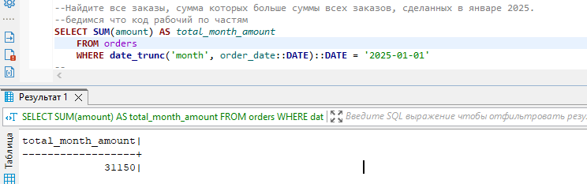<br>
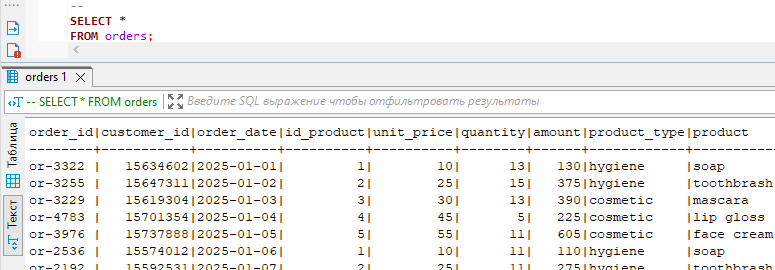<br>
теперь соединим код
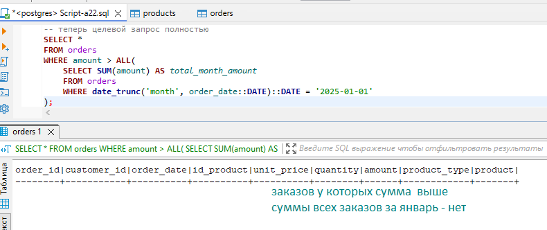<br>
💾 [скрипт: Script-a22.sql](./exercises/Script-a22.sql)

### 🦉22_Упражнение - LIKE, RLIKE
Найдите все заказы, комментарий к которым содержит слово "Скидка".  
--(т.к. нет коммкнтариев то доп действие в сте -добавим в таблицу комментарии о скидке и уже затем найдем все заказы, комментарий к которым содержит слово "Скидка")
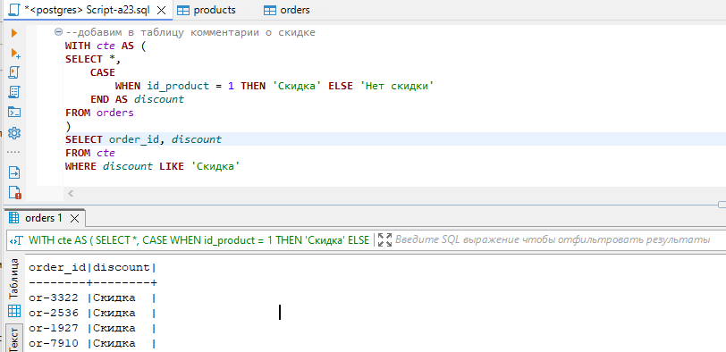<br>
Найдите все продукты, артикул которых состоит из двух букв, затем трех цифр и заканчивается на букву "A".
--(т.к. нет таких артикулов - то доп действие в сте -добавим в таблицу многосоставные артикулы и уже затем найдем запрос по условию об артикуле)

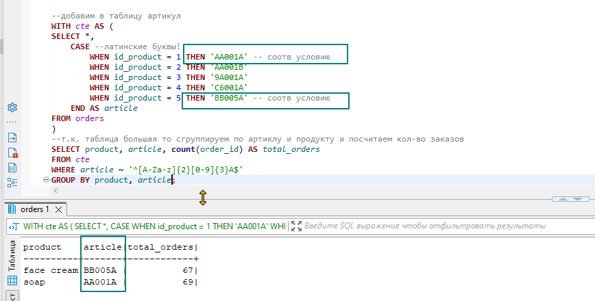<br>
💾 [скрипт: Script-a23.sql](./exercises/Script-a23.sql)
### 🦉23_Упражнение - Работа с NULL значениями
Создайте таблицу products с колонками id, name, price, description. Добавьте несколько записей, оставив некоторые значения price и description пустыми (NULL).
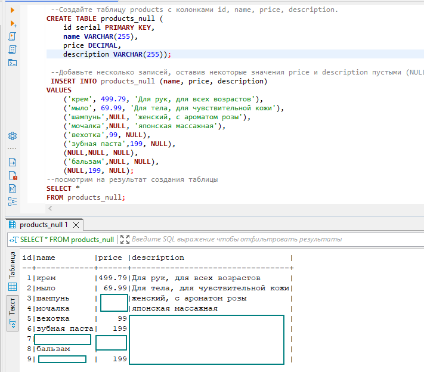<br>
Напишите запрос, который выводит названия продуктов, у которых не указана цена.
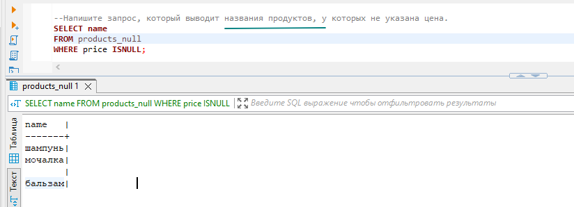<br>
Напишите запрос, который выводит описания продуктов, у которых цена указана.
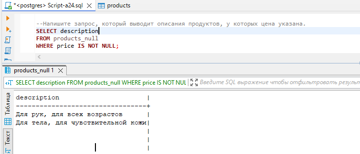<br>
Напишите запрос, который выводит названия продуктов и их цены. Если цена не указана, то вместо нее должно отображаться "Нет в наличии".
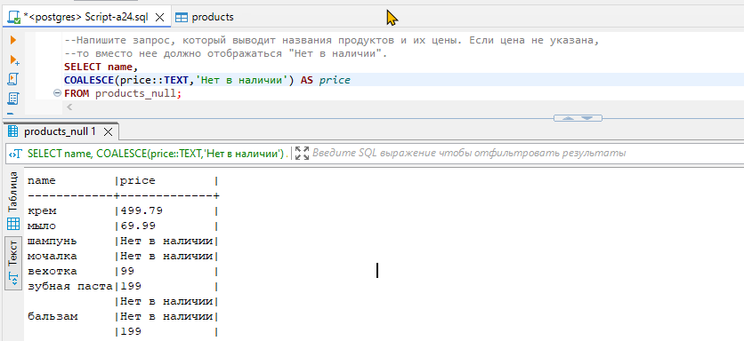<br>
💾 [скрипт: Script-a24.sql](./exercises/Script-a24.sql)


```python

```
