## ⚡ Сложные запросы

### 🦉01_Упр. - Вычисление средней зарплаты и вывод сотрудников с зарплатой выше средней
загрузила из csv две таблички в dbeaver 
💾 [csv файл employees.csv для базы данных](./files/employees.csv) 
💾 [csv файл department.csv для базы данных](./files/department.csv) 

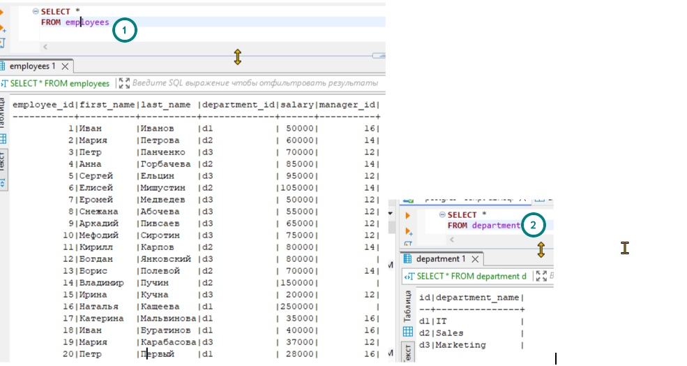 

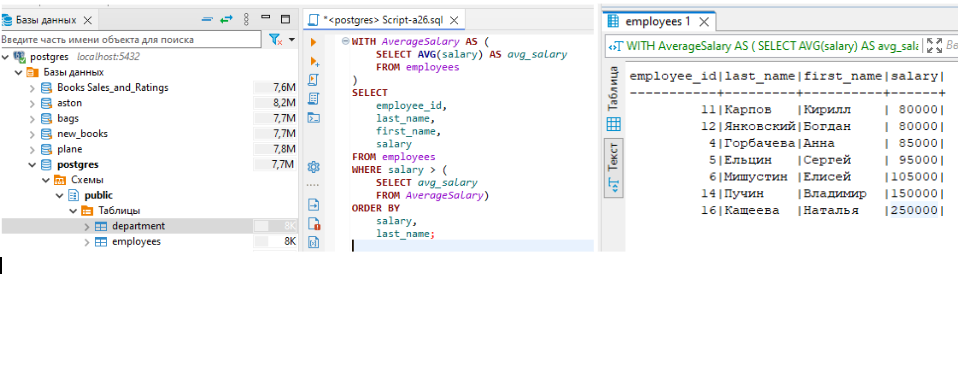 
💾 [скрипт: Script-a25.sql](./exercises/Script-a25.sql)
### 🦉02_Упр. - Поиск всех менеджеров и их подчинённых (рекурсивный CTE)
Пояснение: у менеджеров не может быть менеджеров => manager_id IS NULL = менеджер
для этого примера возможно нужна другая таблица, чтобы понятно было зачем. Но какая именно нужно подбирать 
(скорее всего таблицы изначально нормализованные и код другой нужно использовать) . Делала как в конфе.

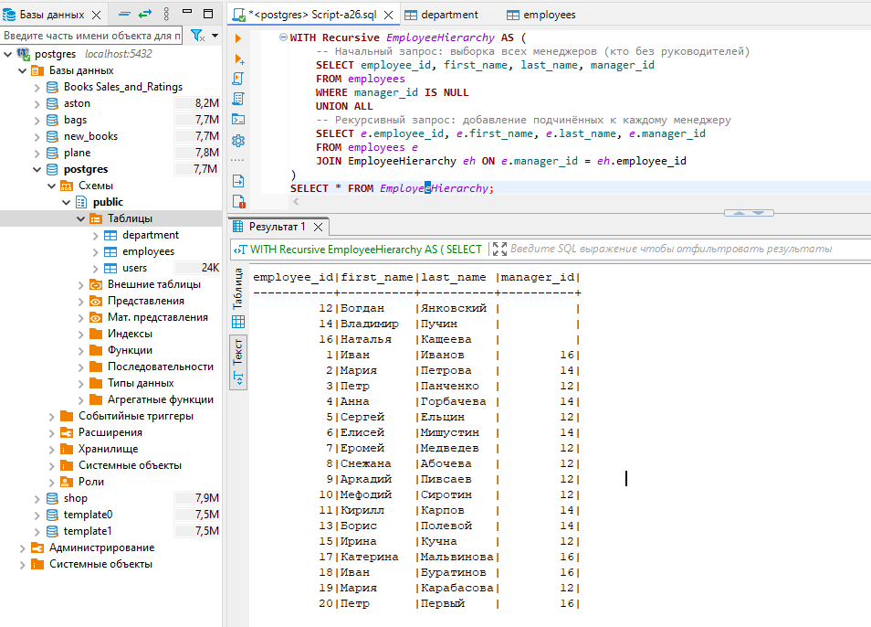 
💾 [скрипт: Script-a26.sql](./exercises/Script-a26.sql)

### 🦉03_Упр. - Множественные CTE
допустим есть таблицы
 
Задача:
 - Найти среднюю зарплату по каждому отделу.
 - Выбрать отделы, где средняя зарплата выше средней зарплаты по всем отделам.

промежуточный шаг - посмотрим на среднюю зп с которой будем сравнивать (для проверки)
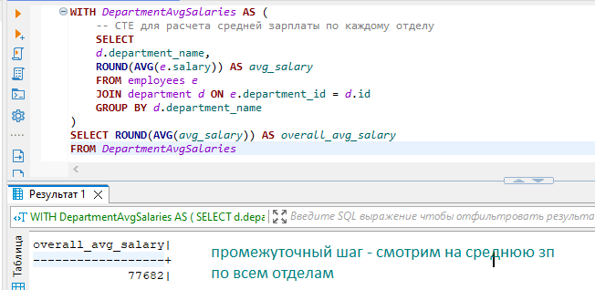 
результат
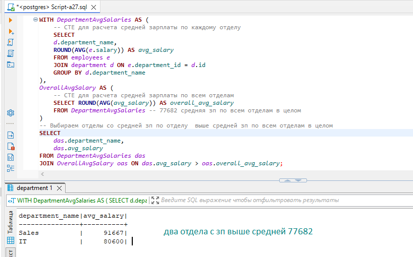 
💾 [скрипт: Script-a27.sql](./exercises/Script-a27.sql)

### 🦉04_Упр. - Передача параметров в CTE: CTE могут принимать параметры, как и функции.
-- Создадим таблицу студентов
-- Заполним таблицу студентов данными
-- Создадим таблицу курсов
-- Заполним таблицу курсов данными
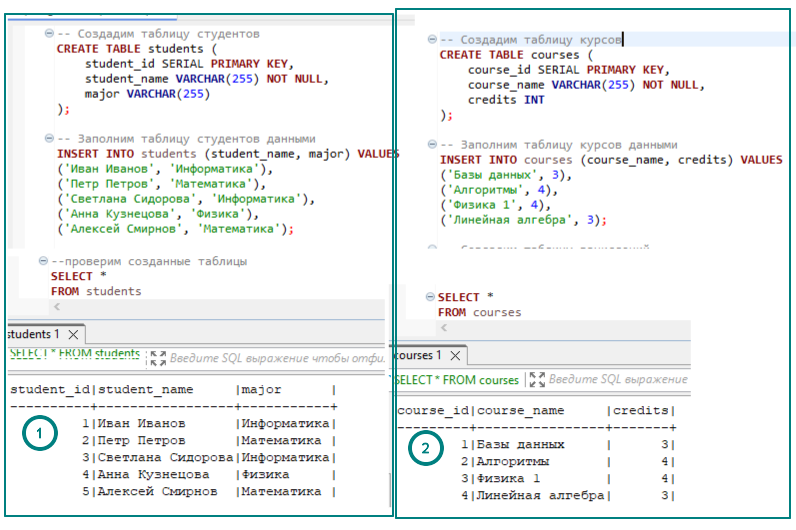 
-- Создадим таблицу зачислений
-- Заполним таблицу зачислений данными
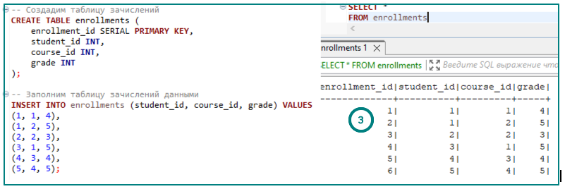 
-- Используем множественные CTE для получения информации о студентах, их средних баллах и количестве курсов

В этом примере мы используем три CTE:
 - StudentsWithMajors: Выбирает информацию о студентах (ID, имя, специальность) из таблицы students.
 - StudentAverageGrades: Считает средний балл (average_grade) для каждого студента на основе данных из таблицы enrollments.
 - StudentCourseCounts: Вычисляет количество различных курсов (course_count), на которые записан каждый студент, 
    используя данные из таблицы enrollments.

Затем мы объединяем результаты всех трех CTE с помощью JOIN по student_id и выбираем имя студента, его специальность, 
средний балл и количество курсов.
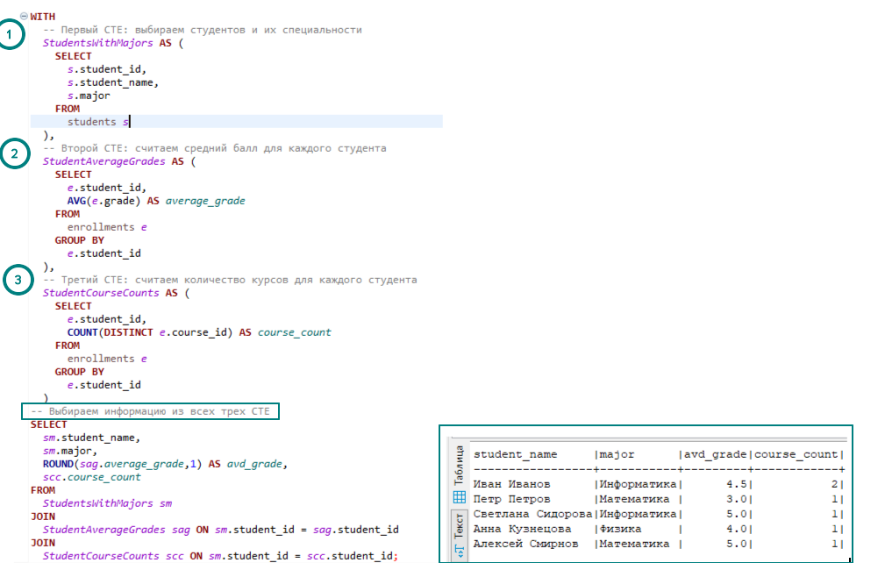 
💾 [скрипт: Script-a28.sql](./exercises/Script-a28.sql)
### 🦉05_Упр. - Вывести список сотрудников из отдела с наибольшим количеством сотрудников

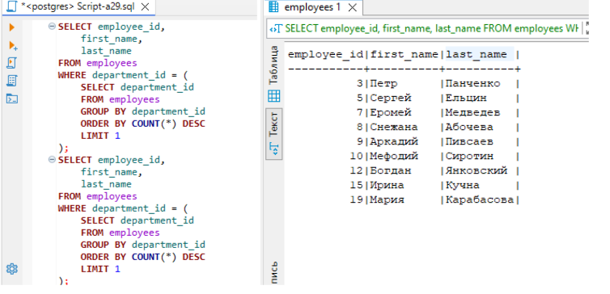 
В этом примере подзапрос находит отдел с наибольшим количеством сотрудников, а затем основной запрос выбирает всех сотрудников из этого отдела.

💾 [скрипт: Script-a28.sql](./exercises/Script-a28.sql)
### 🦉06_Упр. - Вывести список клиентов, которые сделали заказы на все товары
загрузим сгенерированные данные из csv 

💾 [csv файл orders.csv для базы данных](./files/orders.csv) 
💾 [csv файл products.csv для базы данных](./files/products.csv) 
💾 [csv файл customers.csv для базы данных](./files/customers.csv) 

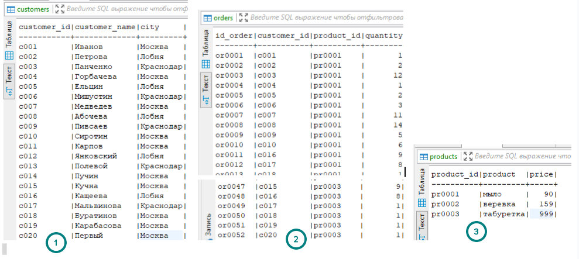 
SELECT customer_id, customer_name
FROM customers
WHERE NOT EXISTS (
  SELECT product_id
  FROM products
  EXCEPT
  SELECT product_id
  FROM orders
  WHERE customer_id = customers.customer_id
);

Этот запрос использует подзапрос с оператором EXCEPT, чтобы найти клиентов, для которых не существует товаров, которые они не заказывали.
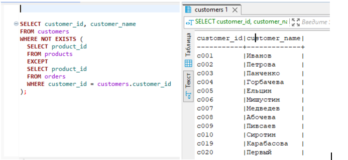 
💾 [скрипт: Script-a29.sql](./exercises/Script-a29.sql)
### 🦉07_Упр. - Подзапросы
Напишите запрос, использующий подзапрос, чтобы найти все заказы, общая сумма которых превышает среднюю сумму заказов.
суммы заказа нет - есть количество. найдем все заказы, общее кол-во товара в которых превышает среднее число товара в  заказах
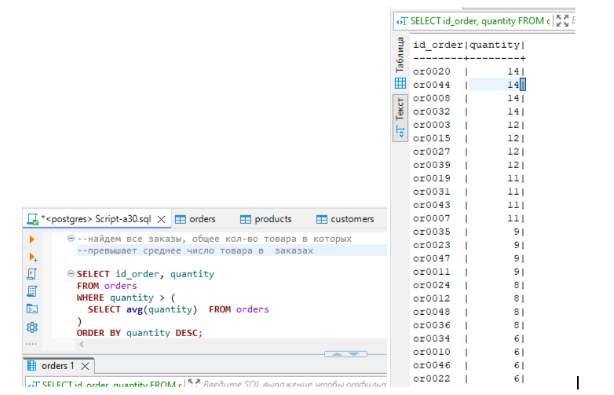 
💾 [скрипт: Script-a30.sql](./exercises/Script-a30.sql)

### 🦉08_Упр. - Примеры в PL/pgSQL 
используем ранее загруженные таблицы с заказамипокупателями и продуктами (упр6)
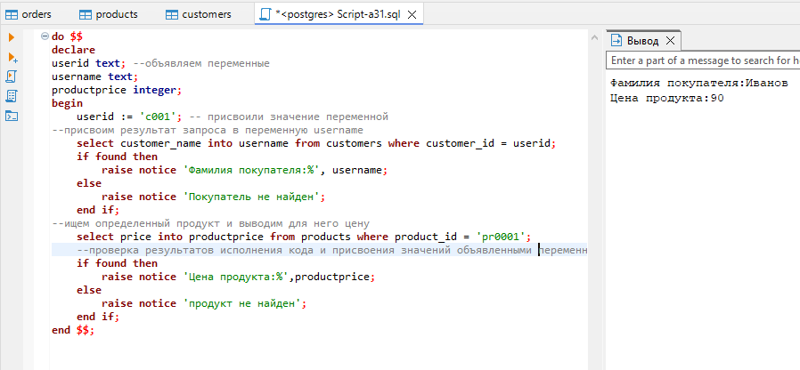 
💾 [скрипт: Script-a31.sql](./exercises/Script-a31.sql)

### 🦉09_Упр. - Пример функции с использованием переменных
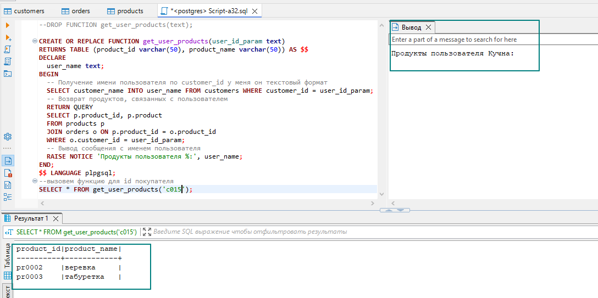 
💾 [скрипт: Script-a32.sql](./exercises/Script-a32.sql)
### 🦉10_Упр. - Вывести список сотрудников с ранжированием по зарплате
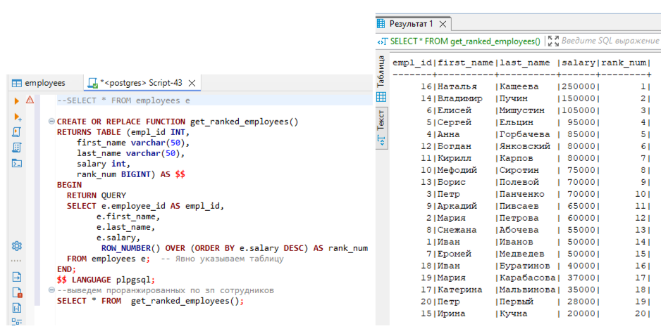 
💾 [скрипт: Script-a33.sql](./exercises/Script-a33.sql)

### 🦉11_Упр. - Переменные
-- созданы таблицы по заданию
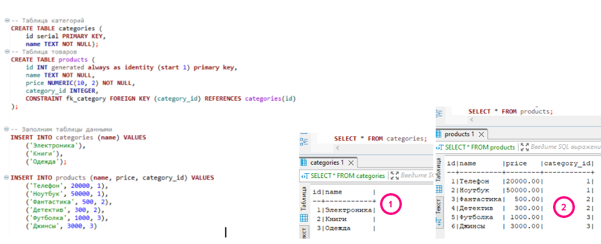 

1. Напишите функцию `get_product_info(product_id INTEGER)`, которая принимает ID товара и возвращает его название, цену и название категории в виде строки.

Используйте переменные для хранения значений, полученных из таблиц.
Пример вызова:
SELECT get_product_info(1);
-- Результат: "Телефон, 20000.00, Электроника"
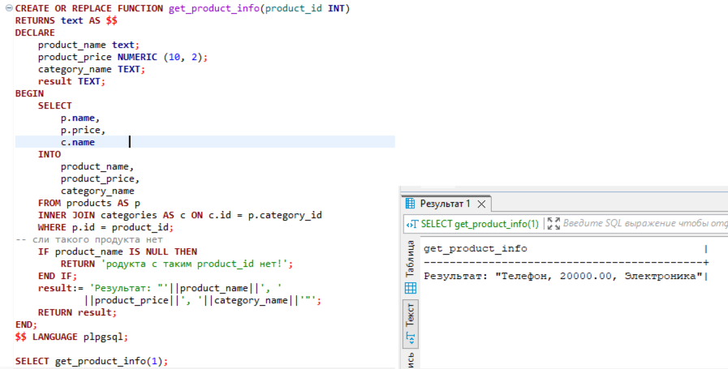 
💾 [скрипт: Script-a34.sql](./exercises/Script-a34.sql)

2. Напишите функцию `get_average_price_by_category(category_name TEXT)`, которая принимает название категории и возвращает среднюю цену товаров в этой категории.
Используйте переменную для хранения ID категории.
Пример вызова:
SELECT get_average_price_by_category('Книги');
-- Результат: 400.00
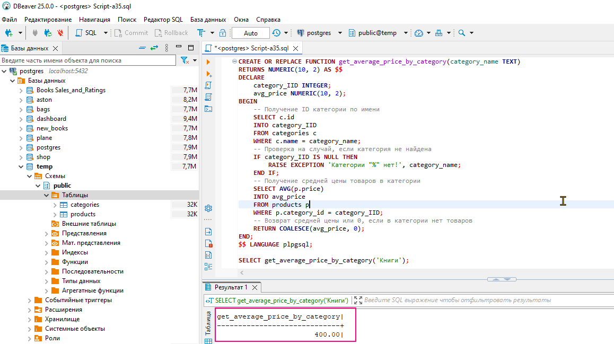 
💾 [скрипт: Script-a35.sql](./exercises/Script-a35.sql)

3. Напишите функцию `update_product_price(product_id INTEGER, percent NUMERIC)`, которая увеличивает цену товара на заданный процент.
Используйте переменную для хранения текущей цены товара.

Пример вызова:  
`SELECT update_product_price(1, 10); -- Увеличиваем цену товара с ID 1 на 10%`

`SELECT price FROM products WHERE id = 1; -- Проверяем новую цену`
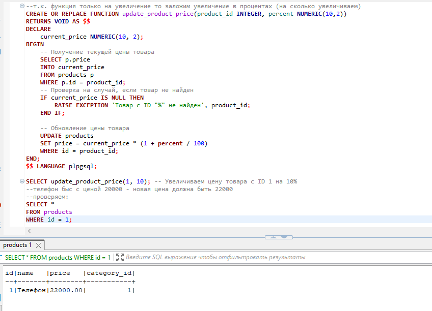 
💾 [скрипт: Script-a36.sql](./exercises/Script-a36.sql)

4. Напишите функцию `get_products_by_price_range(min_price NUMERIC, max_price NUMERIC)`, которая возвращает таблицу с товарами, цена которых находится в заданном диапазоне.

Используйте динамический SQL для построения запроса с переменными min_price и max_price.
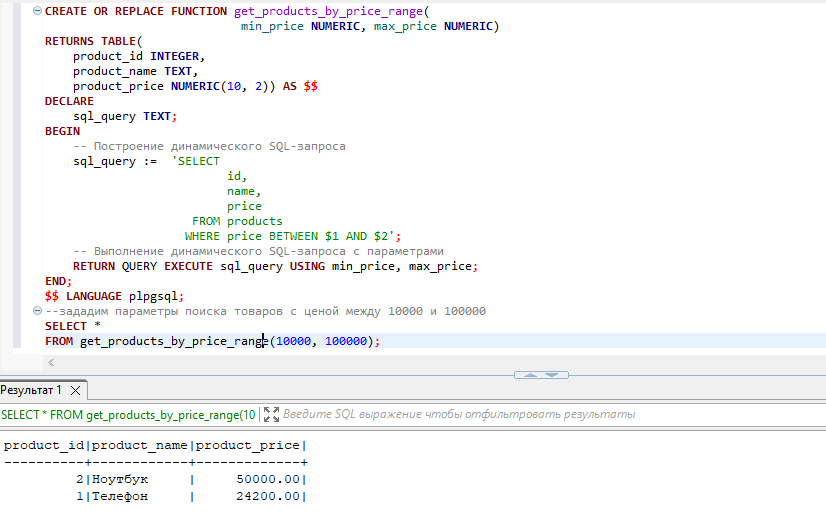 
💾 [скрипт: Script-a37.sql](./exercises/Script-a37.sql)