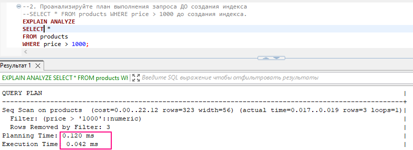
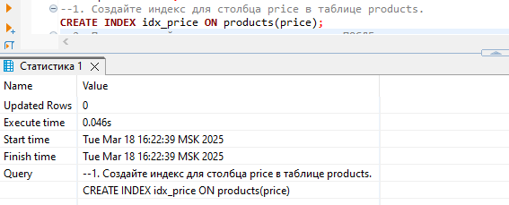
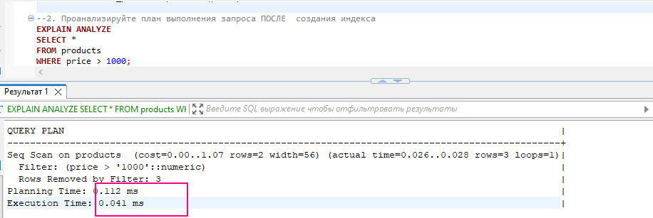
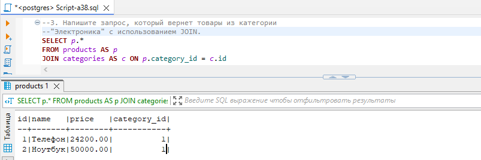
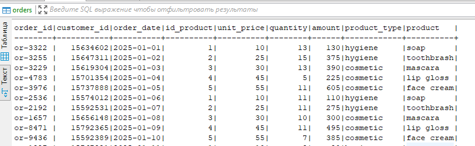
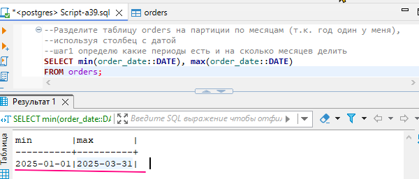
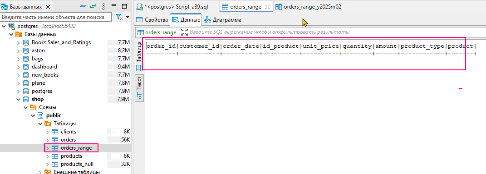
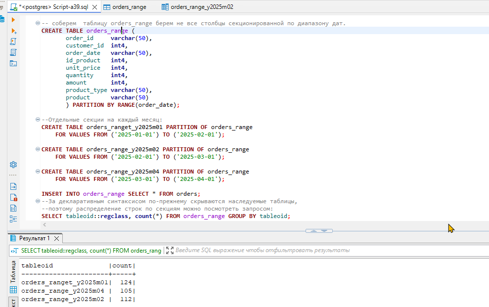
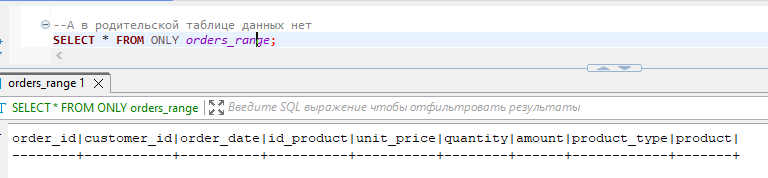

## ⚡ Оптимизация и повышение производительности
### 🦉Упражнения 
#### 1. Создайте индекс для столбца price в таблице products.
но до этого проанализируем план выполнения запроса до индексации чтобы сравнить
 
теперь создаем индекс
 
#### 2. Проанализируйте план выполнения запроса SELECT * FROM products WHERE price > 1000 до и после создания индекса. 
 

#### 3. Напишите запрос, который вернет товары из категории "Электроника" с использованием JOIN.

 

💾 [скрипт: Script-a38.sql](./exercises/Script-a38.sql)

#### 4. Разделите таблицу products на партиции по годам, используя столбец с датой.  
Для выполнения упражнения использую таблицу orders_new.csv там есть даты. 

💾 [csv файл orders_new.csv для базы данных](./files/orders_new.csv) 
 

я буду делить по месяцам январь, февраль, март т.к. год один, а вот эти месяцы в таблице есть
 

 
 
 
💾 [скрипт: Script-a39.sql](./exercises/Script-a39.sql)