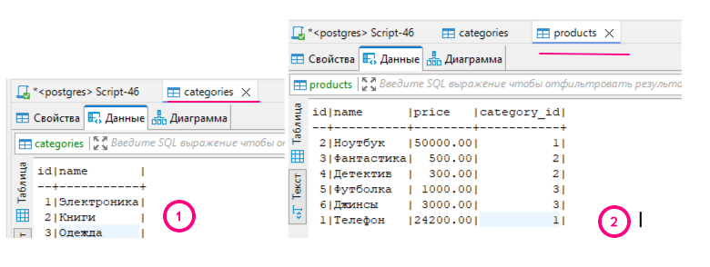
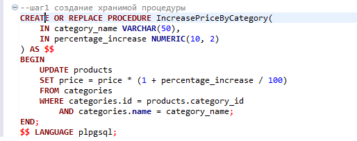
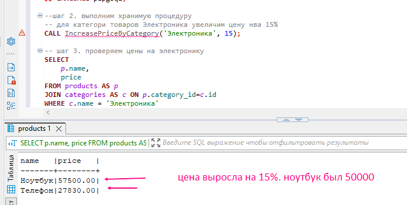
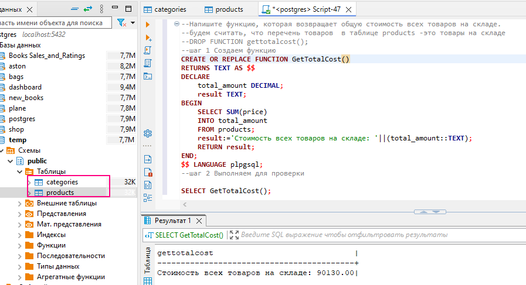
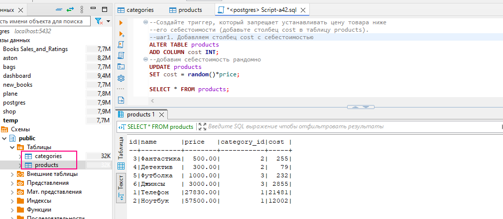
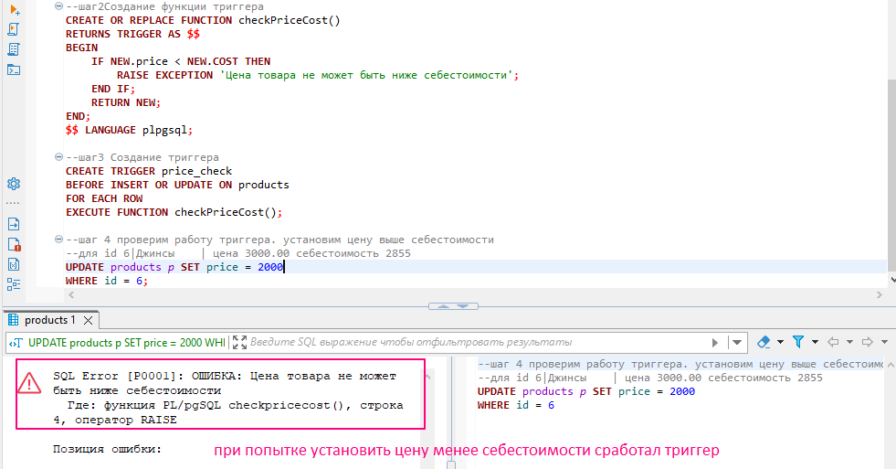

## ⚡ Хранимые процедуры, функции и триггеры
### 🦉Упражнения 
используем таблицы products и category
 
#### упр_1.
Создайте процедуру, 
которая принимает имя категории и увеличивает цену всех товаров в этой категории на заданный процент.  

 
💾 [скрипт: Script-a40.sql](./exercises/Script-a40.sql)

#### упр_2.
Напишите функцию, которая возвращает общую стоимость всех товаров на складе.
  
 💾 [скрипт: Script-a41.sql](./exercises/Script-a41.sql)
#### упр_3.
Создайте триггер, который запрещает устанавливать цену товара ниже его себестоимости (добавьте столбец cost в таблицу products).
 
*на скрине шаг4 правильно читать "установим цену ниже себестоимости"
 
 💾 [скрипт: Script-a42.sql](./exercises/Script-a42.sql)