## ⚡Транзакции и управление concurrency
### 🦉Упражнения  - Блокировки 

#### 1. Разные уровни изоляции
Создайте две сессии PostgreSQL и начните транзакцию в каждой. В первой транзакции измените значение в таблице, но не фиксируйте изменения. Во второй транзакции попробуйте прочитать это значение при разных уровнях изоляции. Что происходит?

используем таблицу products
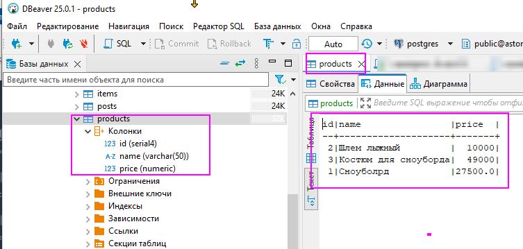 

запускаем первую сессию и вносим изменение в наименование товара с id = 1. не фиксируем изменения

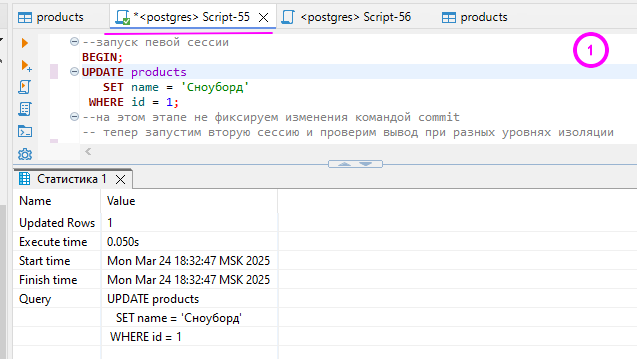 

запускаем вторую сессию параллельно и попробуем прочитать это значение при разных уровнях изоляции.

По умолчанию, в PostgreSQL  использует уровень изоляции `READ COMMITTED`.  
Поэтому вывод при выполнении запроса и при выполнении запроса с установленным уровнем изоляции read commited не отличаются.
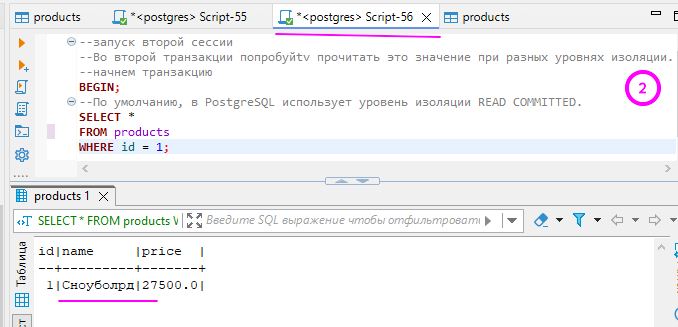 

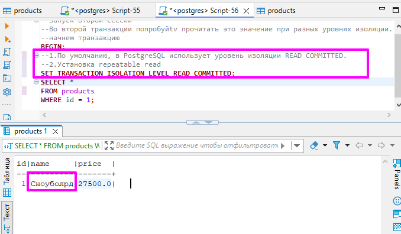 

 Установка serialized:
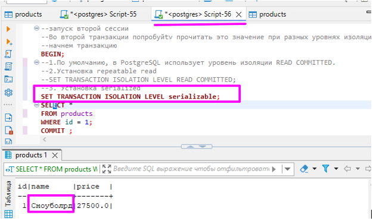 
теперь в первой сессии зафиксируем изменения командой commit 
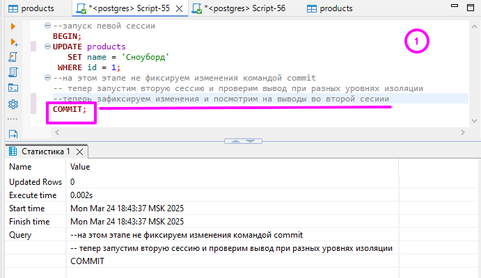 
после этого перейдем ко второй сессии и посмотрим что будет в выводе запроса
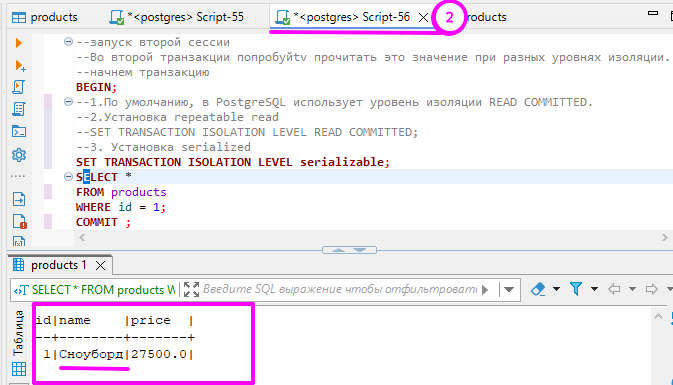 

Наименование поменялось.

####  2.	Анализ блокировок с помощью pg_locks
Используйте pg_locks для анализа блокировок, возникающих при выполнении различных операций (чтение, запись, обновление) в разных транзакциях.

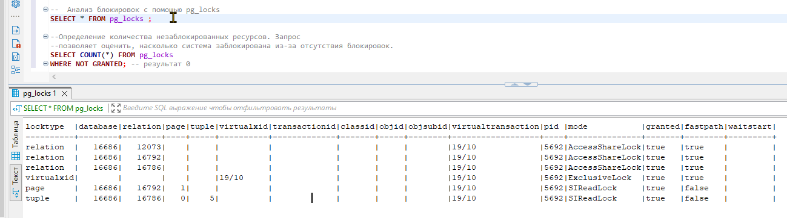 

#### 3.deadlock 
Напишите запрос, который приведет к deadlock. Изучите сообщение об ошибке и проанализируйте причину возникновения deadlock
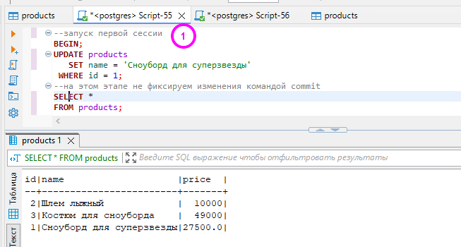 
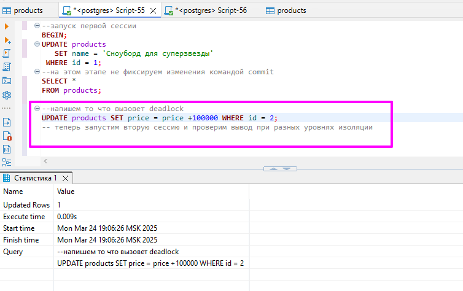 
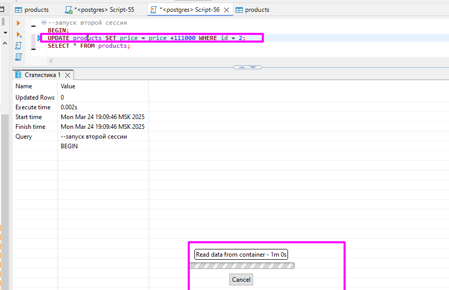 
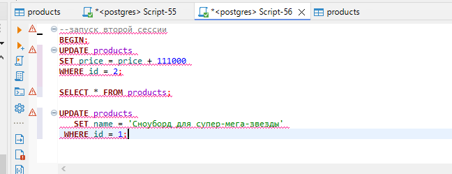 