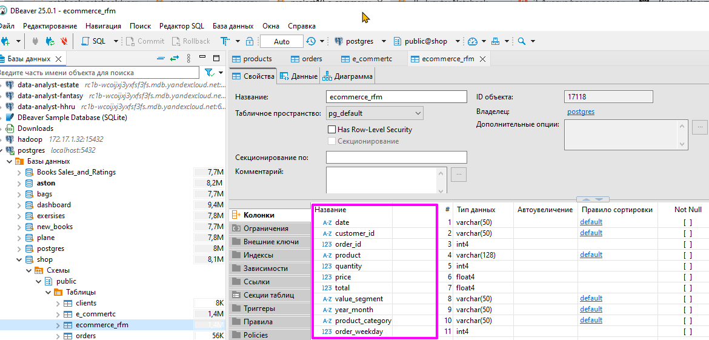
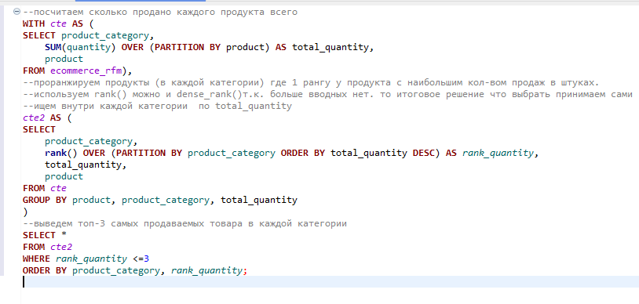
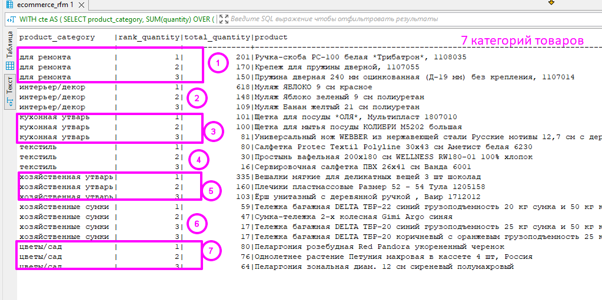
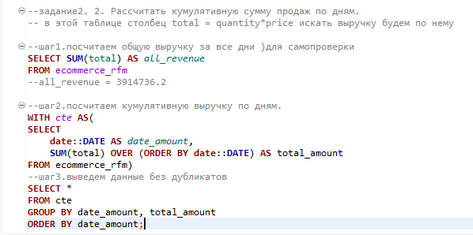
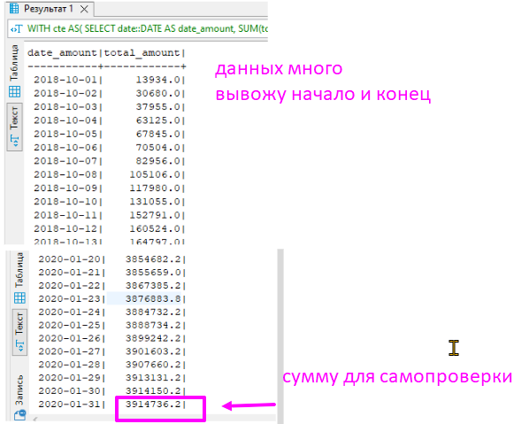
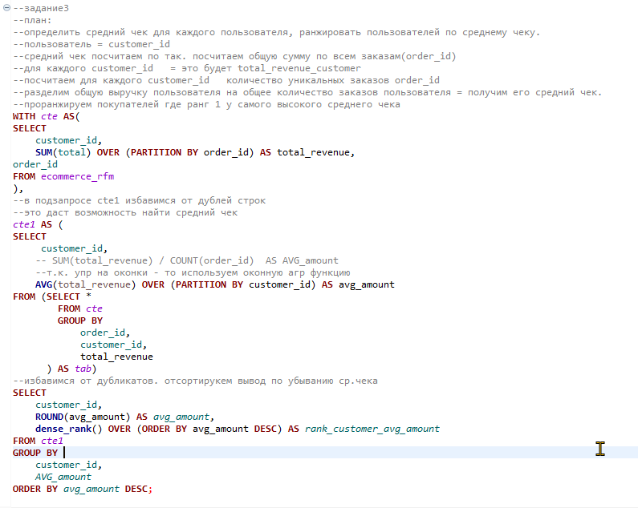

## ⚡Оконные функции
### 🦉Упражнения  - Оконные функции 

#### 1.  3 самых продаваемых продукта
Найти 3 самых продаваемых продукта в каждой категории.

у нас есть обработанная таблица интернет-магазина с товарами и категориями товаров - `ecommerce_rfm.csv`

💾 [csv файл ecommerce_rfm.csv для базы данных](./files/ecommerce_rfm.csv) 
 

самые продаваемые товары будем считать по количеству - поле quantity, а не по выручке.

 

результат 

 

#### 2. Рассчитать кумулятивную сумму продаж по дням.
также используем обработанную таблицу интернет-магазина с товарами и категориями товаров - `ecommerce_rfm.csv`
 
 

 
#### 3.Определить средний чек для каждого пользователя, ранжировать пользователей по среднему чеку.
также используем обработанную таблицу интернет-магазина с товарами и категориями товаров - `ecommerce_rfm.csv`

пользователь = customer_id    
заказ(order_id) для каждого customer_id   
количество уникальных заказов order_id
разделим общую выручку пользователя на общее количество заказов пользователя = получим его средний чек.
либо посчитаем средний чек в оконке и потом избавимся от дублей строк.
 
 

 💾 [скрипт: Script-a44.sql](./exercises/Script-a44.sql)