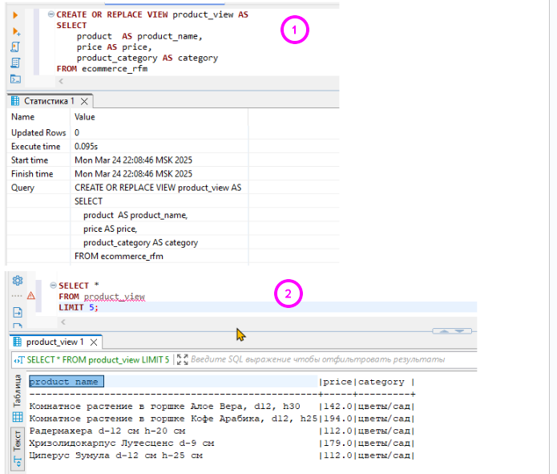
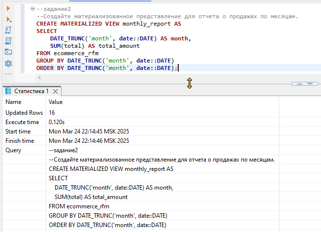
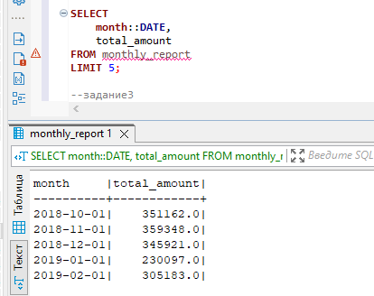
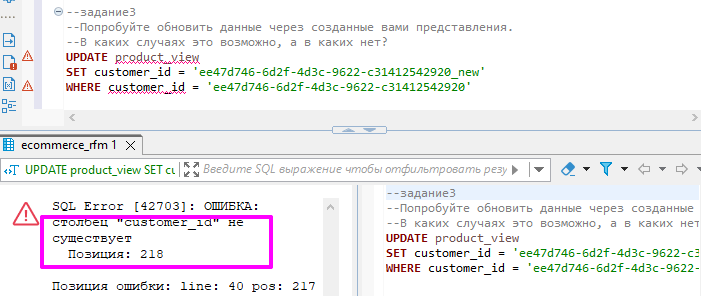
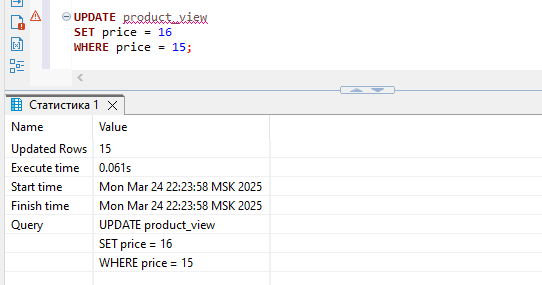
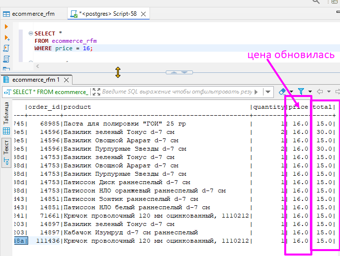
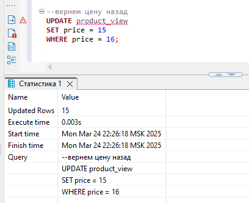
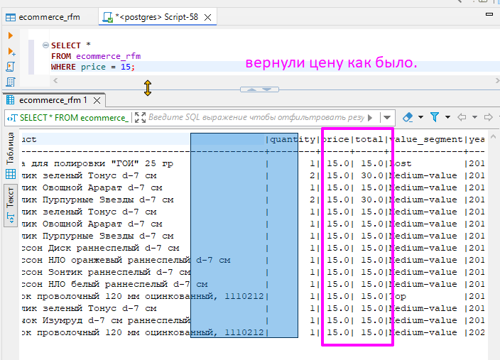

## ⚡Представления
### 🦉Упражнения - Представления

#### 1. Создайте представление, которое показывает имена продуктов, их цены и названия категорий.
 
#### 2. Создайте материализованное представление для отчета о продажах по месяцам.
 
результат ограничим вывод 5 строками
 
#### 3. Попробуйте обновить данные через созданные вами представления. В каких случаях это возможно, а в каких нет?
 
 
 
 
 
 
В общем случае Обновляемые запросы характеризуются следующими признаками:

- Простые запросы без сложных операций, таких как агрегирование (SUM, COUNT и т.д.), группировка (GROUP BY), соединения (JOIN), подзапросы или функции.
- Отсутствие DISTINCT
- Все необходимые столбцы: Если вы хотите обновить определенные столбцы, они должны быть включены в представление.
- Поддержка уникальных идентификаторов

 💾 [скрипт: Script-a45.sql](./exercises/Script-a45.sql)