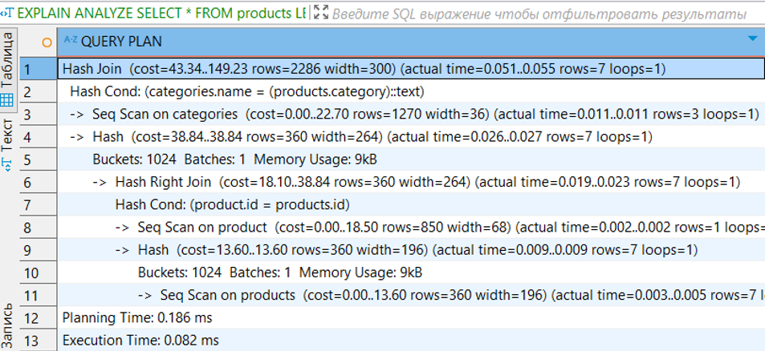
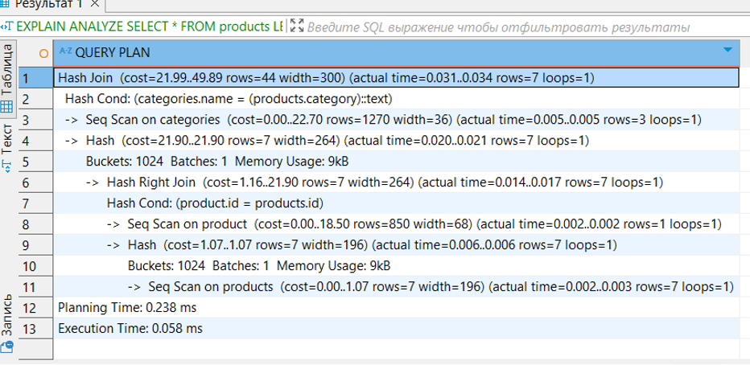

## Упражнение - Оптимизация производительности запросов
 - Напишите запрос, который выполняется медленно (например, соединяет несколько таблиц).
 - Используйте `EXPLAIN ANALYZE`, чтобы проанализировать план выполнения запроса.
 - Добавьте индексы, измените типы соединений или используйте другие методы оптимизации.
 - Снова выполните `EXPLAIN ANALYZE` и сравните планы выполнения до и после оптимизации.

## Решение:
```
EXPLAIN ANALYZE SELECT * FROM products LEFT JOIN product ON products.id = product.id 
JOIN categories ON products.category =categories.name
```
 
```
CREATE INDEX cat ON products(category)
EXPLAIN ANALYZE SELECT * FROM products LEFT JOIN product ON products.id = product.id 
JOIN categories ON products.category =categories.name
```
 


## Упражнение - Производительность и масштабируемость
 - Настройте master-slave репликацию PostgreSQL на двух серверах (контейнерах).
 - Проверьте, что данные с master-сервера реплицируются на slave-сервер.
 - Изучите инструменты и методы шардирования данных в PostgreSQL.

Решение:
1.	Создаем директорию: mkdir -p dopost
- Переходим в нее: cd /dopost
- Создаем файл для docker-compose:

```
services:

  postgresql_01:
    image: postgres
    container_name: postgresql_01
    restart: always
    volumes:
      - /data/postgresql_01:/var/lib/postgresql/data
    environment:
      POSTGRES_PASSWORD: postgres024

  postgresql_02:
    image: postgres
    container_name: postgresql_02
    restart: always
    volumes:
      - /data/postgresql_02/:/var/lib/postgresql/data
    environment:
      POSTGRES_PASSWORD: postgres024
```
 - Запускаем контейнеры: docker-compose up -d  
 - Теперь настраиваем репликацию.  
 - Подключаемся к контейнеру docker: docker exec -it postgresql_01 bash
 - Заходим под пользователем postgres: su – postgres
 - Создаем пользователя, под которым будем подключаться со стороны вторичного сервера:
         - createuser --replication -P repluser

 - Выходим из-под пользователя postgres и контейнера, два раза вводя exit
 - Открываем конфигурационный файл postgresql.conf: vi /data/postgresql_01/postgresql.conf
 - Приводим к следующием виду параметры:
        - wal_level = replica
        - max_wal_senders = 2
        - max_replication_slots = 2
        - hot_standby = on
        - hot_standby_feedback = on
   
 - Теперь открываем файл: vi /data/postgresql_01/pg_hba.conf
 - И добавляем строку после остальных «host    replication»:
         - host    replication     all             172.19.0.0/16           md5
   
 - Перезапустим докер контейнер: docker restart postgresql_01
 - Выполним настройку вторичного сервера. Для начала, удалим содержимое рабочего каталога вторичной базы: rm -r /data/postgresql_02/*
 - Заходим внутрь контейнера postgresql_02: docker exec -it postgresql_02 bash
 - Выполняем команду:
         - su - postgres -c "pg_basebackup --host=postgresql_01 --username=repluser --pgdata=/var/lib/postgresql/data --wal-method=stream --write-recovery-conf"
   
2.	Проверяем, работают ли они.
 - Смотрим статус работы мастера:
         - docker exec -it postgresql_01 su - postgres -c "psql -c 'select * from pg_stat_replication;'"
   
 - Смотрим статус работы слейва:
         - docker exec -it postgresql_02 su - postgres -c "psql -c 'select * from pg_stat_wal_receiver;'"

   
3.	Есть ручное шардирование, когда мы самостоятельно распределяем данные между таблицами, которые созданы по определенному ключу. 
 - Есть расширения Citus, pg_partman для горизонтального масштабирования
 - Есть встроенное партиционирование таблиц, встроенное в PostgreSQL, где используются методы Range Partitioning (разделение по диапазонам), List Partitioning (разделение по списку значений), Hash Partitioning (разделение по хэшу от значения).
